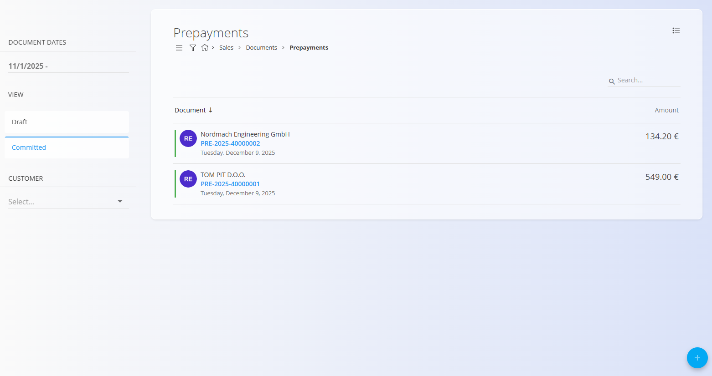
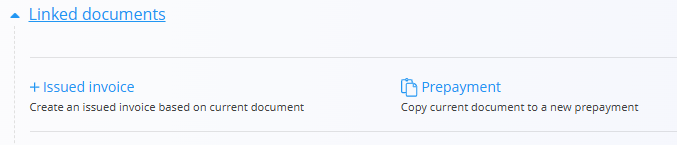

# Predplačila

**Predplačilo** je prodajni dokument, ki se uporablja, kadar stranka poravna dogovorjeni znesek **vnaprej**, še preden je blago ali storitev dobavljena. Evidentira prejeta sredstva, ki se lahko kasneje v celoti ali delno uporabijo pri izstavitvi [**izdanega računa**](IzdaniRacuni.md).  
Predplačila je mogoče ustvariti ročno ali neposredno iz potrjenega [**Predračuna**](Predracuni.md), s čimer so povezana s prodajnim procesom.

Za dostop do tega dokumenta pojdite na **Prodaja / Dokumenti / Predplačila** v [**navigaciji**](../../../Skupno/UI/Navigacija.md).

## Vloga predplačil v prodajnem procesu

Predplačila se uporabljajo, kadar stranka plača del ali celoten znesek vnaprej. V prodajni proces se vključujejo na naslednji način:

1. Ustvarite **[Ponudbo](Ponudbe.md)** in jo pretvorite v **[Predračun](Predracuni.md)**.  
2. Predračun potrdite, s čimer postane primeren za predplačila.  
3. Ustvarite **Predplačilo** – ročno ali prek *Povezani dokumenti → + Predplačilo* na predračunu.  
4. Evidentirate prejeti znesek in objavite predplačilo (preide v stanje **Potrjeno**).  
5. Ob izdaji končnega **[Izdani račun](IzdaniRacuni.md)** predplačilo v celoti ali delno zmanjša znesek za plačilo.  
6. Če je treba predplačilo preklicati ali vrniti, izvedete **[storno](../../Logistika/Dokumenti/Storno.md)**.

Predplačila sledijo prejetim sredstvom in **ne vplivajo na zalogo**.

## Shema

  
<strong>Dokument</strong>

| Polje | Opis |
|------|------|
| [**Šifra**](../../../Skupno/UI/SifreDokumentov.md) | Sistemsko generiran identifikator predplačila. |
| **Številka naročila kupca** | Neobvezna referenca na naročilo stranke. |
| **Stranka** | Stranka, ki izvede predplačilo, izbrana iz šifranta [**Poslovni imenik**](../../../Skupno/Upravljanje/PoslovniImenik.md) (obvezno). |
| **Datum dokumenta** | Datum izdaje dokumenta predplačila. |
| **Datum opravljene storitve** | Predviden datum dobave, povezan s prodajo. |
| **Datum zapadlosti** | Rok za prejem predplačila (obvezno). |
| **Tip reference** | Vrsta plačilnega sklica (obvezno). |
| **Sklic** | Sklicna številka glede na izbrano vrsto sklica. |
| [**Bančni račun organizacije**](../Upravljanje/BancniRacuniOrganizacije.md) | Bančni račun za prejem predplačila (obvezno). |
| [**Stroškovno mesto**](../../../Skupno/Upravljanje/StroskovnaMesta.md) | Neobvezna razporeditev na stroškovno mesto. |
| **Koda namena** | Neobvezen opis namena plačila. |
| **Rabat** | Skupni rabat, uporabljen na znesek predplačila. |
| **Vsebina zgoraj** | Uvodno besedilo iz [**Vnaprej določenih besedil**](../../../Skupno/Upravljanje/VnaprejDolocenaBesedila.md). |
| **Vsebina spodaj** | Zaključna ali pravna besedila iz [**Vnaprej določenih besedil**](../../../Skupno/Upravljanje/VnaprejDolocenaBesedila.md). |
| **Način plačila** | Izbrani način plačila iz šifranta [**Način plačila**](../Upravljanje/NacinPlacila.md). |

  
<strong>Transport, alternativna valuta in dostava</strong>

| Polje | Opis |
|--------|-------------|
| **[Pogoj dobave](../../../Skupno/Upravljanje/PogojiDobave.md)** | Dobavni pogoji, dogovorjeni s stranko. |
| **[Vrsta transporta](../../../Skupno/Upravljanje/VrstaTransporta.md)** | Način transporta, dogovorjen s stranko. |
| [**Alternativna valuta**](../../../Skupno/Upravljanje/Valute.md) | Alternativna valuta glede na privzeto valuto, uporabljeno v dokumentu. |
| [**Tečaj**](../Upravljanje/MenjalniTecaji.md) | Tečaj alternativne valute glede na privzeto valuto. |
| **Dobava – Podjetje / Naslov** | Dobavni podatki stranke, povzeti iz [Poslovnega imenika](../../../Skupno/Upravljanje/PoslovniImenik.md). |

  
<strong>Postavke</strong>

| Polje | Opis |
|--------|-------------|
| **Vrsta blaga oz. storitev** | Izdelek, storitev ali sredstvo, izbrano za to postavko. |
| **Naziv postavke** | Prikazni naziv izbrane postavke (po potrebi ga je mogoče urediti). |
| **[Davčna stopnja](../../../Skupno/Upravljanje/DavcneStopnje.md)** | Davčna stopnja, uporabljena na postavki (nastavljena v konfiguraciji davkov). |
| **Cena brez DDV (na enoto)** | Cena na enoto brez davka. |
| **Cena z DDV (na enoto)** | Cena na enoto z davkom (samodejno izračunana glede na davčno stopnjo). |
| **Količina** | Količina izbrane postavke. |
| **Popust (%)** | Odstotek popusta, uporabljen na neto ceno. |
| **Skupni znesek brez davka** | Izračunan neto znesek (Cena brez DDV × Količina − Popust). |
| **Skupni znesek z davkom** | Skupni znesek z vključenim davkom. |
| **Vrsta obračuna DDV** | Določa način obračuna DDV v posebnih primerih: • **Tristranske dobave** – Za trikotne EU transakcije, kjer DDV obračuna končni kupec (obrnjena davčna obveznost). • **DDV obračuna kupec** – Uporaba obrnjene davčne obveznosti; DDV obračuna kupec namesto prodajalca. • **Izvozne storitve** – Za storitve, opravljene kupcem zunaj EU (običajno oproščene DDV). • **Prevozne storitve** – Posebna davčna obravnava za prevoz blaga. • **Prevoz potnikov** – Posebna pravila DDV za prevoz potnikov. • **Potovalne agencije** – Uporaba posebne maržne sheme za potovalne agencije. • **Po carinskih postopkih 42 in 63** – Za uvoz, kjer je DDV odložen v namembno državo EU. • **Prodaja odpoklicanega blaga iz EU** – Posebna davčna obravnava za vrnjeno ali odpoklicano blago znotraj EU. |
| **Opis** | Dodatne informacije o postavki (neobvezno). |
| **Alternativna valuta** | Možnost prikaza zneska postavke v izbrani alternativni valuti. Ob izbiri se znesek preračuna glede na tečaj, določen v dokumentu. |

  
<strong>Glavna knjiga in Intrastat postavke</strong>

| Polje | Opis |
|--------|-------------|
| **Glavna knjiga – Konto prihodka** | [Konto](../../Racunovodstvo/Upravljanje/GlavnaKnjiga/Konti.md) za knjiženje prihodkov ali odhodkov postavke. |
| **Glavna knjiga – Konto davka** | [Konto](../../Racunovodstvo/Upravljanje/GlavnaKnjiga/Konti.md) za knjiženje davka, vezanega na postavko dokumenta. |
| **[Intrastat – Tarifa](../../Racunovodstvo/Upravljanje/Intrastat/Tarife.md)** | Tarifna oznaka (šifra blaga) za poročanje Intrastat. |
| **Intrastat – Država porekla** | Država, iz katere blago izvira. |
| **Intrastat – Neto teža (kg)** | Neto teža za statistično poročanje. |
| **Intrastat – Statistična vrednost** | Prijavljena statistična vrednost blaga za poročanje Intrastat. |

## Upravljanje

Predplačila imajo lahko status **Osnutek** ali **Potrjeno**.

### Seznam

Seznam predplačil je mogoče filtrirati po:
- **Datumih dokumentov**
- **Pogledu** (Osnutek / Potrjeno)
- **Stranki**

Vsaka vrstica prikazuje:
- Stranko  
- Šifro dokumenta  
- Datum dokumenta  
- Znesek predplačila  

Osnutke je mogoče urejati, potrjena predplačila pa so dokončna, razen če so stornirana.

## Dejanja

### Ustvarjanje novega predplačila

1. Uporabite [**akcijski gumb**](../../../Skupno/UI/AkcijskiGumb.md) za ustvarjanje novega osnutka predplačila.

   

2. Izpolnite obvezna polja: **Stranka**, **Datum zapadlosti**, **Tip reference**, **Sklic** in **Bančni račun organizacije**.

3. V razdelku **Postavke** dodajte postavke z vnosom ali skeniranjem **serijske številke**, **EAN** ali **naziva sredstva/materiala**.

4. Shranite dodane postavke.

5. Izberite **Način plačila**.

   

6. Ko je predplačilo pripravljeno, kliknite **Objavi**.  
   Dokument preide v stanje **Potrjeno** in omogoči nadaljnja dejanja.

> [!NOTE]
> - S klikom na **Objavi** se dokument potrdi in premakne iz **Osnutka** v **Potrjeno**.  
> - Osnutek predplačila je mogoče ustvariti tudi iz potrjenega **[Predračuna](Predracuni.md)** prek dejanja **+ Predplačilo**.
>
> 

### Urejanje predplačila

Osnutek predplačila je mogoče urejati do objave.

Urejate lahko:
- Glavna polja (stranka, datumi, sklici, bančni račun)
- Alternativna valuta
- Transport
- Podatki o dobavi
- Postavke
- Načine plačila
- Besedila (zgoraj/spodaj)

#### Priponke

V razdelku **Priponke** lahko naložite dodatno dokumentacijo.

#### Povezani dokumenti

Razdelek **Povezani dokumenti** omogoča ustvarjanje nadaljnjih dokumentov in prikazuje obstoječe povezave. 

> [!NOTE]
> - Razpoložljiva dejanja so odvisna od tipa in statusa dokumenta.  
> - Predplačila je mogoče v celoti ali delno uporabiti ob izdaji računa.

Razpoložljiva dejanja vključujejo:
- **[+ Izdani račun](IzdaniRacuni.md)** – ustvari končni račun z upoštevanjem predplačila.  
- **Predplačilo** – kopira vsebino v novo predplačilo.

#### Alternativna valuta

Razdelek Alternativna valuta omogoča izražanje cen v dokumentu v valuti, ki je različna od privzete sistemske valute. To se običajno uporablja pri mednarodni prodaji. Tečaji se povzemajo iz šifranta [Devizni tečaji](../Upravljanje/MenjalniTecaji.md).

Ko je izbrana alternativna valuta, se cene v dokumentu samodejno preračunajo z uporabo navedenega deviznega tečaja.

#### Razdelka Transport in Intrastat

Ko je **Intrastat** nastavljen na **Obvezno** v **Sistem / Konfiguracija / Intrastat**, se v obrazcu dokumenta prikažeta dodatna razdelka.

- **Transport** – Uporablja se za zajem logističnih informacij o načinu dostave blaga.
- **Intrastat** – Uporablja se za zbiranje podatkov, potrebnih za Intrastat poročanje. Ta polja so prikazana samo, kadar je Intrastat poročanje omogočeno v sistemu.

> [!NOTE]  
> Več vrednosti, povezanih z Intrastat, je prevzetih iz **šifrantov materialov** (Intrastat konfiguracija), kot sta država in vrsta posla. Ta polja niso prosto nastavljiva na ravni dokumenta in so odvisna od predhodno definiranih matičnih podatkov.

### Dobava

Razdelek **Dobava** določa naslov dobave. Privzeto se izpolni iz podatkov stranke, vendar ga je mogoče prilagoditi.

Ti podatki vplivajo na izpis dokumenta in nadaljnje logistične dokumente, ne spreminjajo pa osnovnih podatkov.

#### Postavke

Postavke določajo naročene artikle ter njihove količine, cene, davke in popuste. Vsaka postavka predstavlja določen izdelek, storitev ali sredstvo.

##### Glavna knjiga

Razdelek **Glavna knjiga** določa, kako se dokument knjiži v glavno knjigo. Opredeljuje, kateri konti se uporabijo za knjiženje prihodkov, odhodkov in davkov ob shranjevanju in knjiženju dokumenta.

Ob knjiženju dokumenta:

- **Neto znesek** se knjiži na izbrani konto prihodka ali odhodka.
- **Znesek davka** se knjiži na izbrani konto davka.
- Sistem samodejno ustvari ustrezne temeljnice v glavni knjigi.

Razpoložljivi konti so določeni v **[Kontnem načrtu](../../Racunovodstvo/Upravljanje/GlavnaKnjiga/Konti.md)**.

##### Intrastat

Če je omogočeno poročanje Intrastat in transakcija vključuje kupca iz druge države EU, se v obrazcu za urejanje postavke prikaže dodatni razdelek **Intrastat**.

Ta razdelek vsebuje statistične podatke, ki so potrebni za poročanje Intrastat.

Polja so obvezna pri čezmejnih EU transakcijah, kadar je organizacija zavezana k poročanju Intrastat.

## Meni

Meni dokumenta omogoča:
- **Tiskanje**
- **Izvoz**
- **Pošlji preko e-pošte**
- **Izbriši vse postavke** (če je dokument v stanju Osnutek)
- [**Storniranje dokument**](../../Logistika/Dokumenti/Storno.md) (zaključeni dokumenti)
- **Vrni v osnutek** (če je dovoljeno)

Storniranje razveljavi finančni učinek potrjenega predplačila. Za več informacij glejte **[Storno](../../Logistika/Dokumenti/Storno.md)**.

## Brisanje

Dokumente v stanju **Osnutek** je mogoče izbrisati v pogledu za urejanje, **samo če ne vsebujejo postavk**.

Če osnutek še vedno vsebuje vrstice v razdelku **Postavke**:

1. Odprite meni dokumenta (zgornji desni kot).
2. Izberite **Izbriši vse postavke**, da odstranite vse vrstice hkrati.
3. Ko dokument ne vsebuje več postavk, kliknite **Izbriši**, da odstranite osnutek.

Če želite odstraniti samo določen material in ne vseh postavk:

1. Kliknite serijsko številko materiala, da odprete zaslon **Uredi postavko**.
2. V oknu za urejanje kliknite **Izbriši**.

> [!NOTE]  
> Objavljenih predplačil **ni mogoče izbrisati**, lahko pa jih [stornirate](../../Logistika/Dokumenti/Storno.md) ali **vrnete v osnutek**.

