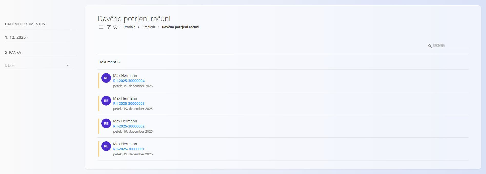

<!-- app_route: /sales/views/fiscal-invoices -->
<!-- app_label: Davčno potrjeni računi -->
<!-- canonical_source_url: https://github.com/Tom-PIT/Connected.Docs/blob/main/sl/Domene/Prodaja/Pregledi/DavcnoPotrjeniRacuni.md -->
<!-- canonical_source_title: Davčno potrjeni računi -->

# Davčno potrjeni računi

Pogled **Davčno potrjeni računi** prikazuje seznam **izdanih maloprodajnih računov**, ki so **fiskalizirani** in skladni z davčno zakonodajo.

Ti računi se običajno uporabljajo za **maloprodajo (B2C)** in so v skladu z lokalnimi pravili fiskalizacije prijavljeni davčnemu organu.

Za dostop do tega pregleda pojdite na **Prodaja / Pregledi / Davčno potrjeni računi** v [**navigaciji**](../../../Skupno/UI/Navigacija.md).

## Seznam davčno potrjenih računov

Seznam prikazuje vse davčno potrjene račune glede na izbrane filtre.

Vsak zapis vključuje:

- **Številka računa**  
- **Stranka**  
- **Datum izdaje**  

### Filtri

Za filtriranje seznama uporabite filtre na levi strani:

- **Datumi dokumentov** – filtriranje po časovnem obdobju  
- **Stranka** – filtriranje po stranki  

## Dejanja

### Ogled podrobnosti

Klik na **številko računa** odpre podroben pogled davčno potrjenega računa ([maloprodajni izdani račun](../Dokumenti/MaloprodajniRacuni.md)).