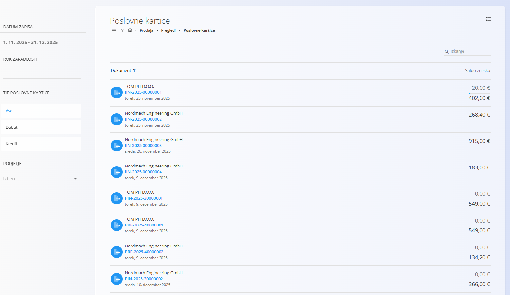
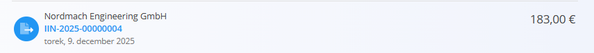
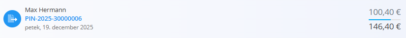
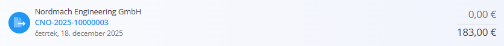

<!-- app_route: /customers/company-cards -->
<!-- app_label: Poslovne kartice -->
<!-- canonical_source_url: https://github.com/Tom-PIT/Connected.Docs/blob/main/sl/Domene/Prodaja/Pregledi/PoslovneKartice.md -->
<!-- canonical_source_title: Poslovne kartice -->

# Poslovne kartice

Pogled **Poslovne kartice** omogoča podroben pregled vseh **bremenitev in dobroimetij** po posameznih podjetjih. Namesto enotnega salda prikazuje **posamezne finančne dokumente** (npr. [izdani računi](../Dokumenti/IzdaniRacuni.md), [dobropisi](../Dokumenti/Dobropisi.md) in [bremepisi](../Dokumenti/Bremepisi.md)) ter njihov status plačila: **neplačano**, **delno plačano** ali **v celoti plačano**.

Ta pogled je namenjen **finančnemu nadzoru** ter omogoča pregled stanja plačil in **evidentiranje plačil neposredno s seznama**.

Za dostop do tega pogleda pojdite na **Prodaja / Pregledi / Poslovne kartice** v [navigaciji](../../../Skupno/UI/Navigacija.md).

Zaslon je dostopen tudi s strani [**Poslovni imenik**](../../../Skupno/Upravljanje/PoslovniImenik.md), s klikom na zavihek **Poslovne kartice** pri izbranem vnosu podjetja. V tem primeru bo seznam samodejno filtriran tako, da prikazuje samo zapise, povezane z izbranim podjetjem.

## Seznam poslovnih kartic

Vsaka vrstica predstavlja **en posamezen finančni dokument** za podjetje, ne povzetega salda.

- **Bremenitev** → Stranka dolguje sredstva vašemu podjetju.
- **Dobroimetje** → Vaše podjetje dolguje sredstva stranki (npr. zaradi preplačil ali dobropisov).

S klikom na posamezno vrstico se odpre povezani dokument (npr. **izdani račun**).

### Filtri

Leva stranska vrstica omogoča natančno filtriranje prikazanih zapisov:

- **Datum zapisa** – Filtrira dokumente po datumu nastanka.
- **Datum zapadlosti** – Filtrira dokumente po datumu zapadlosti.
- **Tip poslovne kartice**
    - *Vse*
    - *Debet*
    - *Kredit*
- **Podjetje** – Prikaže zapise izbranega podjetja.

## Prikaz statusa plačil

Poslovne kartice vizualno prikazujejo status plačila posameznega dokumenta z izpisom **plačanega zneska** in **skupnega zneska dokumenta**.

### V celoti plačani zapisi

Ko je dokument **v celoti plačan**, je prikazan samo skupni znesek dokumenta.

V tem primeru:

- dokument je v celoti poravnan,
- odprtih obveznosti ni več.

### Delno plačani zapisi

Pri **delno plačanih** dokumentih sta ločeno prikazana plačani znesek in skupni znesek dokumenta.

V tem primeru:

- **zgornji znesek** predstavlja **plačani znesek**,
- **spodnji znesek** predstavlja **skupni znesek dokumenta**.

### Neplačani zapisi

Če dokument **še ni plačan**, je plačani znesek prikazan kot **0,00**, skupni znesek dokumenta pa je prikazan spodaj.

To pomeni:

- plačilo še ni bilo evidentirano,
- celoten znesek dokumenta je še vedno odprt.

Ti vizualni prikazi omogočajo hiter pregled neplačanih, delno plačanih in v celoti plačanih dokumentov.

## Dejanja

### Evidentiranje plačila

Plačilo lahko evidentirate neposredno na seznamu, ne da bi odprli povezani dokument.

Kliknite na **plačani znesek**, vnesite novo vrednost in potrdite spremembo.

Primer:

- če je plačani znesek **0,00 €**, lahko vnesete **111,00 €**,
- sistem bo evidentiral, da je za izbrani dokument plačanih **111,00 €**,
- status dokumenta se samodejno posodobi glede na evidentirani znesek.

## Opombe

- Ta pogled združuje **bremenitve in dobroimetja** v enem seznamu za lažje spremljanje stanja plačil.
- Sprememba plačanega zneska evidentira plačilo za izbrani dokument.

Za podrobnejše informacije odprite povezani dokument:

- [**Izdani računi**](../Dokumenti/IzdaniRacuni.md)
- [**Dobropisi**](../Dokumenti/Dobropisi.md)
- [**Bremepisi**](../Dokumenti/Bremepisi.md)