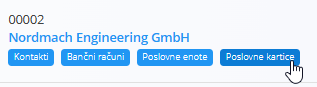
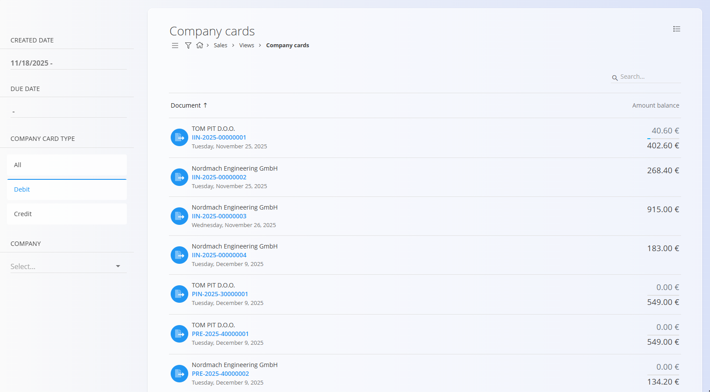
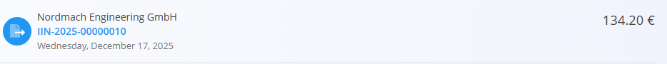

# Poslovne kartice

Pogled **Poslovne kartice** omogoča podroben pregled vseh **bremenitev in dobroimetij** po posameznih podjetjih. Namesto enotnega salda prikazuje **posamezne finančne dokumente** (npr. [izdani računi](../Dokumenti/IzdaniRacuni.md), [dobropisi](../Dokumenti/Dobropisi.md) in [bremepisi](../Dokumenti/Bremepisi.md)) ter njihov status plačila: **neplačano**, **delno plačano** ali **v celoti plačano**.

Ta pogled je namenjen **finančnemu nadzoru in usklajevanju** ter ne omogoča ustvarjanja ali urejanja dokumentov.

Za dostop do tega pogleda pojdite na **Prodaja / Pregledi / Poslovne kartice** v [**navigaciji**](../../../Skupno/UI/Navigacija.md).

Zaslon je dostopen tudi iz strani [**Poslovni imenik**](../../Skupno/Upravljanje/PoslovniImenik.md), s klikom na zavihek **Poslovne kartice** pri izbranem vnosu podjetja. V tem primeru bo seznam samodejno filtriran tako, da prikazuje samo zapise, povezane z izbranim podjetjem.

## Seznam poslovnih kartic

Vsaka vrstica predstavlja **en sam finančni zapis** za podjetje, ne povzetega salda.

- **Bremenitev** → Stranka dolguje sredstva vašemu podjetju  
- **Dobroimetje** → Vaše podjetje dolguje sredstva stranki (npr. preplačila, popravki)

S klikom na posamezno vrstico se odpre povezan dokument (npr. **izdani račun**), kjer je mogoče pregledati podrobnosti ali evidentirati plačila.

### Filtri

Leva stranska vrstica omogoča natančno filtriranje prikazanih zapisov:

- **Datum zapisa** – filtriranje po datumu nastanka dokumentov  
- **Datum zapadlosti** – filtriranje po datumu zapadlosti  
- **Tip poslovne kartice**  
  - *Vse*  
  - *Debet*  
  - *Kredit*  
- **Podjetje** – izbor posamezne stranke

## Prikaz statusa plačil

Poslovne kartice vizualno prikazujejo status plačila vsakega zapisa z izpisom **odprtega zneska** in **izvornega skupnega zneska**.

### V celoti plačani zapisi

Ko je dokument **v celoti plačan**, je prikazan le končni poravnani znesek, kar pomeni, da odprta obveznost ne obstaja.

V tem primeru:
- dokument je popolnoma poravnan,
- ni več odprtega zneska,
- prikazana vrednost predstavlja končni plačani znesek.

### Delno plačani zapisi

Pri **delno plačanih** dokumentih je prikazan ločen znesek za že plačani del in izvorni skupni znesek dokumenta.

V tem primeru:
- **zgornji znesek** predstavlja **že plačani znesek**,
- **spodnji znesek** predstavlja **skupni znesek dokumenta**.

### Neplačani zapisi

Če dokument **še ni bil plačan**, je odprti znesek prikazan kot **0,00**, celotna vrednost dokumenta pa je izpisana spodaj.

To pomeni:
- plačila še niso bila evidentirana,
- celoten znesek dokumenta je še vedno odprt.

Ti vizualni indikatorji omogočajo hiter pregled stanja brez odpiranja posameznih dokumentov.

## Postavke o uporabi

- Pogled združuje **bremenitve in dobroimetja** v enem seznamu, kar omogoča hiter pregled finančnega stanja po dokumentih.  
- Uporabite ga za spremljanje zapadlih terjatev, delnih plačil in kreditnih pozicij po strankah.

Za evidentiranje plačil ali popravke uporabite ustrezne dokumente, kot so:
- [**Izdani računi**](../Dokumenti/IzdaniRacuni.md)
- [**Dobropisi**](../Dokumenti/Dobropisi.md)
- [**Bremepisi**](../Dokumenti/Bremepisi.md)

---
