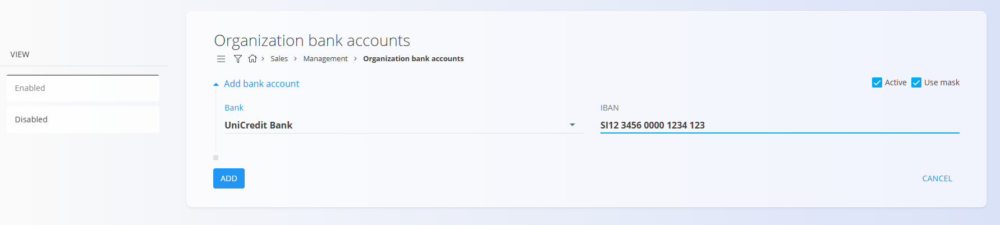

# Bančni računi organizacije

Šifrant **Bančni računi organizacije** hrani IBAN račune, ki jih vaše podjetje uporablja za izdajanje računov, prejemanje plačil in druge finančne procese. Ta zaslon omogoča pregled, dodajanje, omogočanje ali onemogočanje IBAN računov, ki jih uporablja organizacija.  
Vsak zapis določa banko, IBAN številko ter ali je račun aktiven in ali se uporablja maska za vnos IBAN-a.

Za dostop do tega zaslona pojdite na **Prodaja / Šifranti / Bančni računi organizacije** v [**navigaciji**](../../../Skupno/UI/Navigacija.md).

> [!NOTE]  
> **Predpogoji**  
> Pred upravljanjem bančnih računov zagotovite, da je šifrant [**Banke**](../../../Skupno/Upravljanje/BancniRacuni.md) pravilno nastavljen.

## Shema

| Polje | Opis |
|------|------|
| [**Banka**](../../../Skupno/Upravljanje/BancniRacuni.md) | Banka, pri kateri je odprt račun (obvezno). |
| **IBAN** | Mednarodna številka bančnega računa (obvezno). |
| **Aktiven** | Določa, ali je račun na voljo za uporabo v dokumentih (privzeto označeno). |
| **Uporabljaj IBAN masko** | Določa, ali se IBAN prikazuje in vnaša z vnosno masko za boljšo berljivost. |

## Upravljanje

### Seznam bančnih računov

Zaslon prikazuje seznam bančnih računov. Na levi strani lahko račune filtrirate glede na stanje:
- **Omogočeno**
- **Onemogočeno**

S klikom na IBAN številko odprete urejanje izbranega bančnega računa.

## Dejanja

Za dodajanje novega bančnega računa kliknite [Akcijski gumb](../../../Skupno/UI/AkcijskiGumb.md).

### Dodaj nov bančni račun

Vnesite zahtevane podatke:
- **Banka**
- **IBAN**
- **Aktiven**
- **Uporabljaj IBAN masko** (neobvezno)

## Brisanje
  
Na zaslonu za urejanje kliknite **Izbriši**, da se odpre potrditveno okno:

**Ali ste prepričani, da želite izbrisati ta zapis?**

Ob potrditvi se zapis trajno izbriše, v nasprotnem primeru ostane nespremenjen.

> [!NOTE]  
> Bančni račun je mogoče izbrisati le, če ni uporabljen ali referenciran v drugih delih sistema.

---
