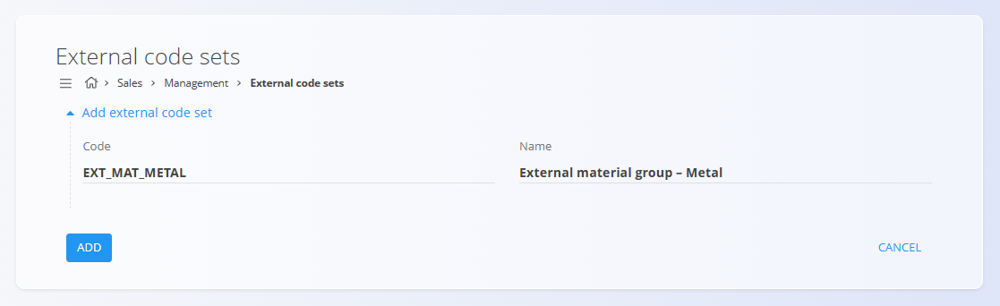

<!-- app_route: /management/common-types/external-code-sets -->
<!-- app_label: Kode namenov plačil -->
<!-- canonical_source_url: https://github.com/Tom-PIT/Connected.Docs/blob/main/sl/Domene/Prodaja/Upravljanje/KodeNamenovPlacil.md -->
<!-- canonical_source_title: Kode namenov plačil -->

# Kode namenov plačil

Zaslon **Kode namenov plačil** omogoča definiranje nastavljivih kod, ki se uporabljajo za preslikavo internih podatkov v **zunanje sisteme, partnerje ali klasifikacije**.  
Te kode se najpogosteje uporabljajo pri integracijah s tretjimi sistemi, kot so ERP sistemi, bančni sistemi, poslovni partnerji ali industrijske klasifikacije.

Za dostop do tega zaslona pojdite na **Prodaja / Upravljanje / Kode namenov plačil** v [navigaciji](../../../Skupno/UI/Navigacija.md). :contentReference[oaicite:0]{index=0}

> [!NOTE]
> Kode namenov plačil same po sebi nimajo vnaprej določenega pomena. Njihova interpretacija je odvisna od tega, kako in kje so uporabljene v drugih dokumentih ali integracijah.

## Shema

| Polje | Opis |
|------|------|
| **Koda** | Enolična identifikacija nabora kod, uporabljena za reference in integracije. |
| **Naziv** | Opisni naziv, ki pojasnjuje namen nabora kod. |

## Upravljanje

### Seznam kod namenov plačil

Seznam prikazuje vse definirane kode namenov plačil.

Vsaka vrstica vsebuje:
- **Kodo**
- **Naziv**

Seznam podpira iskanje po kodi ali nazivu.

## Dejanja

### Ustvariti kodo namena plačila

Za ustvarjanje nove kode namena plačila:

1. Kliknite [akcijski gumb](../../../Skupno/UI/AkcijskiGumb.md).
2. Vnesite **Kodo** in **Naziv**.
3. Kliknite **Dodaj**, da shranite vnos.

### Urediti kodo namena plačila

Za urejanje obstoječe kode namena plačila kliknite njeno **Kodo** v seznamu, da jo odprete v načinu urejanja.  
Po potrebi lahko posodobite **Kodo** ali **Naziv**.

Kliknite **Shrani**, da uveljavite spremembe, ali **Prekliči**, da jih zavrnete.

### Brisati kodo namena plačila

Kliknite ime kode, ki jo želite izbrisati, nato kliknite **Izbriši** v pogledu urejanja. Po potrditvi bo koda odstranjena iz sistema.

> [!NOTE]
> Kodo namena plačila je mogoče izbrisati samo, če ni uporabljena v preslikavah, dokumentih ali integracijah.
