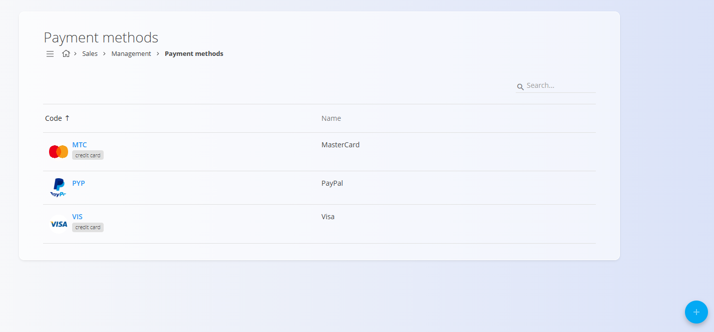

# Način plačila

Šifrant **Način plačila** določa načine, s katerimi lahko stranke poravnajo plačilo za blago ali storitve – na primer kreditne kartice, spletna plačila ali druge podprte načine. Vsak način vključuje **šifro**, **naziv**, neobvezne **oznake** in naloženo **ikono**, ki predstavlja ponudnika plačila. Ti zapisi se uporabljajo povsod v sistemu, kjer je potrebno izbrati način plačila.

Za dostop do te strani pojdite na **Prodaja / Šifranti / Način plačila** v [**navigaciji**](../../../Skupno/UI/Navigacija.md).

## Shema

| Polje | Opis |
|------|------|
| [**Šifra**](../../../Skupno/UI/SifreDokumentov.md) | Kratek identifikator načina plačila (obvezno). |
| **Naziv** | Polno prikazno ime načina plačila (obvezno). |
| **Tags** | Neobvezne oznake za razvrščanje (npr. *kreditna kartica*, *spletno plačilo*). |
| **Slika / ikona** | Neobvezen logotip, naložen za vizualno predstavitev načina plačila. |

## Upravljanje

### Seznam

Seznam prikazuje vse obstoječe načine plačila, skupaj z njihovo **šifro**, **nazivom** ter morebitnimi **oznakami** ali **ikonami**.

Za hitro filtriranje načinov plačila po kodi ali nazivu lahko uporabite iskalno polje **Iskanje**.

## Dejanja

### Dodaj nov način plačila

Kliknite **akcijski gumb**, da odprete obrazec za ustvarjanje. Vnesete lahko osnovne podatke ter naložite logotip ali ikono ponudnika plačila.

### Urejanje načina plačila

S klikom na posamezen način plačila v seznamu se odpre zaslon za urejanje.

Tam lahko spremenite šifro, naziv, oznake ali zamenjate naloženo sliko.

### Brisanje

Na zaslonu za urejanje kliknite **Izbriši**, da se odpre potrditveno okno:

**Ali ste prepričani, da želite izbrisati ta zapis?**

Ob potrditvi se zapis trajno izbriše, v nasprotnem primeru ostane nespremenjen.

> [!NOTE]  
> Način plačila je mogoče izbrisati le, če ni uporabljen v odvisnih dokumentih ali nastavitvah.

---
