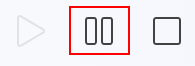

<!-- app_route: /production-orders/execution -->
<!-- app_label: Izvedba -->
<!-- canonical_source_url: https://github.com/Tom-PIT/Connected.Docs/blob/main/sl/Domene/Proizvodnja/Dokumenti/Izvedba.md -->
<!-- canonical_source_title: Izvedba -->

# Izvedba

Modul **Izvedba** uporabljajo proizvodni delavci za izvajanje in beleženje dela na dodeljenih proizvodnih nalogih. Omogoča sprotno spremljanje napredka, proizvedenih količin, [zastojev](Zastoj.md), [slabih kosov](SlabiKosi.md), [kvalitete](Kvaliteta.md) in drugih aktivnosti.

Večina proizvodnih delavcev je ob prijavi samodejno preusmerjena na pogled Izvedba.

> [!TIP]
> Za celovit prikaz si oglejte video vodič **[Izvedba](https://www.youtube.com/watch?v=qf0Ftar4hAg&list=PLH4LYaWds6h8kspUco0t_MaFPNbL0zj1D&index=28)**.

Za ročni dostop pojdite na **Proizvodnja / Izvedba** v [navigaciji](../../../Skupno/UI/Navigacija.md).

> [!NOTE]
> - Ob odprtju zaslon običajno samodejno prikaže dodeljene proizvodne naloge. Če se ne prikaže nobena, kliknite **Izberi proizvodne naloge**.
>   
>   
> - Če je seznam proizvodnih nalogov prazen, za izbrano enoto ni razpoložljivih nalogov (še niso ustvarjeni ali nimajo aktivnih operacij). Naloge ustvarite v **[Proizvodni nalogi](ProizvodniNalogi.md)** in preverite, da je operacija dodeljena izbrani enoti.
> - Če je seznam organizacijskih enot prazen, šifrant še ni definiran. Enote definirajte v **[Organizacijske enote](../../../Skupno/Upravljanje/PoslovneEnote.md)**.

## Pregled uporabniškega vmesnika izvedbe

Glavni zaslon izvedbe prikazuje ključne informacije za trenutni proizvodni nalog in operacijo.

| Št. | Opis |
|----|------|
| **1** | Prijavljeni uporabnik in **organizacijska enota**.  • Klik na sliko uporabnika → odjava  • Klik na organizacijsko enoto → sprememba (glej [Organizacijske enote](../../../Skupno/Upravljanje/PoslovneEnote.md)) |
| **2** | Gumbi za upravljanje operacije:  • **Začni** – začne operacijo  • **Premor** – začasno ustavi delo  • **Ustavi** – zaključi operacijo |
| **3** | Bližnjice:  • **Rumeni koš** – beleženje slabih kosov  • **Oranžni trikotnik** – odprti zastoji ali težave |
| **4** | Trenutni proizvodni nalog |
| **5** | Trenutna operacija |
| **6** | Podatki o seriji |
| **7** | Trenutni izhod operacije in tisk etiket |
| **8** | Napredek proizvodnje (proizvedeno / planirano) |
| **9** | Trenutno zabeleženi slabi kosi |
| **10** | Preostala količina za dokončanje (ureljiva) |
| **11** | Gumb **Proizvedi** — zabeleži proizvedeno količino |
| **12** | Gumb za aktivnosti, ki vodi na izbor aktivnosti |

### Upravljanje operacije

## Proces izvedbe

### Začeti proizvodnjo

Operacijo lahko začnete na dva načina:

#### **1. Klik na Začni**

Kliknite **Začni**, da pričnete operacijo.

#### **2. Klik na Proizvedi (samodejni začetek)**

Če kliknete **Proizvedi**, sistem:

- samodejno začne operacijo  
- zabeleži količino prikazano nad gumbom  
- posodobi preostalo količino  
- če je privzeta količina enaka planirani in je ne spremenite, sistem zabeleži **vse preostale kose kot proizvedene**
  
  

### Začasno ustaviti proizvodnjo

Kliknite **Premor**, da začasno ustavite operacijo. To **ne zaključi** proizvodnje — le prekine jo do nadaljevanja.

### Kontrolni seznami in kakovost

Kontrolni seznami **[kontrolnih list](../../Kvaliteta/Upravljanje/KontrolneListe.md)** zagotavljajo varnost in kakovost izdelkov. Če je za operacijo zahtevan kontrolni seznam, se samodejno prikaže ob pravem času (na začetku, med izvajanjem ali pred zaključkom).

Delavci potrdijo vsak korak v skladu z definicijo kontrolnega seznama.

> [!NOTE]
> Če poskušate ustaviti operacijo, ko je obvezen kontrolni seznam neizpolnjen, vas bo sistem najprej pozval k njegovi izpolnitvi.

## Akcijski meni in aktivnosti

Plavajoči [akcijski gumb](../../../Skupno/UI/AkcijskiGumb.md) v spodnjem desnem kotu odpre meni za izbor aktivnosti.

Na voljo so naslednje možnosti:

- **Proizvodnja** – glavni zaslon izvedbe  
- **[Poraba](Poraba.md)** – beleženje porabe vhodov
- **[Slabi kosi](SlabiKosi.md)** – beleženje slabih ali neuporabnih kosov  
- **[Zastoj](Zastoj.md)** – beleženje prekinitev proizvodnje  
- **[Kvaliteta](Kvaliteta.md)** – pregled in izpolnjevanje kontrol kakovosti  
- **[Delo](Delo.md)** – beleženje delovnega časa  
- **[Navodila](Navodila.md)** – ogled navodil za operacijo  

Vsaka možnost je podrobneje opisana spodaj.

### Proizvodnja (glavni zaslon)

Možnost **Proizvodnja** vas vrne na glavni zaslon izvedbe, kjer beležite proizvedene kose.

### Poraba

Beleženje porabe vhodov za trenutno operacijo. Glejte **[Poraba](Poraba.md)** za podroben vodič.

### Slabi kosi

Beleženje slabih ali neuporabnih kosov. Glejte **[Slabi kosi](SlabiKosi.md)**.

### Zastoj

Beleženje prekinitev proizvodnje. Glejte **[Zastoj](Zastoj.md)**.

### Kvaliteta

Pregled in ponavljanje kontrol kakovosti. Glejte **[Kvaliteta](Kvaliteta.md)**.

### Delo

Beleženje delovnega časa. Glejte **[Delo](Delo.md)** za samodejne in ročne vnose.

### Navodila

Ogled navodil, povezanih s trenutno operacijo. Glejte **[Navodila](Navodila.md)**.

## Zaključiti izvedbo

Kliknite **Ustavi**, da zaključite trenutno operacijo.

Pred zaključkom operacije preverite, da:

* So proizvedene vse zahtevane količine
* So zabeleženi vsi slabi kosi in zastoji
* So zaključene vse kontrole kakovosti

Ko je operacija zaključena, preide v stanje **Zaključeno**.

Če operacijo ustavite pred doseženo planirano količino, se operacija zaključi z delno proizvodnjo.

Ko so zaključene vse operacije proizvodnega naloga, se proizvodni nalog premakne v stanje **Zaključen**.

