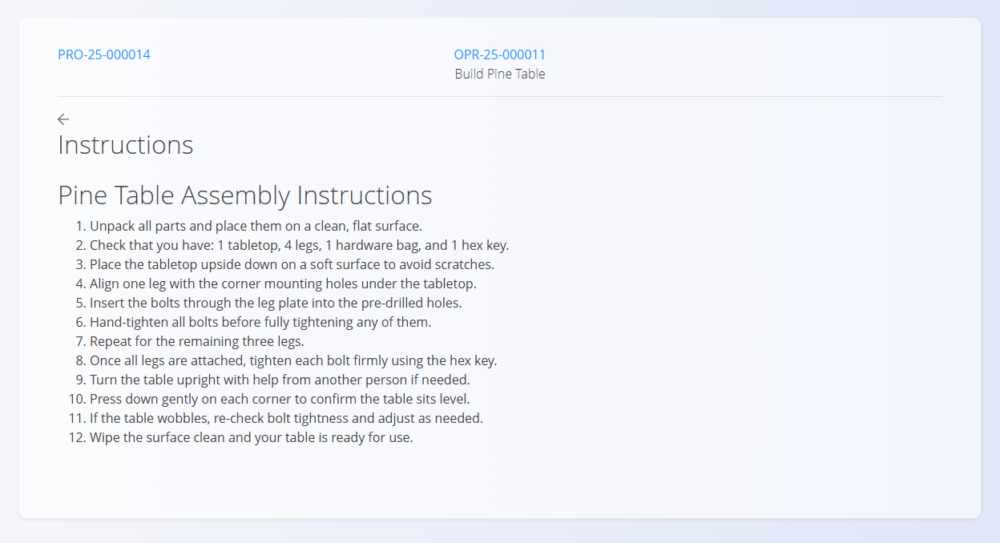

<!-- app_route: /production-orders/execution -->
<!-- app_label: Izvedba -->
<!-- canonical_source_url: https://github.com/Tom-PIT/Connected.Docs/blob/main/sl/Domene/Proizvodnja/Dokumenti/Navodila.md -->
<!-- canonical_source_title: Navodila -->

# Navodila

Aktivnost **Navodila** prikazuje članke iz baze znanja, ki so povezani s trenutno operacijo (npr. koraki sestave, varnostna navodila, vizualni prikazi). Namenjena je hitremu pregledu navodil med delom.

**Navodila** odprete na zaslonu [**Izvedba**](Izvedba.md) prek izbire aktivnosti (tapnite [**akcijski gumb**](../../../Skupno/UI/AkcijskiGumb.md) in izberite **Navodila**).

## Ogled navodil

1. Odprite stran **Navodila** prek [**menija aktivnosti v Izvedbi**](Izvedba.md#akcijski-meni-in-aktivnosti).

   

2. Preberite vsebino, povečajte slike in sledite navodilom.  
3. Ko končate, se vrnite na zaslon [**Izvedba**](Izvedba.md) prek akcijskega gumba → **Proizvedeno**.

## Tipična vsebina

Članki z navodili lahko vključujejo:

- korake sestave  
- varnostne postopke in opozorila  
- vizualna navodila (fotografije, risbe)  
- opombe, specifične za operacijo ali izdelek  

> [!NOTE]
> Vsebino člankov lahko posodabljajo pooblaščeni uporabniki v domeni  
> [**Baza znanja**](../../Znanje/BazaZnanja/BazaZnanja.md).

## Urejanje in posodobitve

Vsebina navodil za posamezno operacijo se upravlja v nastavitvah operacije.  
Za posodobitev odprite [**Operacije**](../Upravljanje/Procesi.md) in v polju **Članek** povežite ustrezno vsebino iz [**Baze znanja**](../../Znanje/BazaZnanja/BazaZnanja.md).