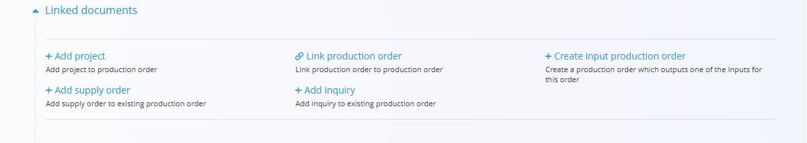
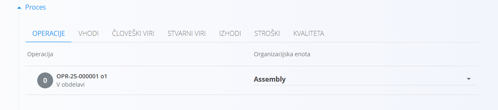
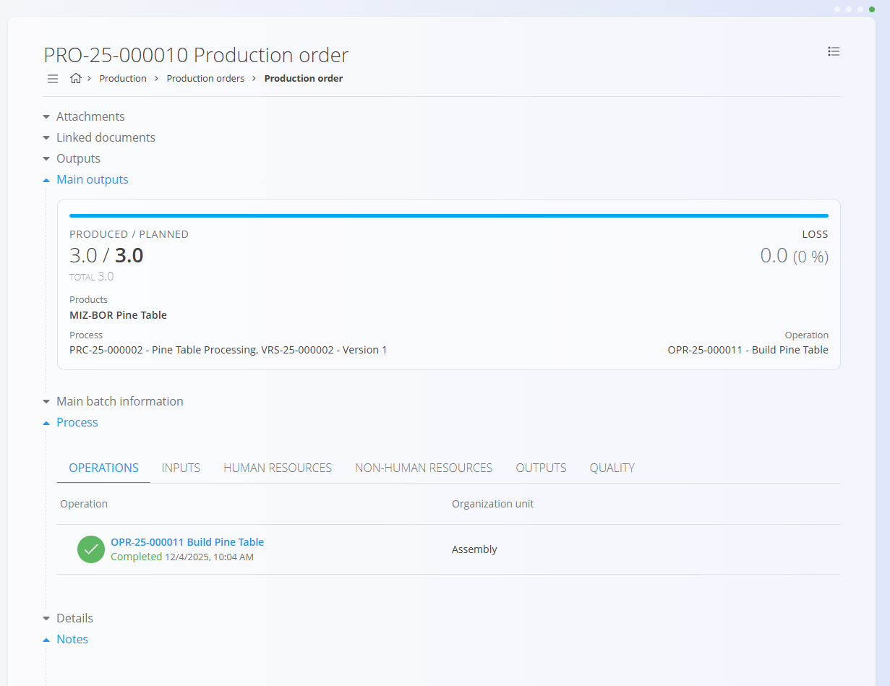

<!-- app_route: /production-orders -->
<!-- app_label: Proizvodni nalogi -->
<!-- canonical_source_url: https://github.com/Tom-PIT/Connected.Docs/blob/main/sl/Domene/Proizvodnja/Dokumenti/ProizvodniNalogi.md -->
<!-- canonical_source_title: Proizvodni nalogi -->

# Proizvodni nalogi

Proizvodni nalogi določajo delo, potrebno za izdelavo izdelkov glede na izbrani proces in verzijo.  
Premikajo se skozi življenjski cikel **Osnutek → V pripravi → Aktiven → Zaključen** in lahko vključujejo več operacij, virov, vhodov, izhodov in kontrol kakovosti glede na dodeljen proces.

> [!NOTE]
> **Predpogoji**  
>
> Pred ustvarjanjem novega proizvodnega naloga zagotovite, da je naslednje že nastavljeno:
> - Vsaj en **[Proces](../Upravljanje/Procesi.md)** z aktivno **verzijo**
> - Dodeljene **[Organizacijske enote](../../../Skupno/Upravljanje/PoslovneEnote.md)** za proizvodnjo  
> - Po potrebi dodatne definicije, kot so **[viri](../Upravljanje/Viri.md)**, **[oznake zastojev](../Upravljanje/OznakeZastojev.md)**, **[oznake klasifikacije slabega kosa](../Upravljanje/OznakeKlasifikacijeSlabegaKosa.md)** in **[kontrolne liste](../Upravljanje/KontrolneListe.md)** glede na potek dela (priporočeno)

> [!TIP]
> Za celovit prikaz si oglejte video vodič **[Proizvodni nalog](https://www.youtube.com/watch?v=q4UjiYpWph8)**.

Do proizvodnih nalogov dostopate preko **Proizvodnja / Proizvodni nalogi** v [navigaciji](../../../Skupno/UI/Navigacija.md).

## Seznam proizvodnih nalogov

Stran Proizvodni nalogi prikazuje vse naloge, razvrščene po statusu. Za natančnejši prikaz uporabite filtre na levi strani.

### Razpoložljivi filtri

- **Datumi proizvodnih nalogov** – Filtriranje nalogov po časovnem obdobju.  
- **Pogled** – Prikaz nalogov glede na fazo življenjskega cikla:  
  - **Osnutek** — Urejevalni nalog, ustvarjen preko čarovnika
  - **V pripravi** — Zaključen nalog, pripravljen za aktivacijo
  - **Aktiven** — V izvajanju; viden v **[Izvedbi](Izvedba.md)**
  - **Zaključen** — Zaključen; rezultati so zabeleženi
- **Projekt** – Filtriranje proizvodnih nalogov, povezanih z določenim projektom

Iskalno polje na vrhu omogoča filtriranje po šifri proizvodnega naloga ali nazivu materiala.

## Dodati proizvodnega naloga

Za ustvarjanje proizvodnega naloga, kliknite [akcijski gumb](../../../Skupno/UI/AkcijskiGumb.md) in uporabite [vodeni čarovnik za ustvarjanje](ProizvodniNalogiUstvarjanje.md).

## Osnutki proizvodnih nalogov

Novo ustvarjen nalog ima status **Osnutek**.

V osnutku je mogoče urejati:

- Šifro
- Količino  
- Serijo
- Datum uporabnosti
- Opombe
- Proces
- Verzija

### Objaviti osnutek

Za prehod v stanje **V obdelavi** mora biti izbrana **Organizacijska enota**, če ni še definirala v [operacijo](../Upravljanje/Operacije.md).

Ko je pripravljeno, kliknite **Objavi**.

## Urediti proizvodni nalog

Osnutke nalogov lahko prosto urejate, medtem ko je urejanje aktivnih in zaprtih nalogov omejeno. Če želite urediti nalog:

1. Kliknite nalog na seznamu, da odprete njegove podrobnosti.
2. Izvedite potrebne spremembe.
3. Kliknite **Shrani**, da uporabite spremembe, ali **Prekliči**, da jih zavržete.

## Proizvodni nalogi v obdelavi

Nalogi v stanju **V obdelavi** so v celoti pripravljeni in čakajo na aktivacijo. Izvajanje proizvodnje še ni mogoče.

V tem stanju lahko:

- Pregledujete operacije  
- Dodajate priloge  
- Dodajate opombe  
- Upravljate povezane dokumente

Ko je nalog pripravljen za proizvodnjo, kliknite **Aktiviraj**.

## Povezani dokumenti

Na proizvodni nalog lahko pripnete druge povezane dokumente, kot so:

- [**Projekti**](../../Projekti/Domena/DomenaProjektov.md)  
- [**Nabavni nalogi**](../../Nabava/Dokumenti/NabavniNalogi.md)
- [**Povpraševanja**](../../Nabava/Dokumenti/Povprasevanja.md)
- Drugi proizvodni nalogi (povezani ali kot vhodni)

Proizvodni nalogi prikazujejo tudi vse dokumente, ustvarjene med življenjskim ciklom naloga, kot so stroškovna in porabna poročila.

## Aktivni proizvodni nalogi

Po aktivaciji nalog postane **Aktiven** in je pripravljen za izvajanje v proizvodnji.

Proizvodni delavci lahko zdaj izvajajo operacije v modulu **Izvedba**.  
Za več informacij glejte **[Izvedba](Izvedba.md)**.

Razdelek **Proces** prikazuje vse planirane [operacije](../Upravljanje/Operacije.md), [vhode](../Upravljanje/Vhodi.md), vire, izhode, [stroške](ProizvodniNalogiStroski.md) in [kontrole kakovosti za izbrano verzijo](ProizvodniNalogiKvaliteta.md).

> [!OPOMBA]
> Vhodni in izhodni razdelki:
> - Prikazujejo **planiranje** in **dejanske** količine. Planirana količina je določena z izbrano različico procesa in količino naročila, medtem ko dejanska količina odraža podatke o izvedbi proizvodnje.
> - Prikazujejo **zaloge** materialov, kar delavcem omogoča preverjanje razpoložljivosti pred začetkom proizvodnje.

Klik na operacijo odpre podroben pogled, kjer lahko delavci beležijo podatke o izvedbi, kot so:

- **Proizvodnja**
- **Poraba**
- **Slabi kosi**
- **Delo**

Vsak razdelek ima gumb **Dodaj vnos** za beleženje podrobnosti izvedbe. Na primer, v razdelku **Proizvodnja** lahko zabeležite proizvedeni material, količino in čase proizvodnje.

### Stroški

**[Stroški proizvodnega naloga](ProizvodniNalogiStroski.md)** omogočajo spremljanje planiranih in dejanskih operativnih stroškov. 

### Kakovost

Razdelek [**Kakovost**](ProizvodniNalogiKvaliteta.md) prikazuje vse [**kontrolne sezname**](../Upravljanje/KontrolneListe.md), povezane z izbranim proizvodnim nalogom.

## Zaključeni proizvodni nalogi

Ko je proizvodnja zaključena in so vse operacije izvedene, se nalog prestavi v stanje **Zaključen**.

Seznam prikazuje tudi strošek na enoto in puščico, ki označuje povečanje ali zmanjšanje stroška v primerjavi s prejšnjim zaključenim nalogom za isti material. Klik na strošek na enoto odpre pogled [**Stroški opravil**](../../Viri/Pregledi/StroskiOpravil.md), filtriran na izbrani nalog, kar omogoča analizo porazdelitve stroškov delovnega naloga in podroben pregled stroškov.

Zaključeni nalogi:

- Ne omogočajo več urejanja  
- Nudijo popolno zgodovino proizvodnje  
- Prikazujejo proizvedene in planirane količine, izgube ter izhode

Razdelek **Proces** prikazuje celotno zgodovino izvedbe. S klikom na zavihke si lahko ogledate podrobnosti, npr. uporabljene vhode:

Zaključeni proizvodni nalogi ponujajo dodatne možnosti v akcijskem meniju:

- Tiskanje
- Izvoz (PDF)
- Povrni v aktivno stanje – omogoča ponovno odprtje naloga za popravke

### Povrniti proizvodni nalog v aktivno stanje

Če so po zaključku potrebne spremembe, lahko nalog povrnete v stanje **Aktiven**:

1. Odprite zaključen proizvodni nalog
2. V akcijskem meniju izberite **Povrni v aktivn**
3. Kliknite **Ponovno Aktiviraj** pri želenem procesu

## Izbrisati proizvodni nalog

Proizvodni nalog je mogoče izbrisati samo v stanju **Osnutek** ali **V pripravi** in le, če nanj niso vezani drugi dokumenti.

Za izbris:

1. Odprite proizvodni nalog v stanju **Osnutek** ali **V pripravi**.
2. Kliknite **Izbriši**. Pojavi se potrditveno okno. Če potrdite, bo nalog trajno odstranjen iz sistema.

> [!NOTE]
>
> Zaključenih nalogov ni mogoče izbrisati, lahko pa jih po potrebi povrnete v aktivno stanje za popravke.

## Meni

Na tej strani so dejanja menija na voljo na dveh mestih.

### Meni seznama

Meni seznama omogoča dejanja za trenutno prikazan seznam.

Na voljo so naslednja dejanja:

- **Masovno procesiranje statusov** – omogoča hkratno spreminjanje statusov več nalogov (npr. iz Osnutek v V pripravi)

### Meni dokumenta

Meni dokumenta omogoča dejanja za trenutno odprt dokument.

Na voljo so naslednja dejanja:

- **Tiskanje**
- **Izvoz v PDF**
- **Povrni v aktiven** (samo za zaključen nalog) 

Za podrobnosti o dejanjih menija glejte [**Dejanja menija**](../../../Skupno/Koncepti/MeniDejanja.md).
