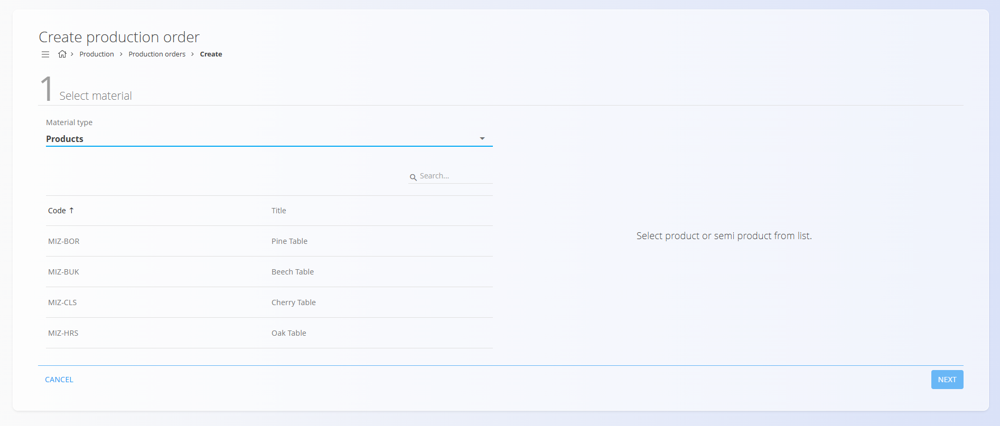
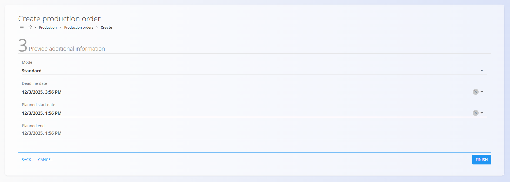
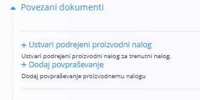

<!-- app_route: /production-orders/create -->
<!-- app_label: Ustvari nov proizvodni nalog -->
<!-- canonical_source_url: https://github.com/Tom-PIT/Connected.Docs/blob/main/sl/Domene/Proizvodnja/Dokumenti/ProizvodniNalogiUstvarjanje.md -->
<!-- canonical_source_title: Dodati nov proizvodni nalog -->

# Dodati nov proizvodni nalog

Za ustvarjanje novega proizvodnega naloga, kliknite [**akcijski gumb**](../../../Skupno/UI/AkcijskiGumb.md) v zaslonu [**Proizvodni nalogi**](ProizvodniNalogi.md) in sledite vodenemu tristopenjskemu čarovniku:

## Koraki konfiguracije

### **1. korak — Izberi material**

Izberite **Tip materiala** (npr. Izdelki ali Polizdelki), nato izberite konkreten [**material**](../../Sredstva/Domena/Materiali.md) in količino, ki jo želite proizvesti.

### **2. korak — Izberi proces**

Izberite **[Proces](../Upravljanje/Procesi.md)** in **verzijo procesa**, ki določa način izdelave materiala.

> [!NOTE]
> Če v tem koraku ni prikazan noben proces, preverite nastavitve v šifrantu **[Procesi](../Upravljanje/Procesi.md)**.  
> Prepričajte se, da ima proces oznako »Proizvodnja« in aktivno verzijo. Manjkajoča oznaka je pogost razlog, da se proces tukaj ne prikaže.

### **3. korak — Podaj dodatne informacije**

Ta korak določa način izvajanja in časovni razpored.

#### **Način**

Določa obnašanje proizvodnega naloga:

- **Standardni** — Ustvari en sam proizvodni nalog za celotno količino.
- **Krovni** — Ustvari nadrejeni (glavni) nalog, ki služi samo kot vsebnik podrejenih nalogov. Nadrejeni nalog **nima operacij** in se ne izvaja. Podrejena naročila se ustvarijo ročno in imajo lahko različne [različice procesa](../Upravljanje/Procesi.md#verzije) kot nadrejeno. Če želite ustvariti podrejeno naročilo, pojdite na **Povezani dokumenti** → **Ustvari podrejeni proizvodni nalog**.

    

- **Krovni z delnimi izdelavami** — Ustvari nadrejeni nalog in samodejno generira več podrejenih proizvodnih nalogov, kjer vsak izdela del celotne količine.  
  Prikažeta se dve polji:
  - **Število delnih proizvodnj** — koliko podrejenih nalogov se ustvari  
  - **Količina delne proizvodnje** — samodejno izračunana glede na skupno količino
- **Delne izdelave** — Samodejno ustvari več proizvodnih nalogov, od katerih vsako proizvede del skupne količine, ne da bi ustvarilo nadrejeno naročilo. Prikažeta se isti polji kot v prejšnjem načinu.

**Primer:**  
Če je skupna količina = **6 kosi**
- 3 delne proizvodnje → vsaka = **2 kosi**
- 2 delni proizvodnji → vsaka = **3 kosi**

#### **Datumi**

Določite podatke za razporejanje za potrebe [planiranja](../../Planiranje/Pregledi/Planiranje.md) (neobvezno):

- **Rok izdelave** – datum, do katerega mora biti proizvodnja zaključena.  
- **Planiran začetek** – kdaj naj bi se proizvodnja začela.  
- **Planiran konec** – kdaj naj bi se proizvodnja zaključila; izpolni se samodejno glede na izbran [proces](../Management/Processes.md) in njegove časovne nastavitve.  

Kliknite **Zaključi**, da ustvarite proizvodni nalog v statusu **Osnutek**.