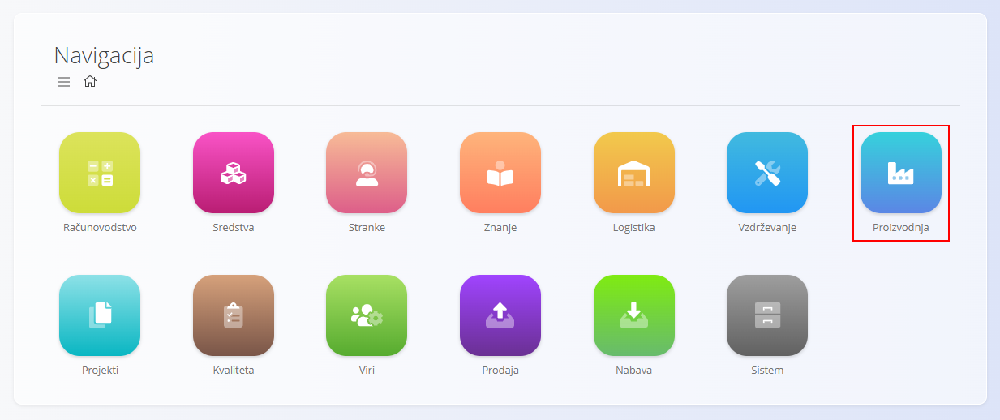
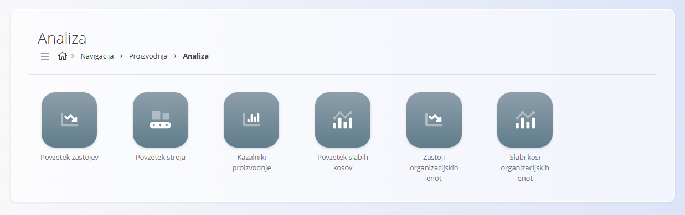
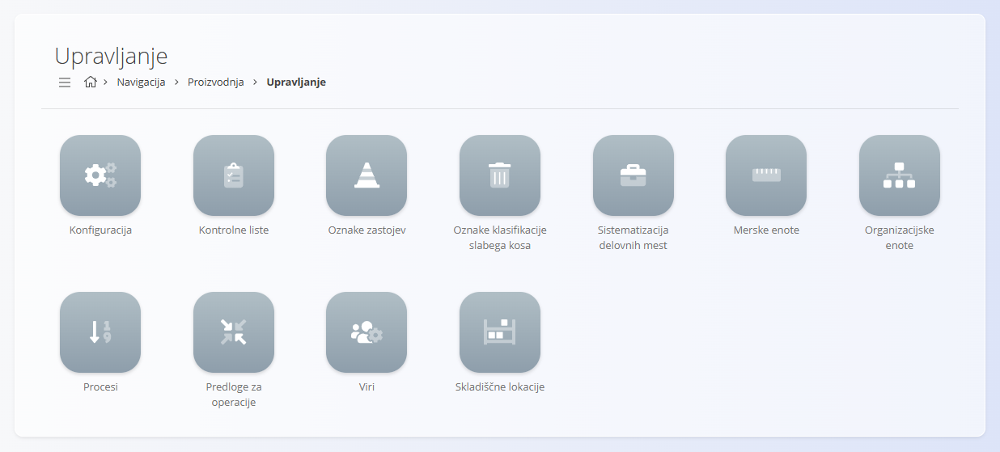

<!-- app_route: /sitemap/production -->
<!-- app_label: Proizvodnja -->
<!-- canonical_source_url: https://github.com/Tom-PIT/Connected.Docs/blob/main/sl/Domene/Proizvodnja/Domena/Proizvodnja.md -->
<!-- canonical_source_title: Proizvodnja -->

# Proizvodnja

Domena **Proizvodnja** upravlja vse procese, povezane s proizvodnjo, izvajanjem na proizvodnih linijah
in analizo proizvodnje. Vključuje orodja za planiranje in izdajanje proizvodnih nalogov,
izvajanje operacij, sledenje porabi in proizvodnji ter pregled analitičnih kazalnikov uspešnosti.

Medtem ko domena **[Nabava](../../Nabava/Domena/Nabava.md)** zagotavlja razpoložljivost materialov,
domena Proizvodnja skrbi, da se ti materiali pretvorijo v končne ali polizdelke
prek nadzorovanih in sledljivih delovnih tokov.

Do domene Proizvodnja dostopate prek **Proizvodnja** v
[**navigaciji**](../../../Skupno/UI/Navigacija.md).

> [!NOTE]
> Razpoložljivost proizvodnih funkcionalnosti je odvisna od konfiguracije proizvodnje,
> procesov in nastavitev virov v podjetju.

## Kaj vključuje domena Proizvodnja?

Domena je organizirana v naslednja funkcionalna področja:

- **[Proizvodni nalogi](../Dokumenti/ProizvodniNalogi.md)** – definicija in izvajanje proizvodnega dela
- **[Izvedba](../Dokumenti/Izvedba.md)** – sprotno poročanje o dejavnostih na proizvodnih linijah
- **[Zahteve](../Dokumenti/Zahteve.md)** – agregirane materialne potrebe za planirano proizvodnjo
- **[Analiza](#analiza)** – vpogled v zastoje, uspešnost, izgube, OEE in kazalnike
- **[Upravljanje](#upravljanje)** – konfiguracija, zasnova procesov in šifranti

## Proizvodni nalogi

Razdelek **[Proizvodni nalogi](../Dokumenti/ProizvodniNalogi.md)** vsebuje osrednje dokumente
za planiranje in izvajanje proizvodnje. Omogoča definicijo:
kaj se proizvaja, po kateri verziji procesa, v kakšni količini in pod katerimi pogoji.

Proizvodni nalogi prehajajo skozi življenjski cikel
**Osnutek → V obdelavi → Aktiven → Zaključen**
in predstavljajo osnovo za vse izvajalne aktivnosti.

## Izvedba

Modul **[Izvedba](../Dokumenti/Izvedba.md)** uporabljajo proizvodni delavci za sprotno poročanje:
proizvedene količine, porabljene materiale, zastoje, izgube, kontrolne sezname in napor.

Izvedba zagotavlja natančno zbiranje podatkov, kar omogoča zanesljivo analitiko in sledljivost.

## Zahteve

Stran **[Zahteve](../Dokumenti/Zahteve.md)** združuje vse planirane materialne vhode
za proizvodne naloge v izbranem obdobju. Prikazuje:

- zahtevane in razpoložljive količine materialov
- zahteve, združene po materialih
- neposredne povezave do proizvodnih nalogov in operacij,
  ki te materiale porabljajo

## Analiza

Razdelek **Analiza** omogoča vpogled v uspešnost proizvodnje, zastoje,
kakovost, porazdelitev izgub in OEE.

Na voljo so naslednji analitični pregledi:

- **[Povzetek zastojev](../Analiza/PovzetekZastojev.md)** – pregled vzrokov zastojev, trajanj in vpliva
- **[Povzetek stroja](../Analiza/PovzetekStroja.md)** – razpoložljivost, čas obratovanja in izkoriščenost strojev
- **[Kazalniki proizvodnje](../Analiza/KazalnikiProizvodnje.md)** – pretok, izmet, čas cikla in kazalniki učinkovitosti
- **[Povzetek slabih kosov](../Analiza/PovzetekSlabihKosov.md)** – porazdelitev slabih kosov po kategorijah
- **[Zastoji organizacijskih enot](../Analiza/ZastojiOrganizacijskihEnot.md)** – analiza zastojev po organizacijskih enotah
- **[Slabi kosi organizacijskih enot](../Analiza/SlabiKosiOrganizacijskihEnot.md)** – analiza slabih kosov po organizacijskih enotah

Ti vpogledi podpirajo planiranje proizvodnje, stalne izboljšave
in operativno odločanje.

## Upravljanje

Razdelek **Upravljanje** vsebuje konfiguracijo, definicije procesov
in proizvodne šifrante, potrebne za nemoteno delovanje.

Na voljo so naslednje nastavitve in šifranti:

- **[Konfiguracija](../Upravljanje/KonfiguracijaProizvodnje.md)** – splošne nastavitve proizvodnje
- **[Kontrolne liste](../Upravljanje/KontrolneListe.md)** – kontrolni seznami za kakovost in procese
- **[Oznake zastojev](../Upravljanje/OznakeZastojev.md)** – klasifikacija razlogov za zastoje
- **[Oznake klasifikacije slabega kosa](../Upravljanje/OznakeKlasifikacijeSlabegaKosa.md)** – standardne kategorije izgub
- **[Sistematizacija delovnih mest](../../../Skupno/Upravljanje/NaziviDelovnihMest.md)** – delovna mesta v proizvodnji
- **[Merske enote](../../../Skupno/Upravljanje/MerskeEnote.md)** – poenotene merske enote
- **[Organizacijske enote](../../../Skupno/Upravljanje/PoslovneEnote.md)** – hierarhija organizacijskih enot
- **[Procesi](../Upravljanje/Procesi.md)** – definicije procesov, verzij, operacij, vhodov in izhodov
- **[Predloge za operacije](../Upravljanje/PredlogeZaOperacije.md)** – predloge protokolov operacij
- **[Viri](../Upravljanje/Viri.md)** – človeški in nečloveški viri v proizvodnji
- **[Skladiščne lokacije](../Upravljanje/SkladiscneLokacije.md)** – lokacije za proizvodnjo in logistiko

Ti elementi določajo delovanje proizvodnje: razpoložljivost virov, strukturo procesov, nastavitev operacij, preverjanje kakovosti in analitično klasifikacijo.

> [!TIP]
Oglejte si celoten seznam upravljanja: **[Kazalo upravljanja](../../../KazaloUpravljanja.md)**.

## Življenjski cikel proizvodnega procesa

Proizvodne aktivnosti običajno sledijo naslednjemu zaporedju:

### 1. Načrtovanje procesov
Procesi in verzije so konfigurirani z operacijami, vhodi, izhodi,
viri in kontrolnimi seznami.

### 2. Ustvarjanje proizvodnega naloga
Proizvodni nalog se ustvari na podlagi povpraševanja ali plana.

### 3. Izvedba
Delavci sproti poročajo o napredku, zastojih, izgubah in porabi materialov.

### 4. Zaključek
Operacije se zaključijo, rezultati se zabeležijo,
proizvodni nalog se zaključi.

### 5. Analiza
Analitika omogoča vpogled v učinkovitost, kakovost,
vzroke zastojev in uspešnost virov.

## Proizvodnja in druge domene

Proizvodnja se povezuje z več drugimi operativnimi domenami:

| Področje | Povezava |
|--------|---------|
| **[Sredstva](../../Sredstva/Domena/DomenaSredstve.md)** | Določajo, kaj se proizvaja in porablja |
| **[Nabava](../../Nabava/Domena/Nabava.md)** | Zagotavlja materiale za proizvodnjo |
| **[Logistika](../../Logistika/Domena/Logistika.md)** | Skrbi za skladiščne premike porabljenih in proizvedenih artiklov |
| **[Vzdrževanje](../../Vzdrzevanje/Domena/Vzdrzevanje.md)** | Deli procese, organizacijske enote, vire in kontrolne sezname; vzdrževalni nalogi se lahko vežejo na proizvodne vire in števce |

## Povzetek

Domena Proizvodnja upravlja vse proizvodne aktivnosti – planiranje,
izvajanje, sledenje in analizo. Zagotavlja strukturirane delovne tokove,
natančne operativne podatke in popolno sledljivost od definicije procesa
do končnega izdelka.
