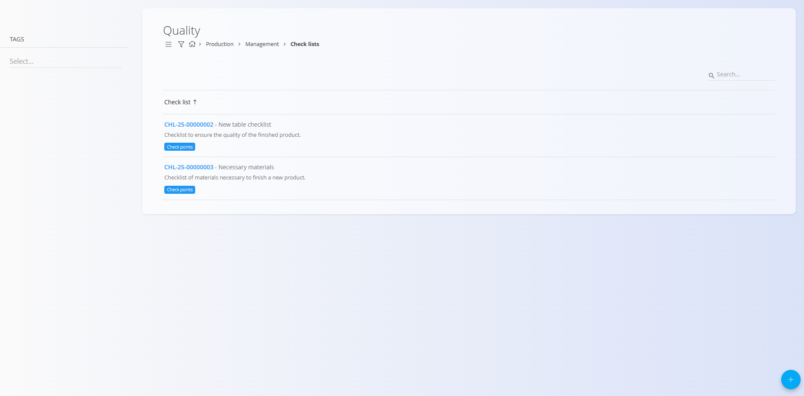

# Kontrolne liste

Kontrolne liste se uporabljajo v modulih **Proizvodnja** in **Vzdrževanje** za definiranje strukturiranih seznamov, ki podpirajo operativne postopke in dejavnosti zagotavljanja kakovosti. Ta stran omogoča ustvarjanje in razvrščanje kontrolnih list, ki se uporabljajo na proizvodnih delovnih mestih in v vzdrževalnih procesih.

Posamezni koraki znotraj kontrolne liste — imenovani **[Kontrolne točke](KontrolneTocke.md)** — se upravljajo ločeno.

Za dostop do tega zaslona pojdite v modul **Proizvodnja** ali **Vzdrževanje**, nato izberite **Upravljanje / Kontrolne liste** v [**navigaciji**](../../../Skupno/UI/Navigacija.md).

> [!TIP]
> Za celovit prikaz si oglejte video vodič **[Kontrolne liste kakovosti](https://www.youtube.com/watch?v=EB7WktBCFC4)**.

## Shema

| Polje | Opis |
|------|------|
| [**Šifra**](../../../Skupno/UI/SifreDokumentov.md) | Sistemsko generirana šifra kontrolne liste (samo za branje). |
| **Naziv** | Naziv kontrolne liste (obvezno). |
| **Opis** | Kratek opis namena kontrolne liste. |
| **Oznake** | Neobvezne oznake za razvrščanje ali združevanje kontrolnih list (npr. Proizvodnja, Vzdrževanje). |
| **Izvajalne vloge** | Neobvezne vloge, ki določajo, katera delovna mesta lahko izvajajo kontrolno listo (npr. operaterji, vzdrževalci). |

## Seznam

Seznam prikazuje vse kontrolne liste, definirane v sistemu. Vsaka vrstica prikazuje šifro, naziv in opis kontrolne liste. Z uporabo polja **Iskanje** lahko filtrirate po nazivu ali šifri.

Vsaka kontrolna lista vsebuje gumb **Kontrolne točke**, s katerim upravljate posamezne korake znotraj liste.

## Filtri

Na levi strani je na voljo filter **Oznake**, ki omogoča prikaz samo tistih kontrolnih list, ki so povezane z izbranimi oznakami.

## Ustvarjanje nove kontrolne liste

1. Kliknite [**akcijski gumb**](../../../Skupno/UI/AkcijskiGumb.md) v spodnjem desnem kotu.
2. Izpolnite naslednja polja:

    

    - **Naziv** – naziv kontrolne liste  
    - **Opis** – neobvezni opis  
    - **Oznake** – izberite eno ali več oznak za razvrščanje (npr. Proizvodnja, Vzdrževanje)  
    - **Izvajalne vloge** – določite delovna mesta, ki lahko izvajajo to kontrolno listo (npr. operaterji, vzdrževalci)

3. Kliknite **Dodaj**, da ustvarite kontrolno listo.

## Upravljanje kontrolnih točk

Vsaka kontrolna lista lahko vsebuje eno ali več **kontrolnih točk**, ki določajo konkretne korake ali preverjanja med izvajanjem.

Za upravljanje kontrolnih točk:

1. Odprite stran **Kontrolne liste**.
2. Poiščite kontrolno listo in kliknite gumb **Kontrolne točke**.

    

Odpre se stran **Kontrolne točke**, kjer lahko kontrolne točke dodajate, urejate, brišete in spreminjate njihov vrstni red.

Za podrobnosti glejte **[Kontrolne točke](KontrolneTocke.md)**.

## Urejanje kontrolne liste

Za urejanje obstoječe kontrolne liste:

1. Kliknite kontrolno listo v seznamu.
2. Po potrebi spremenite **Naziv**, **Opis**, **Oznake** ali **Izvajalne vloge**.
3. Kliknite **Shrani**.

## Brisanje

Kontrolno listo lahko izbrišete na strani za urejanje s klikom na **Izbriši**. Po potrditvi je kontrolna lista trajno odstranjena iz sistema.

---