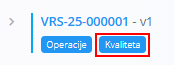
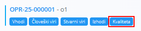

<!-- app_route: /management/processes -->
<!-- app_label: Processes -->
<!-- app_navigation_hint: Na nivoju procesa: odpri proces, izberi ustrezno verzijo in odpri Kvaliteta.
Na nivoju operacije: odpri proces, izberi verzijo, klikni Operacije in nato pri ustrezni operaciji odpri Kvaliteta. -->
<!-- canonical_source_url: https://github.com/Tom-PIT/Connected.Docs/blob/main/sl/Domene/Proizvodnja/Upravljanje/KvalitetaKontrolneListe.md -->
<!-- canonical_source_title: Kvaliteta – kontrolne liste -->

# Kvaliteta – kontrolne liste

Stran **Kakovost** omogoča povezovanje **[kontrolnih list](KontrolneListe.md)** bodisi na **različico procesa** bodisi na **operacijo**. Te kontrolne liste se uporabljajo za izvajanje korakov kontrole kakovosti med proizvodnjo.

Do te strani dostopate s klikom na gumb **Kakovost** iz:

- **Različice procesa**  
  

- **Operacije**  
  

> [!NOTE]
> Kontrolno listo je treba najprej pripraviti v šifrantu **[Kontrolne liste](KontrolneListe.md)**. Tukaj je mogoče povezati samo že definirane kontrolne liste.

> [!TIP]
> Za celovit prikaz si oglejte video vodič **[Quality](https://www.youtube.com/watch?v=B2KX_UvDiCw)**.

| Polje | Opis |
|------|------|
| **Kontrolna lista** | Izbira obstoječe kontrolne liste, definirane v modulu **[Kontrolne liste](../Upravljanje/KontrolneListe.md)**. |
| **Način** | Določa, kdaj se kontrolna lista izvaja: • **Na začetku** • **Ob pavzi** • **Ob prvi proizvodnji** • **Ob zadnji proizvodnji** • **Ob zagonu** • **Pred zaključkom** • **Ročno** • **Vsake n enot** |
| **Material** | Material, na katerega je vezana kontrolna lista. Izbira se iz šifranta **[Materiali](../../Sredstva/Domena/Materiali.md)**. |
| **Perioda** | Število enot, po katerih se kontrolna lista ponovno izvede. Polje je prikazano samo, če je izbran način **Vsake n enot**. |
| **Vrstni red** | Določa zaporedje izvajanja kontrolnih list v okviru iste operacije. |

## Seznamski prikaz

Ob odprtju stran **Kakovost** prikaže vse kontrolne liste, ki so že povezane z izbrano različico procesa ali operacijo.

Zaporedje lahko spreminjate z urejanjem vrednosti **Vrstni red**.

## Dodajanje nove kakovosti

1. Kliknite **akcijski gumb** in izberite **Dodaj kvaliteto**.

   

2. Izberite **Kontrolno listo** in **Način**:
   - **Na začetku**: Kontrolna lista se prikaže ob začetku operacije.
   - **Ob pavzi**: Kontrolna lista se prikaže, ko je operacija začasno zaustavljena.
   - **Ob prvi proizvodnji**: Kontrolna lista se prikaže ob prvi proizvedeni enoti v operaciji.
   - **Ob zadnji proizvodnji**: Kontrolna lista se prikaže ob zadnji proizvedeni enoti.
   - **Ob zagonu**: Kontrolna lista se prikaže ob zagonu operacije.
   - **Pred zaključkom**: Kontrolna lista mora biti izpolnjena pred zaključkom operacije.
   - **Ročno**: Kontrolna lista se odpre in izpolni ročno iz aktivnosti **Kakovost**.
   - **Vsake n enot**: Kontrolna lista se prikaže periodično glede na število proizvedenih enot (zahteva nastavitev **Periode**).

   

3. Kliknite **Dodaj**.

## Urejanje kakovosti

1. Odprite zapis s seznama.
2. Po potrebi posodobite **Kontrolno listo**, **Način** ali **Vrstni red**.
3. Kliknite **Shrani** za uveljavitev sprememb.

## Brisanje

Na strani za urejanje kliknite **Izbriši**.
