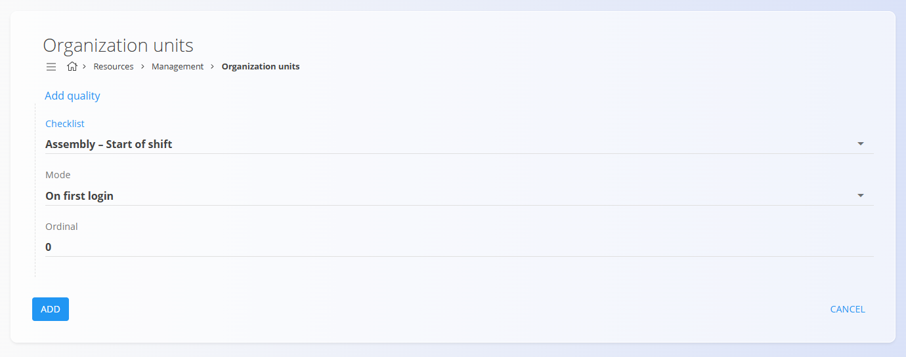
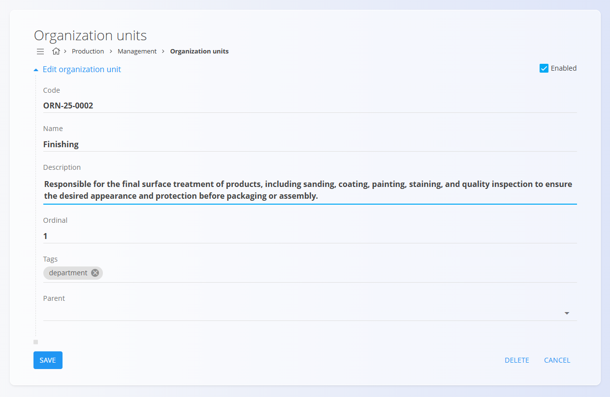

<!-- app_route: /management/resources/organization-units -->
<!-- app_label: Organizacijske enote -->
<!-- canonical_source_url: https://github.com/Tom-PIT/Connected.Docs/blob/main/sl/Domene/Proizvodnja/Upravljanje/OrganizacijskeEnote.md -->
<!-- canonical_source_title: Organizacijske enote -->

# Organizacijske enote

Šifrant **organizacijskih enot** opredeljuje operativne organizacijske entitete, ki se uporabljajo v domenah **Proizvodnja** in **Vzdrževanje** — na primer proizvodne celice, montažne linije, vzdrževalni oddelki ali servisne ekipe. Ta pogled omogoča ogled, dodajanje, urejanje in brisanje organizacijskih enot ter upravljanje njihovih osnovnih lastnosti (naziv, oznake, hierarhija nadrejenih enot in aktivnost), na katere se sklicujejo druge funkcionalnosti sistema.

Organizacijske enote uporabljajo planerji in nadzorniki za razmejevanje operacij, filtriranje seznamov in usmerjanje poteka dela (na primer izbiro ustrezne vhodne/izhodne skladiščne lokacije ali dodeljevanje nalog).  
Primer: organizacijska enota s šifro **ORN-25-0002** predstavlja **Zaključevanje**, proizvodno enoto, odgovorno za končno obdelavo izdelkov pred pakiranjem; podobno je lahko organizacijska enota v **Vzdrževanju** na primer **Električno vzdrževanje** za servisiranje opreme.

Za dostop do dokumentov **Organizacijske enote** pojdite na **Proizvodnja / Upravljanje / Organizacijske enote** v [navigaciji](../../../Skupno/UI/Navigacija.md).

> [!TIP]
> Za celovit prikaz si oglejte video vodič **[Organizacijske enote](https://www.youtube.com/watch?v=qGkHEuOEWT4)**.

## Shema

| Polje | Opis |
|------|------|
| [**Šifra**](../../../Skupno/UI/SifreDokumentov.md) | Enolična šifra organizacijske enote (sistemsko generirana). |
| **Naziv** (obvezno) | Prikazno ime organizacijske enote. |
| **Opis** | Kratek opis odgovornosti ali področja delovanja enote. |
| **Vrstni red** | Celo število za določanje vrstnega reda v seznamih. |
| **Oznake** | Neobvezne oznake za kategorizacijo (npr. Proizvodnja, Vzdrževanje). |
| **Nadrejen** | Neobvezna nadrejena organizacijska enota (hierarhija). |
| **Omogočeno** | Stikalo za vklop ali izklop organizacijske enote. Onemogočene enote se ne uporabljajo v novih potekih dela. |

## Upravljanje

Ta pogled omogoča ogled, dodajanje in urejanje organizacijskih enot, ki se uporabljajo v domenah Proizvodnja in Vzdrževanje.

### Seznam organizacijskih enot

Seznam prikazuje **šifro** in **naziv** organizacijske enote ter njene oznake in vrednost **vrstnega reda**. Za iskanje zapisov uporabite iskalno polje v glavi seznama. Kliknite organizacijsko enoto za odpiranje obrazca za urejanje.

Vsak zapis ima levo od naziva prikazan indikator stanja:
- **Modra** barva pomeni, da je organizacijska enota aktivna
- **Siva** barva pomeni, da je organizacijska enota neaktivna

Uporabite gumbe pod posamezno organizacijsko enoto za pripenjanje **človeških virov**, **stvarni virov** in **kontrolnih list kakovosti** k izbrani organizacijski enoti. Za podrobnosti o definiranju oseb, strojev, ekip in vzdrževalnih orodij glejte **[Viri](Viri.md)**.

### Dejanja

### Dodajanje nove

Kliknite [akcijski gumb](../../../Skupno/UI/AkcijskiGumb.md) za odpiranje obrazca za ustvarjanje nove organizacijske enote.

V obrazec vnesite naslednja polja:

- **Šifra** — prikazana in dodeljena s strani sistema.
- **Naziv** (obvezno) — naziv organizacijske enote.
- **Opis** — neobvezen opis.
- **Vrstni red** — številčni vrstni red (privzeto 0).
- **Oznake** — izberite nič ali več oznak (npr. Proizvodnja, Vzdrževanje).
- **Nadrejen** — po želji izberite nadrejeno enoto za vzpostavitev hierarhije.
- **Omogočeno** — označite za omogočanje enote.

Kliknite **Dodaj** za shranjevanje nove organizacijske enote ali **Prekliči** za opustitev vnosa.

### Kvaliteta v organizacijskih enotah

Organizacijskim enotam je mogoče dodeliti [**kontrolne liste kakovosti**](KontrolneListe.md). Kontrolna lista se uporablja za zahtevo, da uporabniki opravijo osnovna opravila (na primer ob začetku izmene), preden lahko nadaljujejo z delom.

> [!NOTE]
> Trenutno je na voljo samo način **Ob prvi prijavi**.

#### Dodati kontrolno listo kakovosti v organizacijsko enoto

1. Na seznamu organizacijskih enot pri želeni organizacijski enoti kliknite **Kvaliteta**.
2. Kliknite akcijski gumb za dodajanje nove kontrolne liste.
3. Izberite:
   - **Kontrolna lista**
   - **Način** (trenutno **Ob prvi prijavi**)
   - **Vrstni red** (zaporedje prikaza kontrolnih list)
4. Kliknite **Dodaj** za shranjevanje ali **Prekliči** za opustitev.

### Urediti organizacijsko enoto

Kliknite organizacijsko enoto v seznamu, da odprete obrazec za urejanje. Na tej strani lahko spremenite katero koli od naslednjih lastnosti organizacijske enote:

- **Naziv**
- **Opis**
- **Vrstni red**
- **Oznake**
- **Nadrejen**
- **Omogočeno**

Kliknite **Shrani** za shranjevanje sprememb ali **Prekliči** za opustitev. Za odstranitev zapisa uporabite **Izbriši**, kadar enota ni več potrebna.

## Izbrisati organizacijsko enoto

Kliknite organizacijsko enoto v seznamu, da odprete obrazec za urejanje in kliknite **Izbriši**.

Ob potrditvi je zapis trajno odstranjen iz seznama organizacijskih enot; podatki, ki se nanj sklicujejo v drugih domenah, niso spremenjeni.