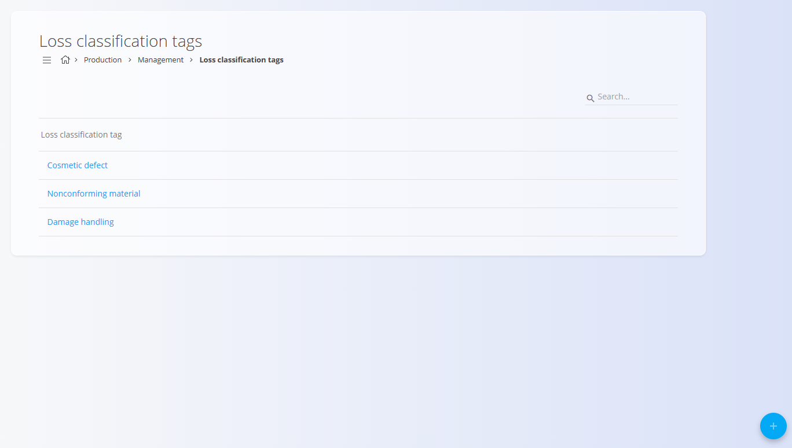
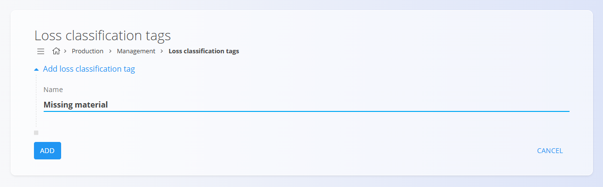

# Oznake klasifikacije slabega kosa

Oznake klasifikacije slabega kosa se uporabljajo v proizvodnji za razvrščanje in beleženje različnih vrst izgub v proizvodnji – kot so neustrezni materiali, težave pri rokovanju ali kozmetične napake. Te oznake pomagajo pri prepoznavanju vzrokov izgub in podpirajo analizo izgub.

Za dostop do te strani pojdite na **Proizvodnja / Upravljanje / Oznake klasifikacije slabega kosa** v [**navigaciji**](../../../Skupno/UI/Navigacija.md).

> [!TIP]
> Za celovit prikaz si oglejte video vodič **[Oznake klasifikacije slabega kosa](https://www.youtube.com/watch?v=pC8TELowUgA)**.

## Shema

| Polje | Opis |
|------|------|
| **Naziv** | Naziv kategorije slabega kosa (npr. Kozmetična napaka, Poškodba pri rokovanju) *(obvezno)*. |

## Seznamski prikaz

Seznam prikazuje vse oznake klasifikacije slabega kosa, definirane v sistemu. Za hitro filtriranje po nazivu uporabite iskalno polje **Iskanje**.

## Dodajanje nove oznake klasifikacije slabega kosa

1. Kliknite **akcijski gumb** v spodnjem desnem kotu.
2. Vnesite **Naziv** kategorije slabega kosa.

   

3. Kliknite **Dodaj**, da shranite novo oznako.

## Urejanje obstoječe oznake

1. Kliknite oznako v seznamu, da odprete stran za urejanje.
2. Posodobite **Naziv**.
3. Kliknite **Shrani**.

## Brisanje

Oznako klasifikacije slabega kosa lahko izbrišete na strani za urejanje s klikom na **Izbriši**.

Po potrditvi je oznaka trajno odstranjena iz sistema.

---