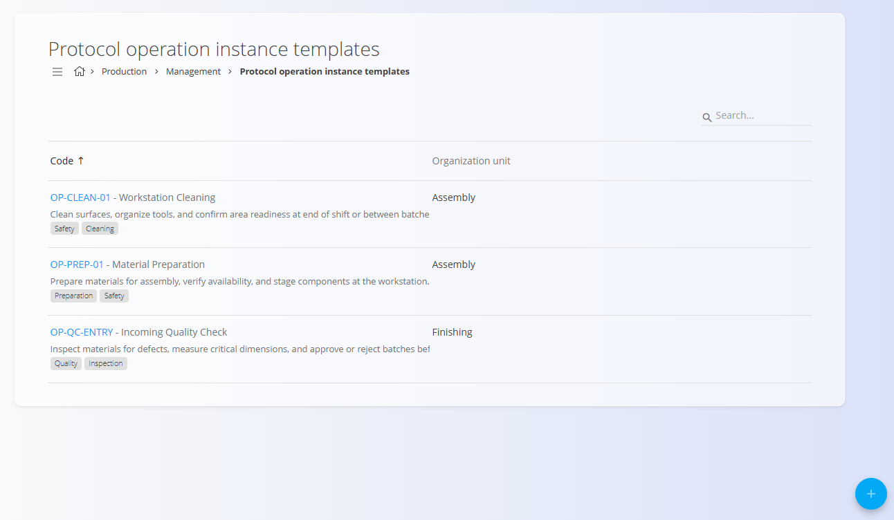
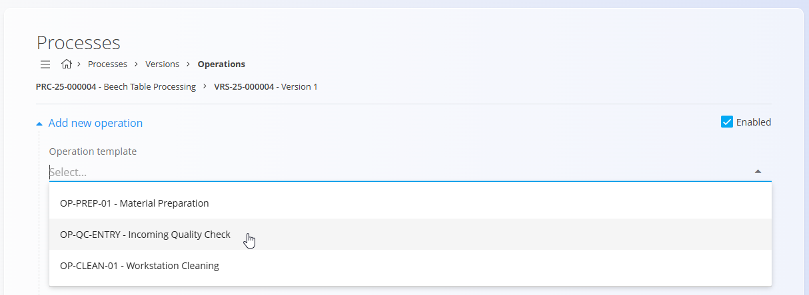

# Predloge za operacije

Predloge za operacije definirajo **ponovno uporabne predloge operacij**, ki jih lahko hitro vstavite v procese. Omogočajo standardizacijo poimenovanja, opisov, vpliva časa, oznak in drugih lastnosti operacij v sistemu za **Proizvodnjo** in **Vzdrževanje** (npr. montažni korak, pregled, čiščenje).

Za dostop do dokumentov **Predloge za operacije** pojdite na **Proizvodnja / Upravljanje / Predloge za operacije** v [**navigaciji**](../../../Skupno/UI/Navigacija.md).

> [!TIP]
> Za celovit prikaz si oglejte video vodič **[Operation templates](https://www.youtube.com/watch?v=Cm8RYdO0f6E)**.

## Shema

| Polje | Opis |
|------|------|
| **Šifra** | Enolična identifikacijska oznaka predloge. |
| **Naziv** | Naziv predloge, ki je prikazan pri izbiri predloge operacije. |
| **Organizacijska enota** | Organizacijska enota, za katero je predloga namenjena (npr. proizvodna linija ali vzdrževalna ekipa). Glejte **[Organizacijske enote](OrganizacijskeEnote.md)**. |
| **Opis** | Opis operacije in namen uporabe predloge. |
| **Vpliv časa** | Določa, ali je čas operacije **vključen** ali **izključen** iz skupnega trajanja procesa. |
| **Članek** | Neobvezen članek z navodili ali dokumentacijo, vezano na predlogo. Glejte **[Bazo znanja](../../Znanje/BazaZnanja/BazaZnanja.md)**. |
| **Oznake** | Oznake za klasifikacijo in lažje iskanje predlog (npr. Proizvodnja, Vzdrževanje, Varnost). |

## Seznamski prikaz

Stran prikazuje vse obstoječe predloge za operacije, skupaj z:

- **Šifro in nazivom**
- **Organizacijsko enoto**
- **Opisom**
- **Oznakami**

Klik na posamezno vrstico odpre predlogo za urejanje.

## Dodajanje nove predloge

1. Kliknite **akcijski gumb** in izberite **Dodaj predlogo za operacijo**.

2. Izpolnite naslednja polja:
   - **Šifra**
   - **Naziv**
   - **Organizacijska enota**
   - **Opis**
   - **Vpliv časa**
   - **Članek** (neobvezno)
   - **Oznake**

3. Kliknite **Dodaj**, da shranite predlogo.

## Urejanje predloge

1. Kliknite obstoječo predlogo v seznamu.
2. Po potrebi posodobite:
   - Naziv
   - Organizacijsko enoto
   - Opis
   - Vpliv časa
   - Članek
   - Oznake
3. Kliknite **Shrani**, da uveljavite spremembe.

## Uporaba predlog pri ustvarjanju operacij

Predloge za operacije lahko uporabite neposredno pri dodajanju novih operacij v različico procesa.

Postopek:

1. Odprite želeno **različico procesa**
2. Pojdite na **Operacije**
3. Kliknite **akcijski gumb** → **Po predlogi**
4. Izberite predlogo v spustnem seznamu **Predloga operacije**

Sistem samodejno izpolni vnaprej definirana polja, ki jih lahko po potrebi še prilagodite.

## Brisanje predloge

Brisanje je na voljo v pogledu urejanja posamezne predloge preko možnosti **Izbriši**.

---