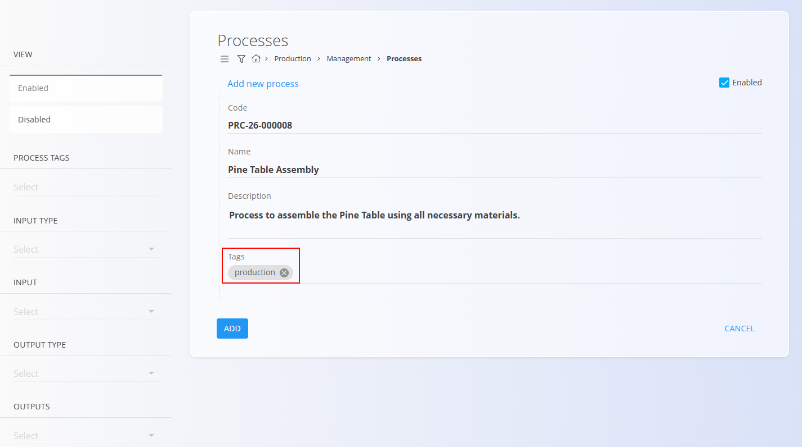
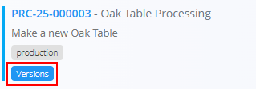
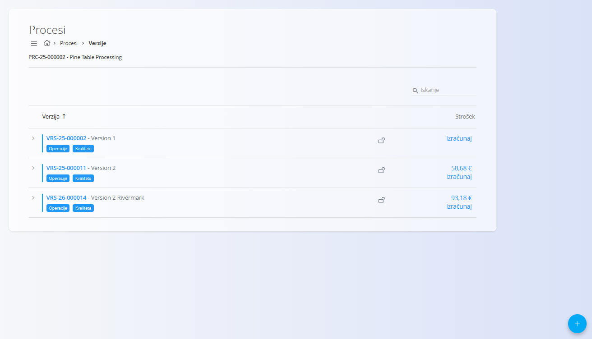
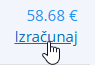
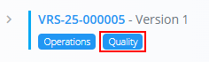

<!-- app_route: /management/processes -->
<!-- app_label: Procesi -->
<!-- canonical_source_url: https://github.com/Tom-PIT/Connected.Docs/blob/main/sl/Domene/Proizvodnja/Upravljanje/Procesi.md -->
<!-- canonical_source_title: Procesi -->

# Procesi

Procesi določajo strukturirane korake, ki se uporabljajo v **Proizvodnji** in **Vzdrževanju** za pretvorbo vhodov v izhode (končne izdelke, polizdelke ali servisirana stanja opreme). Predstavljajo temelj operativnih potekov dela in se uporabljajo v **dokumentih** za izračun materialov, virov, obremenitev in korakov izvedbe:
- **[Proizvodni nalogi](../Dokumenti/ProizvodniNalogi.md)** za proizvodne poteke dela
- **[Vzdrževalni nalogi](../../Vzdrzevanje/Dokumenti/VzdrzevalniNalogi.md)** za vzdrževalne poteke dela

Ta pogled omogoča ustvarjanje in upravljanje procesov, njihovih verzij ter operativne strukture.

Proces lahko vsebuje eno ali več **verzij**, na primer različne verzije za različne velikosti izdelkov ali vzdrževalne variante. Vsaka verzija vsebuje zaporedje **[operacij](Operacije.md)**, ki določajo vhode, vire (človeške in stvarne), izhode in zahteve kakovosti.

Za dostop do tega pogleda pojdite na **Proizvodnja / Upravljanje / Procesi** v [**navigaciji**](../../../Skupno/UI/Navigacija.md). Procesi so skupni in jih je mogoče označiti za uporabo v Proizvodnji ali Vzdrževanju.

> [!TIP]
> Za celovit prikaz si oglejte video vodič **[Processes and versions](https://www.youtube.com/watch?v=4svpFCm7rkk)**.

## Shema

### Polja procesa

| Polje | Opis |
|------|------|
| [**Koda**](../../../Skupno/UI/SifreDokumentov.md) | Sistemsko generirana koda procesa (samo za branje). |
| **Naziv** | Naziv procesa (obvezno). |
| **Opis** | Kratek opis namena procesa. |
| **Oznake** | Oznake za združevanje ali kategorizacijo procesa (npr. **Proizvodnja**, **Vzdrževanje**). |

### Polja verzije

| Polje | Opis |
|------|------|
| [**Koda**](../../../Skupno/UI/SifreDokumentov.md) | Sistemsko generirana koda verzije (samo za branje). |
| **Naziv** | Naziv verzije (obvezno). |
| **Opis** | Dodatne podrobnosti o verziji (neobvezno). |

## Seznam procesov

Seznam procesov prikazuje vse konfigurirane procese. Vsaka vrstica vključuje kodo procesa, naziv, opis in oznake. Za iskanje po nazivu ali kodi uporabite polje **Iskanje**.

Levi stranski panel omogoča filtriranje po:

- **Pogledu**: Aktiven / Neaktiven  
- **Oznakah procesa** (npr. Proizvodnja, Vzdrževanje)  
- **Tipu vhoda**  
- **Vhodu**  
- **Tipu izhoda**  
- **Izhodih**

## Ustvarjanje novega procesa

1. Kliknite [**akcijski gumb**](../../../Skupno/UI/AkcijskiGumb.md) in izberite **Nov** ali **Kopiraj obstoječega**.
2. Izpolnite naslednja polja:
   - **Naziv** – obvezno  
   - **Opis** – neobvezno  
   - **Oznake** – neobvezno, vendar **obvezne** za povezavo procesa z določenim področjem. Na primer:
     - Dodajte oznako **Proizvodnja**, da bo proces na voljo pri ustvarjanju novega [**proizvodnega naloga**](../Dokumenti/ProizvodniNalogi.md).
     - Dodajte oznako **Vzdrževanje**, da bo proces na voljo pri ustvarjanju novega [**vzdrževalnega naloga**](../../Vzdrzevanje/Dokumenti/VzdrzevalniNalogi.md).

   

3. Kliknite **Dodaj**, da ustvarite nov proces.

> [!IMPORTANT]
> Oznake določajo, kje je proces mogoče uporabiti. Če ne dodate ustrezne oznake (npr. **Proizvodnja** ali **Vzdrževanje**), proces ne bo na voljo pri ustvarjanju dokumentov na tem področju (npr. [**proizvodnega naloga**](../Dokumenti/ProizvodniNalogi.md) ali [**vzdrževalnega naloga**](../../Vzdrzevanje/Dokumenti/VzdrzevalniNalogi.md)).

## Urejanje procesa

Za urejanje obstoječega procesa:

1. Izberite proces s seznama.
2. Po potrebi posodobite **Naziv**, **Opis** ali **Oznake**.
3. Kliknite **Shrani**, da uveljavite spremembe.

## Verzije

Vsak proces lahko vsebuje več **verzij**, kar omogoča postopno izboljševanje potekov dela ob hkratnem ohranjanju starejših verzij.

Na pogledu verzij lahko:

- Dodate novo verzijo  
- Urejate ali onemogočite verzijo  
- Zaklenete verzijo  
- Odprete verzijo za delo z njenimi operacijami in konfiguracijo  

Verzija vključuje:

- Osnovne informacije o verziji  
- Seznam **operacij**  
- Kontrole za omogočanje/onemogočanje  
- Možnost **zaklepa** verzije za preprečitev nadaljnjih sprememb  

### Predkalkulacija (izračun stroška verzije)

Na zaslonu **Verzije** lahko ocenite **strošek proizvodnje na kos** za izbrano verzijo procesa.

Vsaka verzija vsebuje stolpec **Strošek**, ki prikazuje:

- **Izračunaj** – izračuna ocenjeni strošek proizvodnje za izbrano verzijo.
- **Vrednost stroška** – zadnji izračunan strošek na kos.

Ko kliknete **Izračunaj**, sistem izračuna ocenjeni strošek proizvodnje enega izdelka za izbrano verzijo procesa. Pri izračunu se upoštevajo:

- **Cene materialov** – določene v cenikih [**Material dobaviteljev**](../../Nabava/Upravljanje/MaterialiDobaviteljev.md)
- **Človeško delo** (delovni vložek) – določeno v šifrantu [**Postavke virov**](../../Viri/Upravljanje/PostavkeVirov.md)
- **Nečloveški viri** (stroji, delovne postaje) – prav tako določeni v [**Postavke virov**](../../Viri/Upravljanje/PostavkeVirov.md)
- **Dodatni stroški**, povezani z verzijo – določeni v šifrantu [**Stroški**](../../Nabava/Upravljanje/Stroski.md)

Če se verzija spremeni (na primer operacije, materiali ali viri), je treba strošek ponovno izračunati.

S klikom na **vrednost stroška** se odpre stran **[Analiza stroška verzije](../Analiza/AnalizaStroskaVerzije.md)**, kjer je prikazana celotna struktura stroškov.

### Operacije znotraj verzije

Verzija vsebuje zaporedje **[operacij](Operacije.md)**, pri čemer vsaka predstavlja posamezen korak procesa. Operacije lahko vključujejo na primer rezanje, barvanje, sestavljanje, pakiranje (proizvodnja) ali pregled, mazanje, kalibracijo (vzdrževanje).

Za dostop do seznama operacij verzije kliknite gumb **[Operacije](Operacije.md)**:

Vsaka operacija vključuje:

- **[Vhodi](Vhodi.md)** – materiali ali elementi, ki se porabijo v operaciji  
- **[Človeški viri](CloveskiViri.md)** – delavci ali delovna mesta  
- **[Stvarni viri](StvarniViri.md)** – stroji ali oprema  
- **[Izhodi](Izhodi.md)** – materiali ali elementi, ki nastanejo v operaciji  
- **[Kvaliteta](KvalitetaKontrolneListe.md)** – dodeljene kontrolne liste in zahteve kakovosti  

## Kvaliteta

Gumb **[Kvaliteta](KvalitetaKontrolneListe.md)** odpre konfiguracijsko stran za izbrano verzijo procesa ali operacijo. Ta stran omogoča dodelitev ene ali več **[kontrolnih list](KontrolneListe.md)**, ki določajo korake kontrole kakovosti med izvedbo.

## Brisanje

Proces je mogoče izbrisati samo, če **ni uporabljen v dokumentih** (npr. proizvodni ali vzdrževalni nalogi) in **ni referenciran v drugih procesih**.  

Če je brisanje dovoljeno, je možnost **Izbriši** na voljo na strani za urejanje procesa.