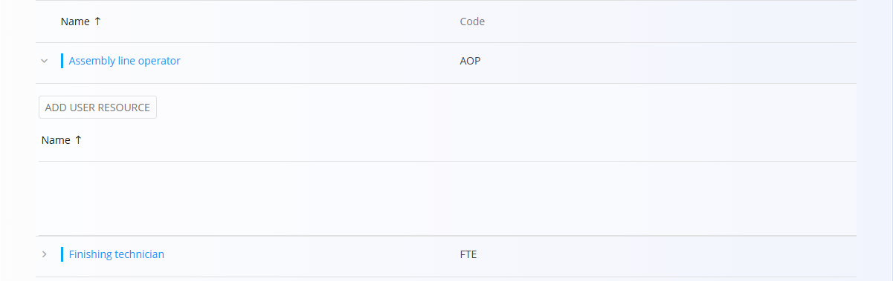

<!-- app_route: /management/resources/job-positions -->
<!-- app_label: Sistematizacija delovnih mest -->
<!-- canonical_source_url: https://github.com/Tom-PIT/Connected.Docs/blob/main/sl/Domene/Proizvodnja/Upravljanje/SistematizacijaDelovnihMest.md -->
<!-- canonical_source_title: Sistematizacija delovnih mest -->

# Sistematizacija delovnih mest

Šifrant **Sistematizacija delovnih mest** določa delovna mesta oziroma vloge, ki jih lahko zaposleni opravljajo v operativnih procesih (proizvodnja in vzdrževanje). Delovna mesta se dodeljujejo registriranim uporabnikom sistema in se uporabljajo pri poročilih o delu, razporejanju, dodeljevanju virov ter pri pravicah za izvajanje kontrolnih list.

Za dostop do dokumenta **Sistematizacija delovnih mest** pojdite na **Proizvodnja / Upravljanje / Sistematizacija delovnih mest** v [**navigaciji**](../../../Skupno/UI/Navigacija.md).

## Shema

| Polje | Opis |
|------|------|
| **Šifra** | Enolična oznaka delovnega mesta (obvezno). |
| **Naziv** | Ime delovnega mesta (obvezno). |
| **Opis** | Dodatni opis odgovornosti ali nalog delovnega mesta (neobvezno). |
| **Aktiven** | Določa, ali je delovno mesto aktivno in ga je mogoče dodeliti uporabnikom. |

## Upravljanje

Na tem zaslonu lahko pregledujete, dodajate in urejate delovna mesta, ki se uporabljajo v modulih **Proizvodnja** in **Vzdrževanje**.

### Seznam delovnih mest

Seznam prikazuje vsa evidentirana delovna mesta z njihovim **Nazivom** in **Šifro**.

Vsak zapis ima na levi strani indikator stanja:
- **Modra** barva pomeni, da je delovno mesto aktivno  
- **Siva** barva pomeni, da je delovno mesto neaktivno  

Za ogled ali dodelitev uporabnikov delovnemu mestu razširite zapis s klikom na puščico na levi strani vrstice. S tem se prikaže možnost **Dodaj uporabniški vir**.

Klik na **Dodaj uporabniški vir** odpre pogovorno okno, kjer lahko izberete enega ali več obstoječih uporabnikov sistema in jih dodelite delovnemu mestu.

## Dejanja

Kliknite [**akcijski gumb**](../../../Skupno/UI/AkcijskiGumb.md) za dodajanje novega delovnega mesta.

### Dodajanje novega delovnega mesta

Izpolnite zahtevana polja:

- **Šifra**  
- **Naziv**  
- **Opis** (neobvezno)  
- **Aktiven**  

Kliknite **Dodaj**, da shranite novo delovno mesto.

## Brisanje

Na strani za urejanje kliknite **Izbriši**, da odstranite delovno mesto. Po potrditvi je zapis trajno izbrisan.

> [!NOTE]
> Delovna mesta je mogoče izbrisati tudi, če so nanje dodeljeni uporabniki.