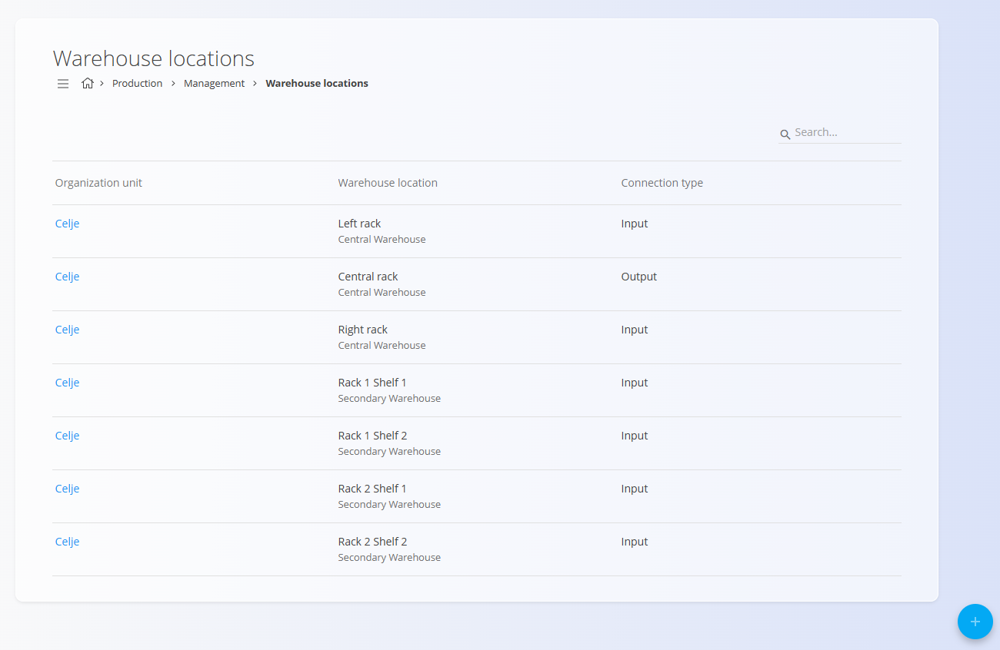
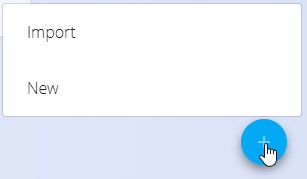
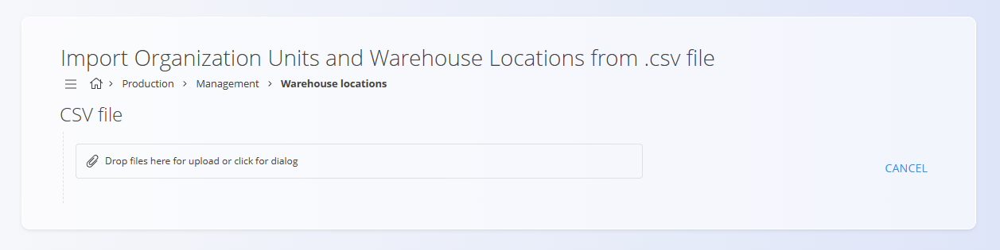

<!-- app_route: /management/organization-units/warehouse-locations -->
<!-- app_label: Skladiščne lokacije -->
<!-- canonical_source_url: https://github.com/Tom-PIT/Connected.Docs/blob/main/sl/Domene/Proizvodnja/Upravljanje/SkladiscneLokacije.md -->
<!-- canonical_source_title: Skladiščne lokacije -->

# Skladiščne lokacije

Seznam **Skladiščne lokacije** povezuje [organizacijske enote](OrganizacijskeEnote.md) s fizičnimi skladiščnimi lokacijami, da lahko proizvodni procesi pridobivajo material in shranjujejo proizvedene izdelke. Na tem zaslonu upravljate, katere lokacije lahko Proizvodnja uporablja za vhod in izhod ter uveljavljate pravila povezav med organizacijskimi enotami in skladiščnimi lokacijami.

Za dostop do dokumentov **Skladiščne lokacije** pojdite na **Proizvodnja / Upravljanje / Skladiščne lokacije** v [navigaciji](../../../Skupno/UI/Navigacija.md).

> [!TIP]
> Za celovit prikaz si oglejte video vodič **[Warehouse locations](https://www.youtube.com/watch?v=qR3o0CpIGpo)**.

## Shema

| Polje | Opis |
|------|------|
| [**Organizacijska enota**](OrganizacijskeEnote.md) | Sklic na proizvodno organizacijsko enoto (obvezno). |
| [**Skladišče**](../../Logistika/Upravljanje/Skladisca.md) | Skladišče, v katerem se nahaja fizična lokacija (obvezno). |
| [**Skladiščna lokacija**](../../Logistika/Upravljanje/Lokacije.md) | Fizična lokacija (hodnik / regal / nivo / mesto) (obvezno). |
| **Tip povezave** | Tip povezave: **Vhod** ali **Izhod** (obvezno). Določa, kako Proizvodnja uporablja lokacijo. |

## Upravljanje

Ta zaslon uporabite za ogled, dodajanje, urejanje in brisanje skladiščnih lokacij, specifičnih za proizvodnjo, po organizacijskih enotah.

### Seznam skladiščnih lokacij

Seznam prikazuje **Organizacijsko enoto**, **Skladiščno lokacijo** in **Tip povezave**. Za iskanje zapisov uporabite iskalno polje v glavi.

Kliknite ime **Organizacijske enote**, da odprete obrazec za urejanje zapisa.

## Dejanja

Kliknite [akcijski gumb](../../../Skupno/UI/AkcijskiGumb.md), da prikažete naslednja dejanja:
- **Uvoz**
- **Novo**

### Uvoziti skladiščne lokacije

Kliknite [akcijski gumb](../../../Skupno/UI/AkcijskiGumb.md) in izberite **Uvoz** za množično ustvarjanje zapisov.

### Ustvariti novo skladiščno lokacijo

Kliknite [akcijski gumb](../../../Skupno/UI/AkcijskiGumb.md) in izberite **Novo**.

Izpolnite polja na obrazcu:

- [**Organizacijska enota**](OrganizacijskeEnote.md)
- [**Skladišče**](../../Logistika/Upravljanje/Skladisca.md)
- [**Skladiščna lokacija**](../../Logistika/Upravljanje/Lokacije.md)
- **Tip povezave** — izberite **Vhod** ali **Izhod**

Kliknite **Dodaj**, da shranite zapis.

> [!NOTE]
> - Ena sama [**Skladiščna lokacija**](../../Logistika/Upravljanje/Lokacije.md) ne more biti dodeljena hkrati kot **Vhod** in **Izhod** za isto
>   [**Organizacijsko enoto**](OrganizacijskeEnote.md). Uporabniški vmesnik preprečuje izbiro iste lokacije za obe vlogi.  
> - Za vsako [**Organizacijsko enoto**](OrganizacijskeEnote.md) je dovoljena samo ena povezava tipa **Izhod**. Dodajanje druge povezave **Izhod**
>   za isto enoto je blokirano z validacijo.  
> - [**Organizacijska enota**](OrganizacijskeEnote.md), [**Skladišče**](../../Logistika/Upravljanje/Skladisca.md) in
>   [**Skladiščna lokacija**](../../Logistika/Upravljanje/Lokacije.md) izvirajo iz pripadajočih šifrantov; zagotovite, da so ti seznami
>   usklajeni z domenama Logistika in Skupno.

### Urediti skladiščno lokacijo

Kliknite ime lokacije v seznamu, da odprete obrazec za urejanje. Polja se obnašajo enako kot pri dodajanju novega zapisa.

Validacija preprečuje neveljavne kombinacije, v skladu s pravili, opisanimi pri ustvarjanju novega zapisa.

## Izbrisati skladiščno lokacijo

Kliknite naziv skladiščne lokacije na seznamu, da odprete stran za urejanje, nato izberite **Izbriši**.

Po potrditvi brisanja se zapis odstrani s seznama skladiščnih lokacij proizvodnega skladišča.

> [!NOTE]
> Brisanje zapisa odstrani povezavo samo iz konfiguracije Proizvodnje. Sklicano
> skladišče in skladiščna lokacija ostaneta nespremenjena v domeni Logistika in se ne izbrišeta.