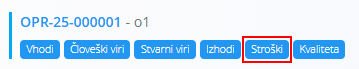
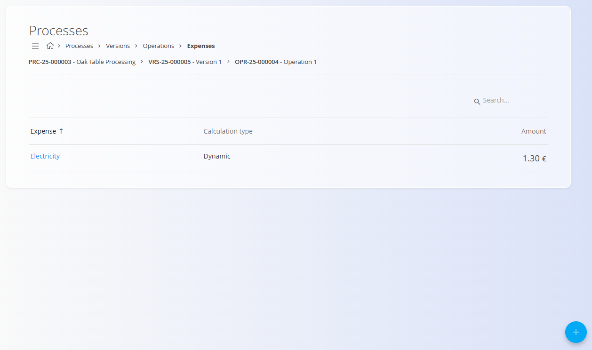

<!-- app_route: /management/processes -->
<!-- app_label: Procesi -->
<!-- app_navigation_hint: Odpri proces, izberi verzijo, klikni Operacije, nato pri ustrezni operaciji odpri Stroški. -->
<!-- canonical_source_url: https://github.com/Tom-PIT/Connected.Docs/blob/main/sl/Domene/Proizvodnja/Upravljanje/StroskiOperacije.md -->
<!-- canonical_source_title: Stroski operacije -->

# Stroski operacije

Stroski predstavljajo dodatne **stroške**, ki se uporabljajo za **operacijo** znotraj različice procesa. Ti stroški prispevajo k skupni kalkulaciji proizvodnih stroškov artikla.

Za dostop do te strani odprite različico procesa iz **Proizvodnja / Upravljanje / [Procesi](Procesi.md)**, kliknite [**Operacije**](Operacije.md), nato izberite **Stroski** za določeno operacijo.

## Shema

| Polje | Opis |
|-------|-------------|
| **Strošek** | Vrsta stroška, ki se uporablja (npr. elektrika, prevoz itd.). |
| **Tip kalkulacije** | Določa, kako se strošek izračuna: **Dinamično** ali **Statično**. |
| **Znesek** | Denarna vrednost stroška. |

## Seznam stroškov

Seznam prikazuje vse stroške, povezane z izbrano operacijo. Vsaka vrstica prikazuje ime stroška, vrsto izračuna in znesek.

## Dodati nov strošek   

1. Kliknite [akcijski gumb](../../../Skupno/UI/AkcijskiGumb.md) v spodnjem desnem kotu.
2. Izpolnite obvezna polja.

    

3. Kliknite **Dodaj** za shranjevanje stroška.

## Urediti strošek

1. Kliknite obstoječi strošek na seznamu.
2. Spremenite katero koli od polj.
3. Kliknite **Shrani**.

## Izbrisati strošek

Kliknite obstoječi strošek na seznamu, da odprete stran za urejanje, nato kliknite **Izbriši**. 

Če potrdite, se odstrani iz operacije.