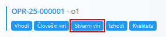

<!-- app_route: /management/processes -->
<!-- app_label: Processes -->
<!-- app_navigation_hint: Odpri proces, izberi verzijo, klikni Operacije, nato pri ustrezni operaciji odpri Stvarni viri. -->
<!-- canonical_source_url: https://github.com/Tom-PIT/Connected.Docs/blob/main/sl/Domene/Proizvodnja/Upravljanje/StvarniViri.md -->
<!-- canonical_source_title: Stvarni viri -->

# Stvarni viri

**Stvarni viri** določajo nečloveške vire, kateri stroji, orodja, oprema ali skupine virov so potrebni za izvedbo posamezne operacije v procesu. Vsak vnos predstavlja planirani čas uporabe tehničnega ali fizičnega vira.

Za dostop do tega pogleda odprite verzijo procesa v **Proizvodnja / Upravljanje / [Procesi](Procesi.md)**, kliknite **[Operacije](Operacije.md)** in nato za izbrano operacijo izberite **Stvarni viri**.

> [!TIP]
> Za celovit prikaz si oglejte video vodič **[Človeški in stvarni viri](https://www.youtube.com/watch?v=iq7fQiPh_i4)**.

## Shema

| Polje | Opis |
|------|------|
| **Tip** | Določa vrsto stvarnega vira:  • [**Vir**](../Upravljanje/Viri.md) • **Kategorija virov** |
| [**Vir**](../Upravljanje/Viri.md) | Konkreten vir ali kategorija virov, izbrana glede na izbrani **Tip**. |
| **Tip kalkulacije** | Določa, kako se izračuna planirani čas.  • **Dinamično** – čas se izračuna glede na količino proizvodnje ali druge parametre procesa. • **Dinamično po seriji** – čas se izračuna glede na posamezno serijo. • **Statično** – količina je fiksna. |
| **Količina** | Planirani čas uporabe vira, vnesen kot trajanje (dnevi, ure, minute, sekunde, milisekunde). |
| **Oznake** | Neobvezne oznake za kategorizacijo ali filtriranje dodeljenih stvarnih virov. |
| **Neobvezno** | Če je omogočeno, vir ni obvezen za izvedbo operacije. |

## Seznam

Seznam **stvarnih virov** prikazuje vse dodelitve virov za izbrano operacijo, vključno z:

- **Vir** – ime stroja, orodja, opreme ali skupine virov  
- **Tip kalkulacije**  
- **Količina** – planirano trajanje  

Za filtriranje po imenu vira uporabite iskalno polje **Iskanje**.

## Ustvariti nov stvarni vir

1. Kliknite [**akcijski gumb**](../../../Skupno/UI/AkcijskiGumb.md) v spodnjem desnem kotu in izberite **Nov** (ali možnost kopiranja, če je na voljo).
2. Izpolnite polja:

   

3. Kliknite **Dodaj**, da shranite vnos.

## Urediti stvarni vir

1. Kliknite vrstico vira v seznamu, da odprete stran za urejanje.
2. Po potrebi prilagodite **Tip**, **Vir**, **Tip kalkulacije**, **Količino**, **Oznake** ali možnost **Neobvezno**.
3. Kliknite **Shrani**.

## Izbrisati stvarni vir

Kliknite vrstico vira v seznamu, da odprete stran za urejanje in kliknite **Izbriši**. 

Po potrditvi se vnos odstrani iz operacije.