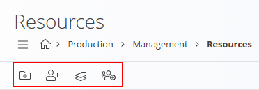

<!-- app_route: /management/resources -->
<!-- app_label: Viri -->
<!-- canonical_source_url: https://github.com/Tom-PIT/Connected.Docs/blob/main/sl/Domene/Proizvodnja/Upravljanje/Viri.md -->
<!-- canonical_source_title: Viri -->

# Viri

Viri se uporabljajo za opredelitev in upravljanje vseh **človeških** in **nečloveških** sredstev, ki so na voljo v domenah **Proizvodnja** in **Vzdrževanje**. Sem spadajo delavci, tehniki, stroji, delovne postaje, orodja, merilna oprema in ekipe. Tukaj ustvarjeni viri se lahko kasneje dodelijo **[operacijam](Operacije.md)**, **[procesom](Procesi.md)** ter dokumentom, kot so **[proizvodni nalogi](../Dokumenti/ProizvodniNalogi.md)** in **[vzdrževalni nalogi](../../Vzdrzevanje/Dokumenti/VzdrzevalniNalogi.md)**.

Za dostop do tega zaslona pojdite na **Proizvodnja / Upravljanje / Viri** ali **Vzdrževanje / Upravljanje / Viri** v [**navigaciji**](../../../Skupno/UI/Navigacija.md).

> [!TIP]
> Za celovit prikaz si oglejte video vodič **[Viri](https://www.youtube.com/watch?v=Kr5WkGMQj48)**.

## Shema

Spodnja tabela prikazuje vsa polja, ki se uporabljajo pri **človeških**, **nečloveških** in **ekipnih** virih.

| Polje | Opis | Č | NČ | E |
|------|------|:-:|:--:|:-:|
| **Uporabnik** | Povezava vira s sistemskim uporabnikom (obvezno za človeške vire). | ✔️ |  |  |
| **Naziv** | Naziv vira ali ekipe (obvezno). | ✔️ | ✔️ | ✔️ |
| **Mapa** | Mapa, v kateri se nahaja vir ali ekipa. | ✔️ | ✔️ | ✔️ |
| **Oznake** | Oznake za razvrščanje ali filtriranje (npr. Proizvodnja, Vzdrževanje). | ✔️ | ✔️ | ✔️ |
| **Ekipe** | Ekipe, katerim pripada človeški vir. | ✔️ |  |  |
| **Nadrejeni stvarni vir** | Nadrejeni vir za hierarhično združevanje. |  | ✔️ |  |
| **Zunanji ključ** | Zunanji identifikator za integracije. |  | ✔️ |  |
| **Člani** | Človeški viri, vključeni v ekipo. |  |  | ✔️ |
| **Omogočeno** | Označuje, ali je vir oziroma ekipa aktivna. | ✔️ | ✔️ | ✔️ |

## Dejanja v orodni vrstici

- **Dodaj mapo** – Ustvari mapo za organizacijo virov.
- **Dodaj človeški vir** – Ustvari posamezen človeški vir (npr. operater, vzdrževalec).
- **Dodaj stvarni vir** – Ustvari stroj, delovno postajo, opremo ali orodje.
- **Dodaj ekipo** – Ustvari skupino človeških virov.

## Struktura

Viri so prikazani v **drevesnem pogledu**. Elementi so lahko v mapah ali samostojni.

Primeri:
- **Assembly stations** (mapa)  
  • Assembly station 1 (stvarni vir)  
  • Assembly station 2 (stvarni vir)
- **Janez Novak** (človeški vir)
- **Ana Kovač** (človeški vir)
- **Spray booth + spray guns** (stvarni vir brez mape)
- **Kalibracijska orodja** (stvarni vir)
- **Vzdrževalna ekipa A** (ekipa)

> [!NOTE]
> Mape niso obvezne; viri lahko obstajajo tudi brez pripadnosti mapi.

## Seznam

Z izbiro elementa v drevesu se prikažejo njegove podrobnosti in obrazec za urejanje.

## Ustvarjanje novega vira

1. V orodni vrstici izberite:
   - **Dodaj mapo**
   - **Dodaj človeški vir**
   - **Dodaj stvarni vir**
   - **Dodaj ekipo**
2. Izpolnite polja, opisana v ustrezni shemi.
3. Kliknite **Dodaj** ali **Shrani** za potrditev.

## Urejanje vira

1. Kliknite vir v drevesnem pogledu.
2. Spremenite njegova polja (npr. Naziv, Mapa, Nadrejeni vir, Oznake, Ekipe ali Zunanji ključ).
3. Kliknite **Shrani**.

## Brisanje

Vir je mogoče izbrisati samo, če **ni uporabljen** v operacijah, procesih ali dokumentih (npr. proizvodnih ali vzdrževalnih nalogih).

Brisanje elementa na strani za urejanje ga trajno odstrani.
