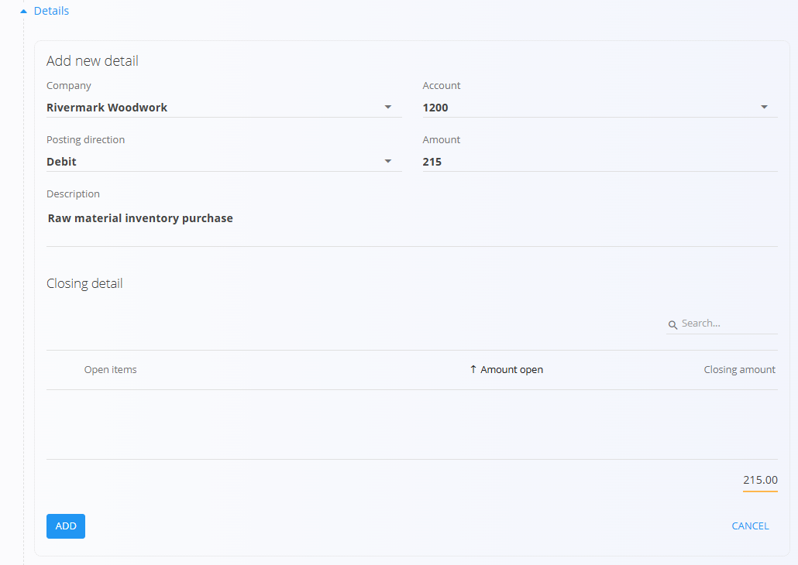

<!-- app_route: /accounting/ledger/bank-statements -->
<!-- app_label: Bančni izpiski -->
<!-- canonical_source_url: https://github.com/Tom-PIT/Connected.Docs/blob/main/sl/Racunovodstvo/Dokumenti/BancniIzpiski.md -->
<!-- canonical_source_title: Bančni izpiski -->

# Bančni izpiski

Bančni izpiski se uporabljajo za evidentiranje prometa na bančnih računih organizacije. Vsak bančni izpisek predstavlja nabor **prilivov in odlivov sredstev** za določen datum in bančni račun.

Za dostop do tega zaslona pojdite na **Računovodstvo / Glavna knjiga / Bančni izpiski** v [navigaciji](../../../Skupno/UI/Navigacija.md).

> [!NOTE]
> Ko je bančni izpisek objavljen, sistem samodejno ustvari pripadajočo **knjižbo v glavni knjigi**.  
> To knjižbo lahko vidite v razdelku **Povezani dokumenti** na bančnem izpisku.

## Shema

  
<strong>Dokument</strong>

| Polje | Opis |
|------|------|
| [**Šifra**](../../../Skupno/UI/SifreDokumentov.md) | Sistemsko generirana enolična oznaka bančnega izpiska. |
| **Datum dokumenta** | Datum bančnega izpiska. |
| [**Bančni račun organizacije**](../../Prodaja/Upravljanje/BancniRacuniOrganizacije.md) | Bančni račun, na katerega se izpisek nanaša. |

  
<strong>Postavke</strong>

| Polje | Opis |
|------|------|
| [**Podjetje**](../../../Skupno/Upravljanje/PoslovniImenik.md) | Poslovni subjekt, povezan z bančnim prometom. |
| [**Konto**](../Upravljanje/GlavnaKnjiga/Konti.md) | Konto glavne knjige, na katerega se knjiži postavka. |
| **Smer knjiženja** | Določa, ali gre za **Debet** ali **Kredit**. |
| **Znesek** | Denarni znesek bančnega prometa. |
| **Opis** | Opis bančne transakcije. |

## Upravljanje

### Seznam

Seznam prikazuje vse bančne izpiske.

Na voljo so naslednji filtri:

- **Pogled**
  - *Osnutek*
  - *Objavljeno*

Objavljeni bančni izpiski so vizualno označeni, kar pomeni, da so že knjiženi v glavno knjigo.

### Stanja dokumentov

Bančni izpiski so lahko v enem izmed naslednjih stanj:

- **Osnutek** – dokument je v urejanju in postavke je mogoče dodajati ali spreminjati.
- **Objavljeno** – dokument je potrjen in pripadajoča knjižba je ustvarjena.

## Dejanja

Kliknite [akcijski gumb](../../../Skupno/UI/AkcijskiGumb.md) za dostop do razpoložljivih dejanj:

- **Novo** – ustvarjanje novega bančnega izpiska.
- **Uvoz** – uvoz bančnih izpiskov iz zunanjih XML datotek.

### Ustvariti bančnega izpiska

1. Kliknite [akcijski gumb](../../../Skupno/UI/AkcijskiGumb.md) in ustvarite nov bančni izpisek.
2. Izberite **Bančni račun organizacije**.
3. Nastavite **Datum dokumenta**.

### Dodati postavke

1. V razdelku **Postavke** kliknite **Dodaj postavko**.
2. Izberite **Podjetje**, povezano s transakcijo.
3. Izberite **Konto**, na katerega se bo knjižilo.
4. Določite **Smer knjiženja** (Debet ali Kredit).
5. Vnesite **Znesek** in **Opis**.
6. Kliknite **Dodaj** za potrditev postavke.

### Objavljati bančnega izpiska

Ko so vse postavke vnesene:

- kliknite **Objavi**,
- sistem samodejno ustvari knjižbo,
- dokument preide iz stanja *Osnutek* v *Objavljeno*.

> [!NOTE]
> Bančni izpiski evidentirajo samo promet na bančnem računu.  
> Ob objavi sistem **samodejno ustvari uravnoteženo knjižbo** z ustrezno protiknjižbo (Debet/Kredit), skladno z načeli dvostavnega knjigovodstva.

## Povezani dokumenti

Vsak objavljen bančni izpisek ima povezano knjižbo v glavni knjigi.

Povezana knjižba:

- vsebuje debetne in kreditne postavke, izpeljane iz bančnega prometa,
- je dostopna v razdelku **Povezani dokumenti** na bančnem izpisku.

Ta povezava zagotavlja sledljivost med bančnim prometom in knjiženjem v glavni knjigi.

## Izbrisati bančni izpisek

Bančne izpiske v stanju **Osnutek** lahko izbrišete v zaslonu urejanja s klikom na **Izbriši**. Potrdite brisanje v pojavnem oknu:
**Ali ste prepričani, da želite izbrisati zapis?**
Če potrdite, se bančni izpisek trajno odstrani; sicer sistem ohrani obstoječe stanje.
