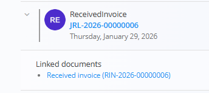
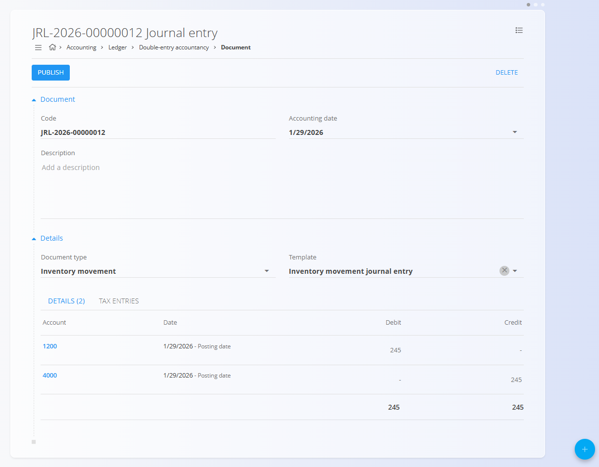
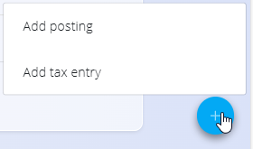

# Dvostavno knjigovodstvo

**Dvostavno knjigovodstvo** je osrednji modul, kjer se hranijo in upravljajo vse **temeljnice**.  
Temeljnice predstavljajo končne računovodske zapise, s katerimi se finančni premiki knjižijo v **glavno knjigo**.

Za dostop do tega zaslona pojdite na **Računovodstvo / Glavna knjiga / Dvostavno knjigovodstvo** v [**navigaciji**](../../Skupno/UI/Navigacija.md).

> [!NOTE]
> Temeljnice se običajno ustvarijo **samodejno** iz drugih dokumentov (na primer izdanih ali prejetih računov, premikov zaloge, inventur ali prilagoditev zaloge).  
> Možno je tudi **ročno ustvarjanje in urejanje** temeljnic za popravke in prilagoditve.

## Shema

  
<strong>Dokument</strong>

| Polje | Opis |
|------|------|
| [**Šifra**](../../Skupno/UI/SifreDokumentov.md) | Sistemsko generirana enolična oznaka temeljnice. |
| **Datum temeljnice** | Datum, na katerega se temeljnica knjiži v glavno knjigo. |
| **Opis** | Neobvezen opis temeljnice. |
| [**Tip dokumenta**](../Upravljanje/GlavnaKnjiga/TipiDokumentov.md) | Razvrstitev temeljnice (npr. splošna temeljnica, premik zaloge). |
| [**Predloga**](../Upravljanje/GlavnaKnjiga/PredlogeZaTemeljnice.md) | Neobvezna predloga za predizpolnitev postavk temeljnice. |

  
<strong>Postavke</strong>

| Polje | Opis |
|------|------|
| [**Konto**](../Upravljanje/GlavnaKnjiga/Konti.md) | Konto glavne knjige, na katerega se knjiži postavka. |
| **Smer knjiženja** | Določa, ali gre za **Debet** ali **Kredit**. |
| **Znesek** | Denarni znesek knjižbe. |
| **Datum knjiženja** | Datum, uporabljen za posamezno postavko. |
| **Opis** | Opis ali referenca postavke. |

> [!NOTE]
> Vsaka temeljnica mora vsebovati **vsaj eno debetno in eno kreditno postavko**, skupni znesek debeta pa mora biti **enak** skupnemu znesku kredita.

## Upravljanje

### Seznam

Seznam prikazuje vse temeljnice skupaj s povzetnimi indikatorji.

Na voljo so naslednji filtri:

- **Datum temeljnice**
- **Pogled**
  - *Osnutek*
  - *Objavljeno*
- **Tip dokumenta**

Povzetni indikatorji na vrhu seznama prikazujejo:

- Skupni znesek debeta
- Skupni znesek kredita
- Število neuravnoteženih temeljnic

Neuravnotežene temeljnice so vizualno označene, da jih je lažje prepoznati in popraviti.

### Stanja dokumentov

Temeljnice so lahko v enem izmed naslednjih stanj:

- **Osnutek** – temeljnica je še v urejanju in je lahko neuravnotežena.
- **Objavljeno** – temeljnica je potrjena in knjižena v glavno knjigo.

Osnutkov z neusklajenim debetom in kreditom **ni mogoče objaviti**.  
Pred objavo mora sistem preveriti, da se zneska ujemata.

## Dejanja

### Ustvarjanje temeljnice

1. Kliknite [**akcijski gumb**](../../Skupno/UI/AkcijskiGumb.md) za ustvarjanje nove temeljnice.
2. Izberite **Tip dokumenta**.
3. Po želji izberite **Predlogo** za predizpolnitev postavk.
4. Nastavite **Datum temeljnice**.
5. Dodajte ali uredite **Postavke**.

### Urejanje postavk

Kliknite katerokoli modro polje v razdelku **Postavke**, da uredite posamezno knjižbo.

Omogočeno je:

- spreminjanje **Konta**
- menjava **Smeri knjiženja**
- prilagoditev **Zneska**
- urejanje datumov ali opisov

Po končanem urejanju kliknite **Shrani**.

### Objavljanje temeljnice

Ko sta skupna zneska debeta in kredita usklajena:

- kliknite **Objavi**,
- temeljnica se knjiži v glavno knjigo,
- stanje se spremeni iz *Osnutek* v *Objavljeno*.

## Povezani dokumenti

Temeljnice so lahko povezane z izvorno dokumentacijo.

Kadar temeljnica nastane iz drugega dokumenta:

- se izvorni dokument prikaže v razdelku **Povezani dokumenti**,
- spremembe v temeljnici lahko vplivajo na izvorni dokument in obratno.

Ta povezava zagotavlja **popolno sledljivost** med operativnimi dokumenti in njihovim računovodskim učinkom.

## Brisanje

Temeljnico je mogoče izbrisati **samo**, če je v stanju **Osnutek** in ni povezana z dokončanimi izvornimi dokumenti.

Za brisanje:

1. v seznamu odprite temeljnico,
2. v načinu urejanja kliknite **Izbriši**.
