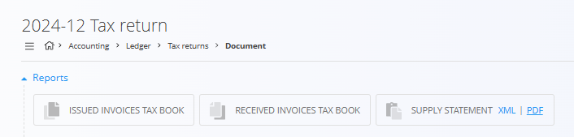

<!-- app_route: /accounting/ledger/tax-returns -->
<!-- app_label: Obračun DDV -->
<!-- canonical_source_url: https://github.com/Tom-PIT/Connected.Docs/blob/main/sl/Domene/Racunovodstvo/Dokumenti/ObracunDDV.md -->
<!-- canonical_source_title: Obračun DDV -->

# Obračun DDV

**Obračun DDV** zagotavlja združen pregled podatkov, povezanih z davkom na dodano vrednost (DDV), za izbrano davčno obdobje.  
Uporablja se za **pregled, preverjanje in izvoz** podatkov, potrebnih za oddajo uradnih davčnih obračunov davčnim organom.

Za dostop do tega zaslona pojdite na **Računovodstvo / Glavna knjiga / Obračun DDV** v [**navigaciji**](../../../Skupno/UI/Navigacija.md).

> [!NOTE]  
> - Ta zaslon je **informativne narave**. Vrednosti se samodejno izračunajo iz objavljenih računovodskih dokumentov (izdani računi, prejeti računi, dobropisi, bremepisi). Polj ni mogoče ročno urejati.
>
> - **Razlike med državami**: Nazivi polj, razdelki, stopnje DDV in XML sheme se lahko razlikujejo glede na državo. Pred ustvarjanjem poročil ali izvozov preverite lokalne zahteve.

## Uporaba v praksi

V praksi se ta zaslon uporablja ob zaključku davčnega obdobja (običajno mesečno) za:

- pregled DDV, obračunanega na izdanih računih,
- pregled odbitnega DDV iz prejetih računov,
- preverjanje končne davčne obveznosti ali presežka,
- izvoz poročil (PDF ali XML) za oddajo davčnim organom.

Prikazani zneski predstavljajo **neto pozicijo DDV** za izbrano obdobje:
- DDV, obračunan na prodaji  
- zmanjšan za odbitni DDV pri nabavah

## Shema

  
<strong>Dokument</strong>

| Polje | Opis |
|------|------|
| **Koda** | Identifikator davčnega obdobja (na primer `2025-12`). |
| **Datum od** | Začetni datum davčnega obdobja. |
| **Datum do** | Končni datum davčnega obdobja. |
| **Znesek iz prejšnjega obdobja** | Presežek ali obveznost DDV, prenesena iz prejšnjega obdobja. |
| **Vračilo presežka** | Označuje, ali se presežek DDV vrne ali prenese v naslednje obdobje. |

  
<strong>Dobave blaga in storitev (brez davka)</strong>

| Polje | Opis |
|------|------|
| **Dobave blaga in storitev** | Skupna obdavčljiva dobava brez DDV. |
| **Dobave v Sloveniji (davek plača prejemnik)** | Domače transakcije z obrnjeno davčno obveznostjo. |
| **Dobave v države EU** | Znotrajskupnostne dobave. |
| **Prodaja blaga na daljavo** | Prodaja na daljavo končnim kupcem v EU. |
| **Montaža in instalacija v EU** | Dobave z montažo ali instalacijo v EU. |
| **Oproščene dobave brez pravice do odbitka** | Dobave, oproščene DDV brez pravice do odbitka. |

  
<strong>Obračunani davek</strong>

| Polje | Opis |
|------|------|
| **Domači promet po stopnjah** | DDV, obračunan v Sloveniji, razvrščen po stopnjah. |
| **Pridobitve blaga iz EU po stopnjah** | DDV od znotrajskupnostnih pridobitev blaga. |
| **Prejete storitve iz EU po stopnjah** | DDV od prejetih storitev iz EU. |
| **Samoobdavčitev po stopnjah** | Obračuni DDV po sistemu samoobdavčitve. |
| **Samoobdavčitev uvoza** | DDV, obračunan ob uvozu blaga. |

  
<strong>Nabave blaga in storitev</strong>

| Polje | Opis |
|------|------|
| **Nabava blaga in storitev** | Skupna vrednost nabav brez DDV. |
| **Nabave v Sloveniji (davek plača prejemnik)** | Domače nabave z obrnjeno davčno obveznostjo. |
| **Pridobitve iz EU** | Nabave blaga iz držav EU. |
| **Prejete storitve iz EU** | Storitve, prejete od dobaviteljev iz EU. |
| **Oproščene nabave** | Nabave, oproščene DDV. |
| **Vrednost nabave nepremičnin** | Nabave nepremičnin. |
| **Vrednost nabave drugih osnovnih sredstev** | Nabave drugih osnovnih sredstev. |

  
<strong>Odbitek davka</strong>

| Polje | Opis |
|------|------|
| **Odbitni davek po stopnjah** | Odbitni DDV, razvrščen po stopnjah. |
| **Pavšalno nadomestilo (8 %)** | Posebni primeri pavšalnega odbitka. |

  
<strong>Končni izračun</strong>

| Polje | Opis |
|------|------|
| **Davčna obveznost** | Znesek DDV za plačilo davčnemu organu. |
| **Presežek DDV** | Presežek DDV, ki se lahko vrne ali prenese v naslednje obdobje. |

## Seznam

Seznam prikazuje vse ustvarjene obračune DDV. S klikom na vrstico odprete podrobni pogled posameznega obračuna.

Objavljeni obračuni so označeni z zeleno barvo, osnutki pa s sivo.

## Poročila in izvozi

Na vrhu odprtega dokumenta obračuna DDV so na voljo hitra dejanja za poročila.

Na voljo so naslednji izvozi:
- **Davčna knjiga izdanih računov**
- **Davčna knjiga prejetih računov**
- **Rekapitulacijsko poročilo** (PDF / XML)

Ti izvozi se običajno uporabljajo za:
- notranji pregled,
- arhiviranje,
- oddajo davčnim organom.

## Dejanja

### Ustvarjanje obračuna DDV

Nov obračun DDV se ustvari za izbrano obdobje.

1. Odprite **Računovodstvo / Glavna knjiga / Obračun DDV**
2. Kliknite **+** v spodnjem desnem kotu
3. Preglejte samodejno izračunano obdobje in vrednosti
4. Kliknite **OBJAVI**, da zaključite obračun DDV

> [!NOTE]  
> Nov obračun DDV je mogoče ustvariti le, če je **prejšnji obračun že zaključen**.

### Brisanje obračuna DDV

Izbrisati je mogoče samo **neobjavljene (osnutke)** obračune DDV.

1. Odprite obračun DDV, ki je še v stanju osnutka
2. Kliknite **Izbriši**
3. Potrdite dejanje

Po objavi obračuna DDV ni več mogoče izbrisati.
