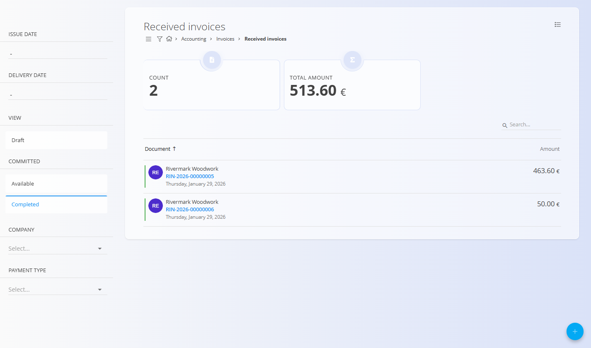
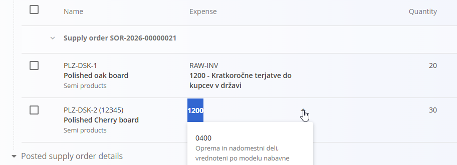

# Prejeti računi

**Prejeti računi** so finančni dokumenti, ki predstavljajo račune, prejete od dobaviteljev za kupljeno blago ali storitve.  
Uporabljajo se za evidentiranje računov dobaviteljev, ustvarjanje računovodskih knjižb in sprožanje izhodnih plačil.

Za dostop do tega zaslona pojdite na **Računovodstvo / Računi / Prejeti računi** v [**navigaciji**](../../../Skupno/UI/Navigacija.md).

> [!NOTE]
> Prejeti računi so običajno povezani z enim ali več **nabavnimi nalogi**.  Povezava z nabavnimi nalogi omogoča, da sistem predizpolni podatke in predlaga knjižbe na podlagi prejetega blaga.
>
> Za knjiženje postavk na prejetem računu mora biti za vsako postavko izbran [**Strošek**](../../Nabava/Upravljanje/Stroski.md). Ta določa konto glavne knjige, davčno stopnjo in logiko knjiženja, ki se uporabi ob potrditvi dokumenta.

## Kako se prejeti računi vključujejo v računovodski tok

Ko od dobavitelja prejmemo račun, ta sledi naslednjemu poteku:

1. Ustvari se nov prejeti račun v stanju **Osnutek**.
2. En ali več **[nabavnih nalogov](../../Nabava/Dokumenti/NabavniNalogi.md)** se poveže prek **Povezav dokumentov**.
3. Vnesejo se podatki glave dokumenta in skupni znesek.
4. Pregledajo in ustvarijo se predlagane knjižbe.
5. Račun se **Objavi**, kar pomeni knjiženje v glavno knjigo.
6. Dokument preide v stanje **Zaključeno**.
7. V ozadju se ustvari **temeljnica** (glejte [**Dvostavno knjigovodstvo**](DvostavnoKnjigovodstvo.md)).
8. Iz prejetega računa se lahko ustvari **[plačilni nalog](../../Racunovodstvo/Dokumenti/PlacilniNalogi.md)**.

## Shema

  
<strong>Dokument</strong>

| Polje | Opis |
|-----|-----|
| **Interna šifra** | Sistemsko generirana enolična oznaka prejetega računa. |
| **Zunanja šifra** | Referenčna številka računa dobavitelja (obvezno). |
| **Dobavitelj** | Dobavitelj, ki je izdal račun (obvezno). Prevzeto iz **[Poslovnega imenika](../../../Skupno/Upravljanje/PoslovniImenik.md)**. |
| [**Bančni račun**](../../../Skupno/Upravljanje/BancniRacuni.md) | Bančni račun dobavitelja za plačilo (obvezno). |
| **Datum izdaje** | Datum, naveden na računu dobavitelja. |
| **Datum dobave** | Datum, ko je bilo blago ali storitev dobavljena. |
| **Datum prejema** | Datum, ko je bil račun prejet. |
| **Datum zapadlosti** | Rok za plačilo računa (obvezno). |
| **Znesek** | Skupni neto znesek računa. |
| [**Valuta**](../../../Skupno/Upravljanje/Valute.md) | Valuta računa. |
| **Referenca** | Sklic za plačilo, ki ga določi dobavitelj (obvezno). |
| **Način plačila** | Način poravnave (npr. plačilni nalog). |
| [**Stroškovno mesto**](../../../Skupno/Upravljanje/StroskovnaMesta.md) | Neobvezna dodelitev stroškovnega mesta. |
| [**Konto**](../Upravljanje/GlavnaKnjiga/Konti.md) | Konto glavne knjige za knjiženje (obvezno). |
| [**Predloga**](../Upravljanje/GlavnaKnjiga/PredlogeZaTemeljnice.md) | Predloga knjiženja, uporabljena za račun. |

  
<strong>Postavke</strong>

| Polje | Opis |
|-----|-----|
| [**Strošek**](../../Nabava/Upravljanje/Stroski.md) | Stroškovna ali zalogovna kategorija postavke. |
| [**Konto**](../Upravljanje/GlavnaKnjiga/Konti.md) | Konto glavne knjige za posamezno postavko. |
| [**Davčna stopnja**](../../../Skupno/Upravljanje/DavcneStopnje.md) | Uporabljena davčna stopnja. |
| **Znesek** | Neto znesek postavke. |
| **Znesek DDV** | Izračunan znesek davka. |
| **Predplačilo** | Označuje, ali gre za predplačilo. |
| **Samoobdavčitev** | Označuje uporabo samoobdavčitve. |
| **Odbitek DDV** | Označuje, ali je DDV odbiten. |

## Upravljanje

### Seznam

Seznam prikazuje vse prejete račune skupaj s povzetnimi kazalniki.

Na voljo so naslednji filtri:

- **Datum izdaje**
- **Datum dobave**
- **Pogled**
  - Osnutek
  - Na voljo
  - Zaključeno
- **Podjetje**
- **Način plačila**

Seznam prikazuje tudi agregirane kazalnike, kot so število dokumentov in skupni znesek glede na trenutne filtre.

### Stanja dokumentov

Prejeti računi prehajajo skozi naslednja stanja:

- **Osnutek** – dokument je v urejanju in še ni knjižen.
- **Na voljo** – dokument je objavljen, vendar vsebuje neusklajene zneske.
- **Zaključeno** – dokument je objavljen in vsi zneski so usklajeni.

Stanje dokumenta določa razpoložljiva dejanja in nadaljnje postopke.

#### Neusklajeni zneski

Do neusklajenosti pride, kadar znesek v glavi dokumenta ne ustreza vsoti postavk (neto in/ali DDV).  
To se lahko zgodi, kadar je DDV vključen ali izključen nepravilno ali so zneski vneseni previsoko ali prenizko.

Za odpravo:
- z uporabo menija dokument **Vrnete v osnutek** in prilagodite glavo ali postavke (priporočeno),
- pri dokumentu v stanju *Na voljo* je mogoče urejati samo razdelek **Postavke**.

## Dejanja

### Ustvari prejeti račun

1. Kliknite [**akcijski gumb**](../../../Skupno/UI/AkcijskiGumb.md) za ustvarjanje novega prejetega računa.
2. V **Povezavah dokumentov** povežite enega ali več nabavnih nalogov.
3. Preglejte ali vnesite podatke glave dokumenta, vključno z **Zneskom**.
4. Izberite ustrezen **Konto** in po potrebi **Predlogo**.

### Ustvari predlagane knjižbe

V razdelku **Predlagane knjižbe** sistem predlaga knjižbe na podlagi povezanih nabavnih nalogov.

1. Preglejte predlagane postavke.
2. Uredite polja **Strošek** in **Količina** na seznamu po potrebi.

   

3. Izberite ustrezne vrstice.
4. Kliknite **Ustvari knjižbe** za ustvarjanje postavk.

   

#### Priponke

Vsak dokument vsebuje razdelek **Priponke**.

Naložite lahko poljubne datoteke (dobavnice, transportne dokumente, fotografije ali podporno dokumentacijo).  
Vse priponke so shranjene skupaj z dokumentom in so vedno dostopne.

### Urejanje postavk

Kliknite katerokoli modro polje v razdelku **Postavke**, da ga uredite.  
Po spremembah kliknite **Shrani**.

### Objavi prejeti račun

Ko so vsi zneski usklajeni in obvezni podatki izpolnjeni, je spodnji del dokumenta videti takole:

- Kliknite **Objavi** za potrditev dokumenta.
- Račun se knjiži v glavno knjigo.
- Samodejno se ustvari povezana **temeljnica** v **[Dvostavnem knjigovodstvu](DvostavnoKnjigovodstvo.md)**.

> [!NOTE]
> Če obstaja razlika med zneskom v glavi in vsoto postavk, dokument prikaže **Preostali znesek** in je označen.
>
> 

### Vrnitev v osnutek

Če so po objavi potrebne spremembe:

1. Odprite dokument.
2. Odprite meni v zgornjem levem kotu.
3. Izberite **Vrni v osnutek**.

To omogoča popravljanje datumov ali kontov pred ponovnim objavljanjem.

### Ustvari plačilni nalog

Pri zaključenih dokumentih razdelek **Povezave dokumentov** omogoča ustvarjanje plačilnega naloga iz prejetega računa.

## Brisanje

Dokumente v stanju **Osnutek** lahko izbrišete v urejanju, vendar **le, če ne vsebujejo postavk**.

Če osnutek še vsebuje postavke:

1. Kliknite modro polje stroška v razdelku **Postavke**, da odprete urejanje.
2. V oknu za urejanje kliknite **Izbriši**, da odstranite postavko.
3. Postopek ponovite za vse preostale postavke.

Ko dokument ne vsebuje več postavk, ga lahko izbrišete.

> [!NOTE]
> - Izbris je mogoč samo za **osnutke**.  
> - Objavljenih dokumentov ni mogoče izbrisati; uporabite **Vrni v osnutek**.  
> - Če so bila zabeležena plačila, dokumenta ni mogoče izbrisati, dokler plačila niso odstranjena in dokument vrnjen v osnutek.
