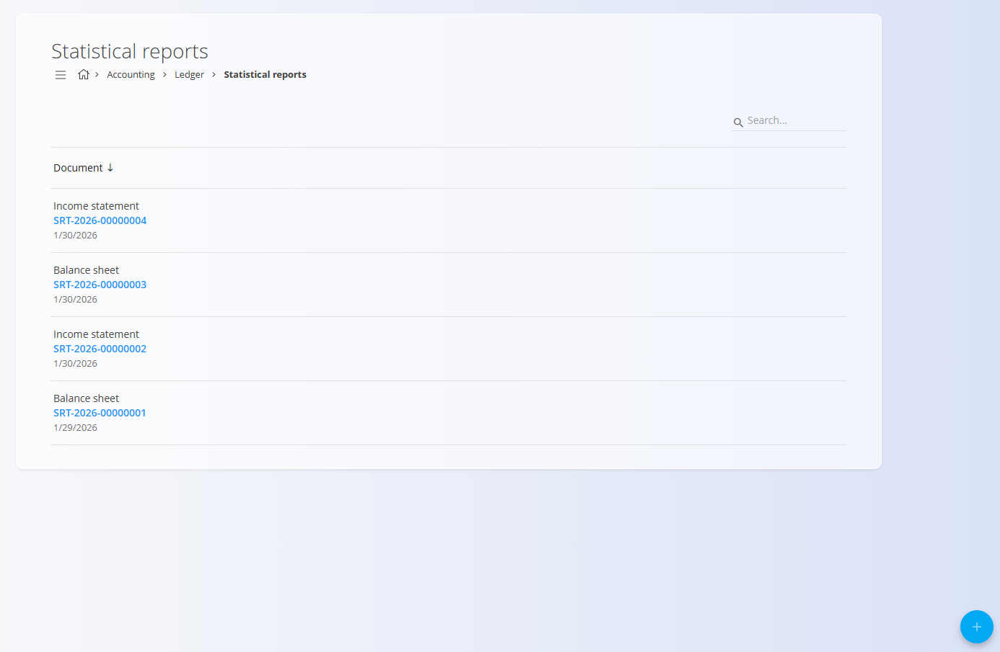

<!-- app_route: /accounting/ledger/statistical-reports -->
<!-- app_label: Statistična poročila -->
<!-- canonical_source_url: https://github.com/Tom-PIT/Connected.Docs/blob/main/sl/Domene/Racunovodstvo/Dokumenti/StatisticnaPorocila.md -->
<!-- canonical_source_title: Statistična poročila -->

# Statistična poročila

**Statistična poročila** omogočajo pregled finančnih podatkov, agregiranih po **AOP postavkah**, ter primerjavo med **trenutnim obdobjem** in **prejšnjim obdobjem** (najpogosteje prejšnje leto). Poročila se običajno uporabljajo za **bilanco stanja**, **izkaz poslovnega izida** ter druga zakonska ali interna finančna poročila.

Do tega zaslona dostopate preko **Računovodstvo / Glavna knjiga / Pregledi / Statistična poročila** v [**navigaciji**](../../../Skupno/UI/Navigacija.md).

> [!NOTE]
> - Statistična poročila so po ustvarjanju **samo za branje**.
> - Podatki se samodejno pridobijo iz **potrjenih (knjiženih) računovodskih vnosov**.
> - Če se osnovni računovodski podatki spremenijo, je treba ustvariti **novo statistično poročilo**, da se prikažejo posodobljene vrednosti.

## Shema

| Polje | Opis |
|------|------|
| **Tip statističnega poročila** | Izberite tip poročila: **Bilanca stanja** ali **Izkaz poslovnega izida**. |
| **Datum** | Določite časovna obdobja za **trenutno leto** in **prejšnje leto**. |

## Seznam statističnih poročil

Seznam prikazuje vsa ustvarjena statistična poročila.

Vsak vnos prikazuje:
- **Tip statističnega poročila** (*Bilanca stanja* ali *Izkaz poslovnega izida*)
- **Šifro dokumenta**
- **Datum**

S klikom na poročilo v seznamu odprete njegov podroben pogled.

## Dodajanje statističnega poročila

Za ustvarjanje novega statističnega poročila kliknite **Dodaj statistično poročilo**.

Izberite **tip statističnega poročila** (npr. *Bilanca stanja*) in določite primerjalna obdobja:
- **Trenutno leto od / do**
- **Prejšnje leto od / do**

Ta datumska obdobja določajo, kateri računovodski vnosi bodo vključeni v izračun.

Kliknite **Dodaj** za ustvarjanje poročila ali **Prekliči** za opustitev sprememb.

## Pogled statističnega poročila

Ob odprtju statističnega poročila se prikaže podroben pregled po **AOP postavkah**.

Za vsako AOP postavko so prikazani:
- **AOP šifra**
- **Ime AOP**
- **Znesek – trenutno obdobje**
- **Znesek – prejšnje obdobje**

Vrednosti se samodejno izračunajo in agregirajo na podlagi računovodskih vnosov ter njihove povezave z AOP postavkami.

> [!NOTE]
> AOP strukture so **specifične za posamezno državo**. Prikazan primer velja za **Slovenijo**. V drugih državah se uporabljajo podobne strukture, prilagojene lokalni zakonodaji.
