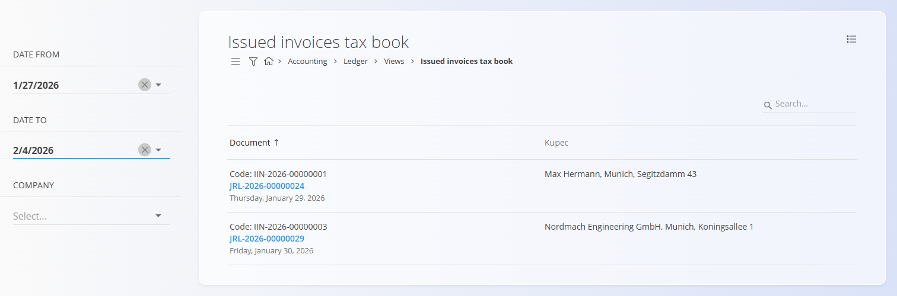

<!-- app_route: /accounting/ledger/issued-invoices-tax-book -->
<!-- app_label: Knjiga izdanih računov -->
<!-- canonical_source_url: https://github.com/Tom-PIT/Connected.Docs/blob/main/sl/Domene/Racunovodstvo/Pregledi/KnjigaIzdanihRacunov.md -->
<!-- canonical_source_title: Knjiga izdanih računov -->

# Knjiga izdanih računov

Pogled **Knjiga izdanih računov** omogoča **filtriran pregled izdanih računov, ki vsebujejo davčne zneske**, skupaj s povezavami na povezane temeljnice.

Gre za **analitični pogled samo za branje**, namenjen davčnemu pregledu in kontroli. Podatkov na tem zaslonu ni mogoče urejati.

Za dostop do tega pogleda pojdite na **Računovodstvo / Glavna knjiga / Pregledi / Knjiga izdanih računov** v [**navigaciji**](../../../Skupno/UI/Navigacija.md).

> [!NOTE]  
> Ta pogled prikazuje samo **izdane račune, ki ustvarijo davčne knjižbe**. Namenjen je davčnemu pregledu in poročanju ter ne nadomešča uradnega obračuna DDV.

## Namen pogleda

Knjiga izdanih računov se običajno uporablja za:

- Pregled **izdanih računov z obračunanim davkom**
- Preverjanje **podatkov o kupcu in dokumentu**
- Dostop do povezane **temeljnice**
- Podporo **DDV poročanju in usklajevanju**

S klikom na **modro kodo temeljnice** se odpre ustrezen dokument temeljnice.

## Filtri

Filtri na levi strani omogočajo omejitev rezultatov:

- **Datum od / Datum do** – Omeji račune na izbrano časovno obdobje.
- **Podjetje** – Prikaže račune za izbrano podjetje.

## Stolpci

Vsaka vrstica predstavlja en izdan račun in vključuje:

- **Dokument** – Šifra računa in povezana temeljnica.
- **Kupec** – Ime in naslov kupca.
- **Datum** – Datum računa.

## Meni

V meniju (zgornji desni kot) lahko izberete **Izvoz v PDF** za generiranje PDF datoteke filtriranega seznama.