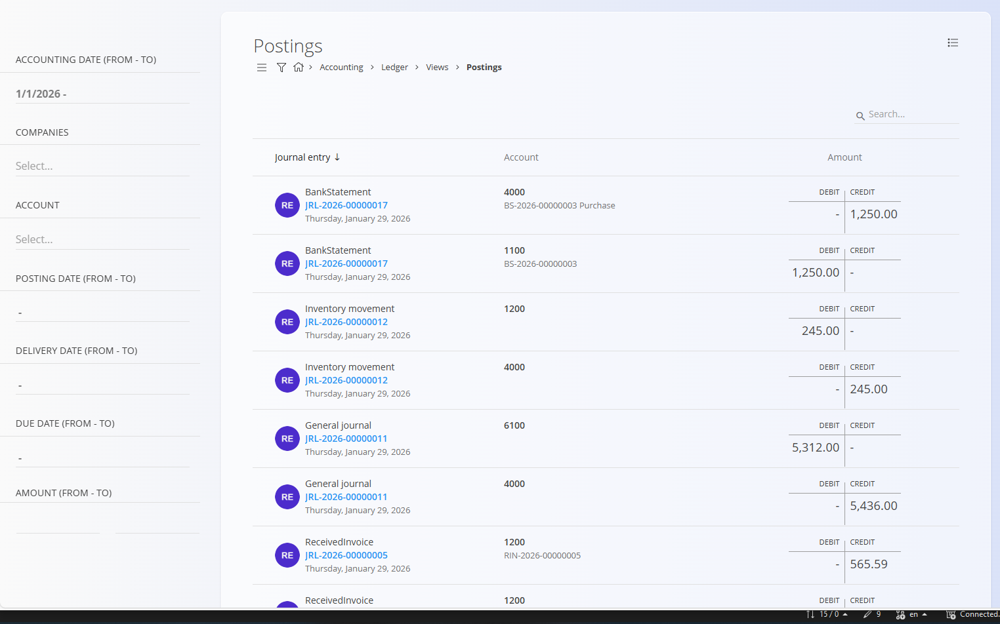

# Knjižbe

Pogled **Knjižbe** omogoča **ploskovit, vrstični pregled vseh debetnih in kreditnih knjižb**, ki so nastale iz knjiženih temeljnic. Vsaka vrstica predstavlja **eno knjižbo**, skupaj s kontom, zneskom in izvorno temeljnico.

Gre za **analitični pogled samo za branje**, namenjen pregledu in reviziji knjižb. Na tem zaslonu **ni mogoče urejati podatkov**.

Do tega pogleda dostopate prek **Računovodstvo / Glavna knjiga / Pregledi / Knjižbe** v [**navigaciji**](../../../Skupno/UI/Navigacija.md).

## Namen pogleda

Pogled **Knjižbe** se običajno uporablja za:

- pregled **posameznih debetnih in kreditnih vrstic** vseh temeljnic
- preverjanje, **kateri konto** je bil prizadet z določenim dokumentom
- sledenje zneskov nazaj do **izvorne temeljnice**
- podporo pri **usklajevanju, revizijah in odpravljanju napak**

S klikom na **modro označeno šifro temeljnice** odprete ustrezen dokument temeljnice.

## Filtri

Filtri na levi strani omogočajo omejevanje prikazanih knjižb:

- **Datum temeljnice (od / do)** - Omeji knjižbe na izbrano obdobje datuma temeljnice.

- **Podjetja** - Prikaže knjižbe za izbrana podjetja.

- **Konto** - Filtrira knjižbe po enem ali več kontih glavne knjige.

- **Datum knjiženja (od / do)** - Omeji knjižbe glede na datum knjiženja.

- **Datum opravljene storitve (od / do)** - Filtrira po datumu opravljene storitve, kjer je to relevantno.

- **Datum zapadlosti (od / do)** - Filtrira po datumu zapadlosti, kjer je to relevantno.

- **Znesek (od / do)** - Omeji knjižbe glede na razpon debetnih ali kreditnih zneskov.

## Stolpci

Vsaka vrstica v seznamu predstavlja eno knjižbo in vključuje:

- **Temeljnica** - Temeljnica, iz katere je knjižba nastala.

- **Konto** - Konto glavne knjige, na katerega je bila knjižba izvedena.

- **Znesek** - Debetni ali kreditni znesek knjižbe.

> [!NOTE]  
> Pogled **Knjižbe** prikazuje vse knjižbe ne glede na uravnoteženost.  
> V nasprotju s temeljnicami ta pogled **ne združuje debetnih in kreditnih vrstic** in **ne prikazuje**, ali je temeljnica uravnotežena.

## Meni

**Meni** v zgornjem desnem kotu omogoča izvoz seznama knjižb v **CSV datoteko** za nadaljnjo analizo.
