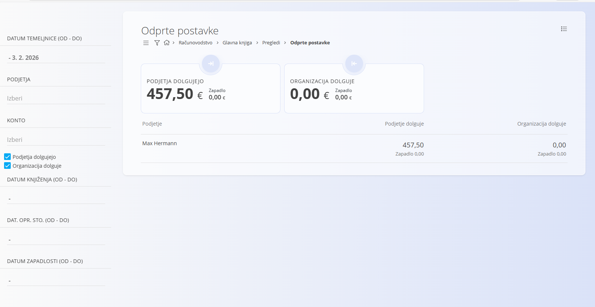

# Odprte postavke

Pogled **Odprte postavke** omogoča pregled knjiženih računovodskih postavk, ki **še niso v celoti poravnane**. Namenjen je spremljanju odprtih terjatev in obveznosti ter zapadlih zneskov.

Za dostop do tega pogleda pojdite na **Računovodstvo / Glavna knjiga / Pregledi / Odprte postavke** v [**navigaciji**](../../Skupno/UI/Navigacija.md).

> [!NOTE]
> Pogled je samo za branje. Odprtih postavk ni mogoče urejati neposredno, temveč se zapirajo preko plačil, pobotov ali knjižb.

> [!IMPORTANT]
> Prikazani podatki temeljijo izključno na pravilno knjiženih in poravnanih dokumentih.

## Namen pogleda

Pogled **Odprte postavke** se uporablja za:

- spremljanje neplačanih izdanih računov (**podjetja dolgujejo**),
- spremljanje neplačanih prejetih računov (**organizacija dolguje**),
- pregled zapadlih in nezapadlih zneskov,
- podporo nadzoru denarnega toka.

Pogled prikazuje podatke **izključno iz potrjenih (knjiženih) temeljnic**.

## Povzetki

Na vrhu zaslona sta prikazani dve povzetni kartici:

- **Podjetja dolgujejo** - Skupni znesek odprtih terjatev do podjetij. Pod zneskom je prikazan tudi **zapadli znesek**.

- **Organizacija dolguje** - Skupni znesek odprtih obveznosti organizacije do podjetij. Pod zneskom je prikazan tudi **zapadli znesek**.

Zneski odražajo trenutno stanje glede na izbrane filtre.

## Seznam postavk

Podatki so prikazani **po podjetjih**. Za vsako podjetje so prikazane naslednje informacije:

- **Podjetje** – ime poslovnega partnerja
- **Podjetje dolguje** – znesek, ki ga podjetje dolguje organizaciji
- **Organizacija dolguje** – znesek, ki ga organizacija dolguje podjetju
- **Zapadlo** – del zneska, ki mu je rok plačila že potekel (prikazan pod zneskom)

Vsaka vrstica predstavlja agregirano stanje odprtih postavk za posamezno podjetje.

## Filtri

Levi stranski meni omogoča filtriranje odprtih postavk po naslednjih kriterijih:

- **Datum temeljnice (od – do)**
- **Podjetja**
- **Konto**
- **Podjetja dolgujejo**
- **Organizacija dolguje**
- **Datum knjiženja (od – do)**
- **Datum opravljene storitve (od – do)**
- **Datum zapadlosti (od – do)**

Filtre je mogoče kombinirati za natančnejši pregled po obdobjih, kontih ali podjetjih.

## Viri podatkov

Odprte postavke nastanejo iz knjiženih računovodskih temeljnic, ki običajno izvirajo iz:

- izdanih računov,
- prejetih računov,
- dobropisov,
- delnih plačil in pobotov.

Ko je postavka v celoti poravnana, se samodejno odstrani iz tega pogleda.

## Menu

V zgornjem desnem kotu lahko preko **menija** izvozite podatke v PDF obliki.
