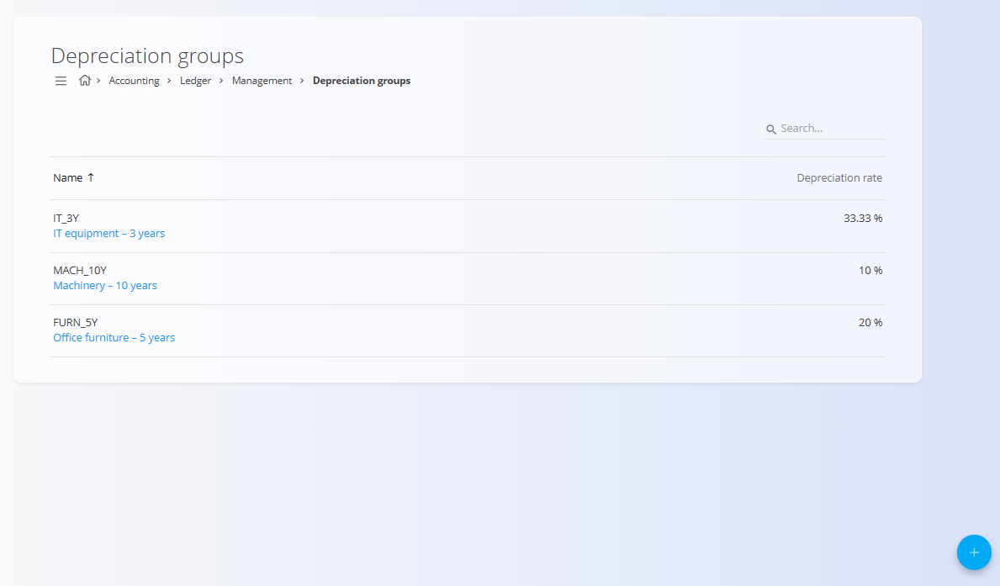
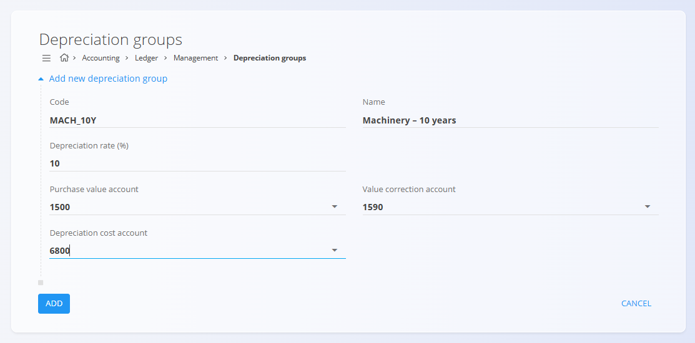

<!-- app_route: /management/accounting/depreciation-groups -->
<!-- app_label: Amortizacijske skupine -->
<!-- canonical_source_url: https://github.com/Tom-PIT/Connected.Docs/blob/main/sl/Domene/Racunovodstvo/Upravljanje/GlavnaKnjiga/AmortizacijskeSkupine.md -->
<!-- canonical_source_title: Amortizacijske skupine -->

# Amortizacijske skupine

Zaslon **Amortizacijske skupine** določa, kako se osnovna sredstva amortizirajo v glavni knjigi. Amortizacijska skupina opredeljuje amortizacijsko stopnjo ter konte, ki se uporabljajo za knjiženje nabavne vrednosti, popravkov vrednosti (akumulirane amortizacije) in stroškov amortizacije.

Amortizacijske skupine se uporabljajo pri osnovnih sredstvih in jih sistem uporablja pri izračunu in knjiženju amortizacije.

Za dostop do tega zaslona pojdite na **Računovodstvo / Glavna knjiga / Upravljanje / Amortizacijske skupine** v [**navigaciji**](../../../../Skupno/UI/Navigacija.md).

> [!NOTE]
> **Predpogoji**
>
> **[Konti](Konti.md)** morajo biti nastavljeni ustrezni konti za **nabavno vrednost**, **popravek vrednosti** in **strošek amortizacije**.

## Pregled

Amortizacijska skupina:

- predstavlja **pravilo amortizacije** za skupino osnovnih sredstev  
- določa **amortizacijsko stopnjo (%)**  
- povezuje knjiženje amortizacije s konkretnimi konti glavne knjige  
- se lahko uporablja pri več osnovnih sredstvih  

Amortizacijske skupine ne predstavljajo osnovnih sredstev. Gre za nastavitvene zapise, ki standardizirajo način amortizacije.

## Shema

| Polje | Opis |
|------|------|
| **Šifra** | Tehnični identifikator amortizacijske skupine. |
| **Ime** | Opisno ime amortizacijske skupine. |
| **Amortizacijska stopnja (%)** | Letna amortizacijska stopnja, izražena v odstotkih. |
| **Konto nabavne vrednosti** | Konto, na katerega se knjiži prvotna nabavna vrednost sredstva. |
| **Konto popravka vrednosti** | Konto za akumuliranje zneskov amortizacije (popravki vrednosti). |
| **Konto stroška amortizacije** | Odhodkovni konto za knjiženje stroškov amortizacije. |

## Seznam

Seznam prikazuje vse definirane amortizacijske skupine.

Vsaka vrstica prikazuje:

- **Ime**
- **Amortizacijsko stopnjo**

Klik na amortizacijsko skupino odpre zapis v načinu urejanja.

## Dejanja

### Ustvariti amortizacijsko skupino

Za ustvarjanje nove amortizacijske skupine:

1. Kliknite [**akcijski gumb**](../../../../Skupno/UI/AkcijskiGumb.md) za dodajanje novega zapisa
2. Vnesite:
   - **Šifro**
   - **Ime**
   - **Amortizacijsko stopnjo (%)**
3. Izberite ustrezne konte:
   - **Konto nabavne vrednosti**
   - **Konto popravka vrednosti**
   - **Konto stroška amortizacije**
4. Kliknite **Dodaj** za shranjevanje ali **Prekliči** za opustitev vnosa

### Urediti amortizacijske skupine

Kliknite amortizacijsko skupino v seznamu, da jo odprete v načinu urejanja. Po potrebi spremenite polja.

Kliknite **Shrani** za uveljavitev sprememb ali **Prekliči** za zavrnitev.

## Praktični primeri

Naslednji primer prikazuje tipično amortizacijsko skupino. Predpostavimo, da želi podjetje definirati amortizacijo za proizvodne stroje z dobo uporabe 10 let.

### Stroji – 10 let

- **Šifra:** MACH_10Y  
- **Amortizacijska stopnja:** 10 %  
- **Primer uporabe:** Proizvodni stroji in oprema  
- **Konto nabavne vrednosti:** Stroji  
- **Konto popravka vrednosti:** Akumulirana amortizacija – stroji  
- **Konto stroška amortizacije:** Strošek amortizacije  

Ta skupina je primerna za dolgoročna proizvodna sredstva.

## Brisati amortizacijsko skupino

Amortizacijsko skupino je mogoče izbrisati le, če **ni uporabljena** pri nobenem obstoječem osnovnem sredstvu.

Za brisanje odprite amortizacijsko skupino v načinu urejanja in izberite **Izbriši**.

> [!WARNING]
> Brisanje amortizacijske skupine, ki je v uporabi, lahko onemogoči pravilno izvajanje amortizacije za povezana sredstva.
