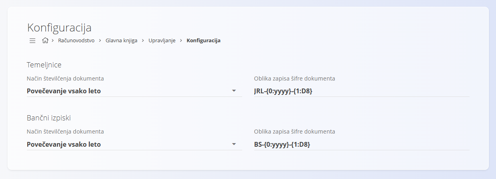

<!-- app_route: /management/ledger/configuration -->
<!-- app_label: Konfiguracija glavne knjige -->
<!-- canonical_source_url: https://github.com/Tom-PIT/Connected.Docs/blob/main/sl/Domene/Racunovodstvo/Upravljanje/GlavnaKnjiga/KonfiguracijaGlavneKnjige.md -->
<!-- canonical_source_title: Konfiguracija glavne knjige -->

# Konfiguracija glavne knjige

Nastavitve **glavne knjige**, ki vplivajo na številčenje dokumentov. Spremembe se shranjujejo samodejno.

Do te strani dostopate preko **Računovodstvo / Glavna knjiga / Upravljanje / Konfiguracija** v [**navigaciji**](../../../../Skupno/UI/Navigacija.md).

## Nastavitve številčenja dokumentov

Določite način številčenja in obliko zapisa šifre dokumentov za temeljnice in bančne izpiske.

| Polje | Opis |
|------|------|
| **Način številčenja dokumenta** | • **Povečevanje vsako leto** – številčenje se vsako leto ponastavi.   • **Neprekinjeno povečevanje** – enotno zaporedje brez letne ponastavitve. |
| **Oblika zapisa šifre dokumenta** | Vzorec, ki določa strukturo šifre dokumenta. |

> [!NOTE]
> Spremembe načina številčenja in oblike zapisa začnejo veljati takoj. Obstoječi dokumenti se ne preštevilčijo.
