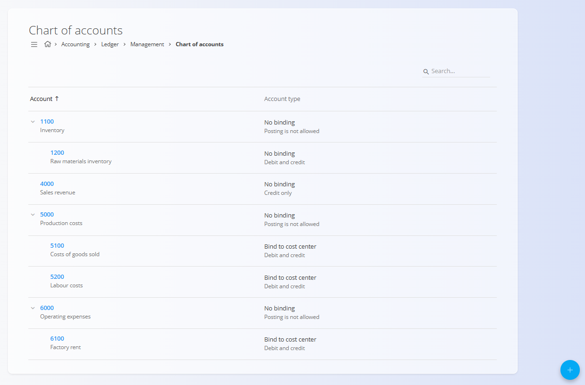

# Konti

Šifrant **Konti** določa celotno strukturo finančnih kontov, ki jih sistem uporablja za knjiženje, razvrščanje in poročanje o vseh računovodskih transakcijah. Vsak konto predstavlja določeno finančno kategorijo, kot so sredstva, prihodki, stroški proizvodnje ali poslovni odhodki.

Kontni plan je **osrednji konfiguracijski element** sistema. Nanjo se sklicujejo številni drugi deli sistema, vključno s temeljnicami, računi, vrednotenjem zalog, stroškovnimi mesti in računovodskimi poročili. Konti morajo biti zato definirani, preden jih je mogoče uporabiti drugje.

Za dostop do tega zaslona pojdite na **Računovodstvo / Glavna knjiga / Upravljanje / Konti** v [**navigaciji**](../../../Skupno/UI/Navigacija.md).

## Shema

| Polje | Opis |
|------|------|
| **Konto** | Enolična številčna oznaka konta. Oštevilčenje običajno sledi logični strukturi (npr. sredstva, prihodki, stroški) (obvezno). |
| **Ime** | Opisno ime konta, ki jasno določa njegov namen (obvezno). |
| **Tip knjiženja** | Določa, ali in kako je dovoljeno knjiženje na konto. |
| **Tip konta** | Določa operativna pravila vezave konta (npr. vezava na stroškovno mesto ali partnerja) (obvezno). |
| **Nadrejeni konto** | Izbirni nadrejeni konto, ki se uporablja za gradnjo hierarhičnega kontnega plana. |
| **Oznake** | Oznake za filtriranje, poročanje ali integracije. |

### Tip knjiženja

**Tip knjiženja** določa, kako se konto lahko uporablja pri knjiženjih:

- **Knjiženje ni dovoljeno** – Konto je strukturni ali zbirni konto. Na njega ni dovoljeno neposredno knjižiti.
- **Samo v debet** – Dovoljena so samo knjiženja v breme.
- **Samo v kredit** – Dovoljena so samo knjiženja v dobro.
- **Debet in kredit** – Dovoljena so knjiženja v obe smeri.

> [!TIP]
> Zbirni konti (npr. *Stroški proizvodnje* ali *Poslovni odhodki*) običajno uporabljajo **Knjiženje ni dovoljeno**, medtem ko operativni konti uporabljajo **V breme in v dobro**.

### Tip konta

**Tip konta** določa, ali mora biti konto povezan z drugim poslovnim objektom:

- **Brez vezave** – Konto se uporablja samostojno, brez obveznih povezav.
- **Vezava na stroškovno mesto** – Vsako knjiženje mora vsebovati stroškovno mesto.
- **Vezava na klienta** – Vsako knjiženje mora vsebovati poslovnega partnerja.
- **Sintetični** – Sistemsko izračunan konto, ki ni namenjen ročnemu knjiženju.

## Seznam

Seznam prikazuje vse definirane konte v hierarhični strukturi.

Vsaka vrstica prikazuje:

- **Številko konta**
- **Ime konta**
- **Tip konta in pravila knjiženja**

Nadrejene konte je mogoče razširiti za prikaz podrejenih kontov. Seznam je mogoče iskati z iskalnim poljem v zgornjem desnem kotu.

## Dejanja

Kliknite [**akcijski gumb**](../../../Skupno/UI/AkcijskiGumb.md) za dostop do razpoložljivih dejanj:
- **Novo**
- **Uvoz**

### Dodajanje novega konta

Za ustvarjanje novega konta:

1. Kliknite **akcijski gumb** in izberite **Novo**
2. Vnesite obvezna polja
3. Kliknite **Dodaj** za shranjevanje ali **Prekliči** za opustitev vnosa

### Uvoz kontov

Dejanje **Uvoz** omogoča množično ustvarjanje kontov z nalaganjem CSV datoteke. To se običajno uporablja ob začetni nastavitvi sistema ali pri migraciji iz drugega računovodskega sistema.

CSV datoteka mora slediti pričakovani strukturi stolpcev za konte, vključno s številkami kontov, imeni in konfiguracijskimi polji.

### Urejanje konta

Kliknite na konto v seznamu, da ga odprete v načinu urejanja. Njegove lastnosti lahko spreminjate, dokler to ni omejeno zaradi obstoječih knjižb ali odvisnosti.

Kliknite **Shrani** za potrditev sprememb ali **Prekliči** za zavrnitev.

## Opombe o uporabi

- Nadrejeni (zbirni) konti ne smejo dovoljevati knjiženja.
- Proizvodna podjetja običajno ločujejo **stroške proizvodnje** od **poslovnih odhodkov**.
- Konti, vezani na stroškovna mesta, se pogosto uporabljajo za sledenje proizvodnji, delu in režijskim stroškom.
- Kontni plan mora biti definiran pred ustvarjanjem temeljnic, računov ali zalogovnih transakcij.

## Pravila brisanja

Konto je mogoče izbrisati na zaslonu za urejanje s klikom na gumb **Izbriši**. Izbrišete ga lahko le, samo če **ni uporabljen** v:

- Temeljnicah
- Dokumentih (npr. računi, premiki zaloge)
- Poročilih ali izračunih

Če je bil konto že uporabljen, je brisanje onemogočeno zaradi zagotavljanja računovodske integritete.
