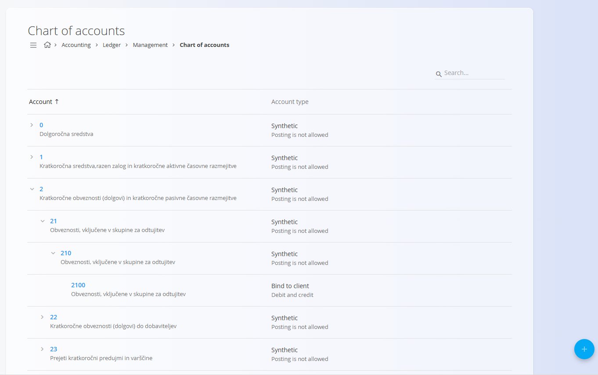

<!-- app_route: /management/ledger/accounts -->
<!-- app_label: Konti -->
<!-- canonical_source_url: https://github.com/Tom-PIT/Connected.Docs/blob/main/sl/Domene/Racunovodstvo/Upravljanje/GlavnaKnjiga/Konti.md -->
<!-- canonical_source_title: Konti -->

# Konti

Šifrant **Konti** določa celotno strukturo finančnih kontov, ki jih sistem uporablja za knjiženje, razvrščanje in poročanje o vseh računovodskih transakcijah. Vsak konto predstavlja določeno finančno kategorijo, kot so sredstva, prihodki, stroški proizvodnje ali poslovni odhodki.

Kontni plan je **osrednji konfiguracijski element** sistema. Nanjo se sklicujejo številni drugi deli sistema, vključno s temeljnicami, računi, vrednotenjem zalog, stroškovnimi mesti in računovodskimi poročili. Konti morajo biti zato definirani, preden jih je mogoče uporabiti drugje.

Za dostop do tega zaslona pojdite na **Računovodstvo / Glavna knjiga / Upravljanje / Konti** v [navigaciji](../../../../Skupno/UI/Navigacija.md).

## Evropski računovodski kontekst

V večini držav EU kontni plan sledi **strukturiranemu in hierarhičnemu modelu**, ki je pogosto definiran ali močno vplivan z nacionalnimi računovodskimi predpisi.

To običajno vključuje:
 - Razrede kontov (npr. 1–9), ki predstavljajo visokonivojske finančne kategorije
 - Sintetične (zbirne) konte, uporabljene za strukturo in poročanje
 - Analitične konte, uporabljene za operativna knjiženja

Sistem je zasnovan tako, da podpira ta model in hkrati ostaja prilagodljiv za razširitve specifične za podjetje.

> [!NOTE]
> Čeprav je hierarhični model kontnega plana s sintetičnimi/analitičnimi konti običajen v večini držav EU, sistem podpira tudi nestandardne ali podjetniško definirane kontne plane. To vključuje enostavnejše strukture brez vnaprej definiranih razredov kontov ali nadrejenih sintetičnih kontov, ki so pogostejše izven EU ali na skupinski ravni.

### Nacionalne različice

Čeprav je skupna struktura kontnih planov v EU podobna, se lahko specifično oštevilčenje, poimenovanje in obvezne strukture med državami razlikujejo.

Sistem ne vsiljuje enega samega nacionalnega kontnega plana, temveč podpira uvoz in razširitev predlog, specifičnih za posamezno državo.

## Shema

| Polje | Opis |
|------|------|
| **Konto** | Enolična številčna oznaka konta. Oštevilčenje običajno sledi logični strukturi (npr. sredstva, prihodki, stroški) (obvezno). |
| **Ime** | Opisno ime konta, ki jasno določa njegov namen (obvezno). |
| **Tip knjiženja** | Določa, ali in kako je dovoljeno knjiženje na konto. |
| **Tip konta** | Določa operativna pravila vezave konta (npr. vezava na stroškovno mesto ali partnerja) (obvezno). |
| **Nadrejeni konto** | Določa hierarhični položaj konta v kontnem planu. V EU strukturah se analitični konti običajno ustvarijo pod vnaprej definiranimi sintetičnimi nadrejenimi konti. |
| **Oznake** | Oznake za filtriranje, poročanje ali integracije. |

### Tip knjiženja

**Tip knjiženja** določa, kako se konto lahko uporablja pri knjiženjih:

- **Knjiženje ni dovoljeno** – Konto je strukturni ali zbirni konto. Na njega ni dovoljeno neposredno knjižiti.
- **Samo v debet** – Dovoljena so samo knjiženja v breme.
- **Samo v kredit** – Dovoljena so samo knjiženja v dobro.
- **Debet in kredit** – Dovoljena so knjiženja v obe smeri.

> [!TIP]
> Zbirni konti (npr. *Stroški proizvodnje* ali *Poslovni odhodki*) običajno uporabljajo **Knjiženje ni dovoljeno**, medtem ko operativni konti uporabljajo **V breme in v dobro**.

### Tip konta

**Tip konta** določa, ali mora biti konto povezan z drugim poslovnim objektom:

- **Brez vezave** – Konto se uporablja samostojno, brez obveznih povezav.
- **Vezava na stroškovno mesto** – Vsako knjiženje mora vsebovati stroškovno mesto.
- **Vezava na klienta** – Vsako knjiženje mora vsebovati poslovnega partnerja.
- **Sintetični** – Strukturni konto, uporabljen za združevanje in poročanje. Sintetični konti so tipično definirani z nacionalnimi računovodskimi okviri in ne dovoljujejo neposrednih knjiženj.

> [!NOTE]
> Operativna knjiženja se vedno izvajajo na analitičnih kontih, ki so definirani kot podrejeni sintetičnim kontom.

## Seznam

Seznam prikazuje vse definirane konte v hierarhični strukturi.

Vsaka vrstica prikazuje:

- **Številko konta**
- **Ime konta**
- **Tip konta in pravila knjiženja**

Nadrejene konte je mogoče razširiti za prikaz podrejenih kontov. Seznam je mogoče iskati z iskalnim poljem v zgornjem desnem kotu.

## Dejanja

Kliknite [akcijski gumb](../../../../Skupno/UI/AkcijskiGumb.md) za dostop do razpoložljivih dejanj:
- **Novo**
- **Uvoz**

### Ustvariti novega konta

Za ustvarjanje novega konta:

1. Kliknite akcijski gumb in izberite **Novo**
2. Vnesite obvezna polja
3. Kliknite **Dodaj** za shranjevanje ali **Prekliči** za opustitev vnosa

### Uvoz kontov

Dejanje **Uvoz** omogoča množično ustvarjanje kontov z nalaganjem CSV datoteke. To se običajno uporablja ob začetni nastavitvi sistema ali pri migraciji iz drugega računovodskega sistema.

CSV datoteka mora slediti pričakovani strukturi stolpcev za konte, vključno s številkami kontov, imeni in konfiguracijskimi polji.

### Urediti konta

Kliknite na konto v seznamu, da ga odprete v načinu urejanja. Njegove lastnosti lahko spreminjate, dokler to ni omejeno zaradi obstoječih knjižb ali odvisnosti.

Kliknite **Shrani** za potrditev sprememb ali **Prekliči** za zavrnitev.

## Opombe o uporabi

- Nadrejeni (zbirni) konti ne smejo dovoljevati knjiženja.
- Proizvodna podjetja običajno ločujejo **stroške proizvodnje** od **poslovnih odhodkov**.
- Konti, vezani na stroškovna mesta, se pogosto uporabljajo za sledenje proizvodnji, delu in režijskim stroškom.
- Kontni plan mora biti definiran pred ustvarjanjem temeljnic, računov ali zalogovnih transakcij.

## Izbrisati konto

Konto je mogoče izbrisati na zaslonu za urejanje s klikom na gumb **Izbriši**. Izbrišete ga lahko le, samo če **ni uporabljen** v:

- Temeljnicah
- Dokumentih (npr. računi, premiki zaloge)
- Poročilih ali izračunih

Če je bil konto že uporabljen, je brisanje onemogočeno zaradi zagotavljanja računovodske integritete.
