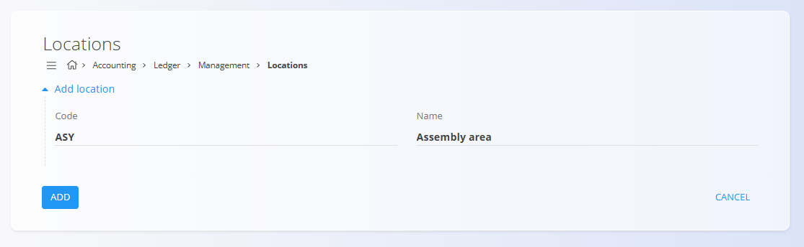

<!-- app_route: /management/accounting/locations -->
<!-- app_label: Lokacije glavne knjige -->
<!-- canonical_source_url: https://github.com/Tom-PIT/Connected.Docs/blob/main/sl/Domene/Racunovodstvo/Upravljanje/GlavnaKnjiga/LokacijeGlavneKnjige.md -->
<!-- canonical_source_title: Lokacije glavne knjige -->

# Lokacije glavne knjige

Zaslon **Lokacije glavne knjige** omogoča definiranje lokacij, ki se uporabljajo za računovodske in poročevalske namene v glavni knjigi. Lokacije glavne knjige predstavljajo fizična ali organizacijska mesta, kjer se nahajajo sredstva, zaloge ali vrednosti, ter jih uporabljajo drugi računovodski objekti.

Lokacije glavne knjige so **konfiguracijski vnosi**. Same po sebi ne ustvarjajo knjižb, temveč zagotavljajo kontekstne informacije, ki jih lahko uporabljajo osnovna sredstva, zaloge in poročila.

Za razlikovanje od logističnih lokacij se ta dokumentacija nanaša nanje kot na **lokacije glavne knjige**.

Za dostop do tega zaslona pojdite na **Računovodstvo / Glavna knjiga / Upravljanje / Lokacije** v [navigaciji](../../../../Skupno/UI/Navigacija.md).

## Pregled

Lokacija glavne knjige:

- predstavlja **fizično ali organizacijsko mesto**
- se lahko uporablja v računovodskih objektih
- podpira razvrščanje in poročanje
- **ne vpliva neposredno** na knjiženje v glavno knjigo

Lokacije glavne knjige se običajno uporabljajo za opis, kje se sredstva ali zaloge nahajajo, na primer v proizvodnih prostorih, skladiščih ali pisarnah.

## Shema

| Polje | Opis |
|------|------|
| **Šifra** | Kratek tehnični identifikator lokacije glavne knjige. |
| **Ime** | Opisno ime lokacije glavne knjige. |

## Seznam

Seznam prikazuje vse definirane lokacije glavne knjige.

Vsaka vrstica prikazuje:

- **Šifro**
- **Ime**

S klikom na lokacijo v seznamu jo odprete v načinu urejanja.

## Dejanja

### Ustvariti lokacijo glavne knjige

Za ustvarjanje nove lokacije glavne knjige:

1. Kliknite [akcijski gumb](../../../../Skupno/UI/AkcijskiGumb.md) za dodajanje novega vnosa.
2. Vnesite:
   - **Šifro**
   - **Ime**
3. Kliknite **Dodaj** za shranjevanje ali **Prekliči** za opustitev vnosa.

### Urediti lokacijo glavne knjige

Kliknite lokacijo glavne knjige v seznamu, da jo odprete v načinu urejanja. Po potrebi posodobite njena polja.

Kliknite **Shrani** za uveljavitev sprememb ali **Prekliči** za zavrnitev sprememb.

## Primeri uporabe

Tipični primeri lokacij glavne knjige vključujejo:

- **Montažni oddelek** – območje, kjer poteka sestavljanje izdelkov
- **Zaključni oddelek** – območje za dodelavo ali obdelavo izdelkov
- **Centralno skladišče** – glavna skladiščna lokacija
- **Pomožno skladišče** – dodatno ali rezervno skladišče
- **Sedež podjetja** – administrativni ali pisarniški prostori
- **Razstavni prostor** – prostor za predstavitev izdelkov

Te lokacije zagotavljajo kontekstne informacije in jih je mogoče ponovno uporabljati v celotnem sistemu.

## Brisanti lokacije glavne knjige

Lokacijo glavne knjige je mogoče izbrisati le, če **ni uporabljena** v drugih objektih.

Za brisanje lokacije jo odprite v načinu urejanja in izberite **Izbriši**.

> [!WARNING]
> Brisanje lokacije glavne knjige, ki je v uporabi, lahko povzroči prekinjene povezave v računovodstvu ali poročilih.
