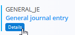
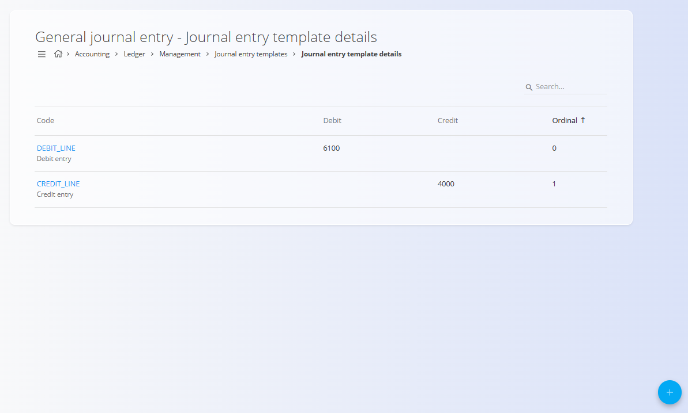

<!-- app_route: /management/ledger/journal-entry-templates -->
<!-- app_label: Predloge za temeljnice -->
<!-- canonical_source_url: https://github.com/Tom-PIT/Connected.Docs/blob/main/sl/Domene/Racunovodstvo/Upravljanje/GlavnaKnjiga/PredlogeZaTemeljnice.md -->
<!-- canonical_source_title: Predloge za temeljnice -->

# Predloge za temeljnice

Šifrant **Predloge za temeljnice** določa vnaprej pripravljene predloge za ustvarjanje računovodskih temeljnic v glavni knjigi. Predloga temeljnice določa tip dokumenta in ponuja ponovno uporabno strukturo, ki jo lahko uporabite pri ustvarjanju računovodskih knjižb.

Predloge za temeljnice poenostavijo vnos podatkov, zagotavljajo enotnost ter zmanjšujejo tveganje za napake s standardizacijo pogosto uporabljenih struktur temeljnic.

> [!NOTE]
> - Predloge za temeljnice določajo strukturo temeljnic, ne pa zneskov.
> - Uravnoteženje debetnih in kreditnih postavk se izvede ob ustvarjanju dejanske temeljnice.
> - Konti, uporabljeni v podrobnostih predloge, morajo že obstajati v **[Kontnem načrtu](Konti.md)**.
> - Predloge je mogoče ponovno uporabiti pri več temeljnicah.

Za dostop do tega zaslona pojdite na **Računovodstvo / Glavna knjiga / Upravljanje / Predloge za temeljnice** v [**navigaciji**](../../../../Skupno/UI/Navigacija.md).

## Shema

  
<strong>Dokument</strong>

| Polje | Opis |
|------|------|
| **Tip dokumenta** | Tip dokumenta, dodeljen predlogi temeljnice. Določa razvrstitev temeljnice v glavni knjigi. |
| **Šifra** | Tehnični identifikator predloge temeljnice. |
| **Ime** | Berljivo ime, ki opisuje namen predloge. |

  
<strong>Postavke</strong>

| Polje | Opis |
|------|------|
| **Šifra** | Tehnični identifikator postavke predloge temeljnice. |
| **Konto** | Konto iz **[Konti](Konti.md)**, uporabljen v tej postavki. |
| **Smer knjiženja** | Določa, ali gre za debetno ali kreditno knjiženje. |
| **Vrstni red** | Zaporedje postavke v temeljnici. |
| **Opis** | Privzeti opis, uporabljen pri vrstici temeljnice. |

## Seznam

Seznam prikazuje vse definirane predloge za temeljnice.

Vsaka vrstica prikazuje:

- **Šifra**
- **Ime**
- **Tip dokumenta**

Vsaka predloga omogoča dostop do **Postavk**, kjer so definirane posamezne vrstice temeljnice.

## Dejanja

### Ustvariti predlogo za temeljnico

Za ustvarjanje nove predloge temeljnice:

1. Kliknite [**akcijski gumb**](../../../../Skupno/UI/AkcijskiGumb.md) za dodajanje nove predloge
2. Izberite **Tip dokumenta**
3. Vnesite:
   - **Šifra**
   - **Ime**
4. Kliknite **Dodaj** za shranjevanje ali **Prekliči** za opustitev vnosa

### Urediti predloge za temeljnico

Kliknite predlogo v seznamu, da jo odprete v načinu urejanja. Po potrebi posodobite polja.

Kliknite **Shrani** za potrditev sprememb ali **Prekliči** za opustitev.

## Postavke predloge temeljnice

Vsaka predloga temeljnice lahko vsebuje eno ali več **postavk**, ki določajo posamezne debetne in kreditne vrstice temeljnice.

Za upravljanje postavk kliknite **Postavke** pri izbrani predlogi temeljnice.

### Seznam postavk

Seznam postavk prikazuje vse definirane vrstice za izbrano predlogo temeljnice.

Vsaka vrstica prikazuje:

- **Šifra**
- **Debetni** ali **kreditni konto**
- **Vrstni red**

### Dodati postavko predloge temeljnice

Za dodajanje nove postavke:

1. Kliknite **Dodaj novo podrobnost za predlogo**
2. Vnesite:
   - **Šifra**
   - **Konto**
   - **Smer knjiženja**
   - **Vrstni red**
   - **Opis**
3. Kliknite **Dodaj** za shranjevanje ali **Prekliči** za opustitev vnosa

## Izbrisati predlogo za temeljnico

Predlogo temeljnice je mogoče izbrisati samo, če **ni uporabljena** v obstoječih temeljnicah.

Za brisanje odprite predlogo v načinu urejanja in izberite **Izbriši**.

> [!WARNING]
> Brisanje predloge temeljnice, ki je v uporabi, lahko onemogoči ustvarjanje ali ponovno ustvarjanje temeljnic.
