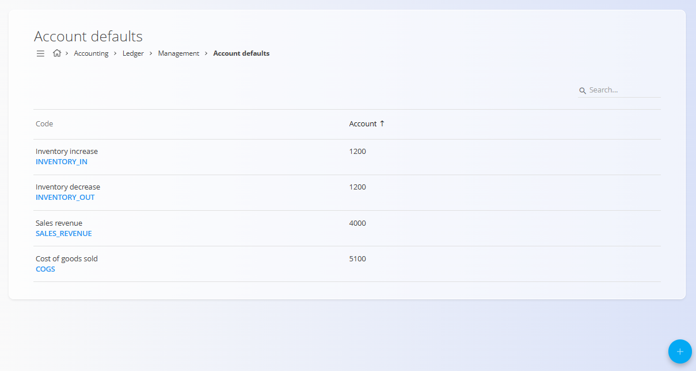

<!-- app_route: /management/ledger/account-defaults -->
<!-- app_label: Privzeti konti -->
<!-- canonical_source_url: https://github.com/Tom-PIT/Connected.Docs/blob/main/sl/Domene/Racunovodstvo/Upravljanje/GlavnaKnjiga/PrivzetiKonti.md -->
<!-- canonical_source_title: Privzeti konti -->

# Privzeti konti

Šifrant **Privzeti konti** določa, kako sistem samodejno izbira konte pri knjiženju računovodskih postavk, ki jih ustvarjajo sistemski procesi. Vsak privzeti konto predstavlja vnaprej določeno povezavo med poslovnim scenarijem in konkretnim kontom, skupaj s smerjo knjiženja.

Privzeti konti se uporabljajo vedno, ko se računovodske postavke ustvarijo **samodejno**, na primer pri izdaji prodajnih računov, premikih zaloge ali pripoznavanju stroškov. Zagotavljajo dosledno in predvidljivo knjiženje brez potrebe po ročni izbiri konta.

> [!NOTE]
> Privzeti konti se običajno nastavijo ob začetni konfiguraciji sistema. Spremembe vplivajo na prihodnja samodejna knjiženja, ne pa na že obstoječe postavke.

Za dostop do tega zaslona pojdite na **Računovodstvo / Glavna knjiga / Upravljanje / Privzeti konti** v [**navigaciji**](../../../../Skupno/UI/Navigacija.md).

## Shema

| Polje | Opis |
|------|------|
| **Šifra** | Tehnični identifikator privzetega konta, ki ga sistem uporablja v logiki knjiženja. |
| **Ime** | Opisno ime, ki pojasnjuje namen privzetega konta. |
| **Smer knjiženja** | Določa, ali se izbrani konto knjiži na debetno ali kreditno stran. |
| **Konto** | Konto iz **[Kontnega načrta](Konti.md)**, ki se uporabi ob tem privzetem pravilu. |

### Smer knjiženja

Polje **Smer knjiženja** določa, kako se izbrani konto uporabi, ko se privzeti konto sproži:

- **Debet** – Konto se bremeni s sistemsko ustvarjeno knjižbo.
- **Kredit** – Konto se odobri s sistemsko ustvarjeno knjižbo.

Smer knjiženja je fiksna za vsak privzeti konto, kar zagotavlja enotno računovodsko obnašanje v samodejnih procesih.

## Seznam

Seznam prikazuje vse definirane privzete konte.

Vsaka vrstica vsebuje:

- **Šifro**
- **Ime**
- **Konto**

Seznam je mogoče preiskovati z iskalnim poljem v zgornjem desnem kotu.

## Dejanja

### Ustvariti privzeti konto

Za ustvarjanje novega privzetega konta:

1. Kliknite [**akcijski gumb**](../../../../Skupno/UI/AkcijskiGumb.md)
2. Vnesite:
   - **Šifro**
   - **Ime**
   - **Smer knjiženja**
   - **Konto**
3. Kliknite **Dodaj** za shranjevanje ali **Prekliči** za preklic

### Urediti privzeti konto

Kliknite vnos v seznamu, da ga odprete v načinu urejanja. Po potrebi spremenite polja.

Kliknite **Shrani** za uveljavitev sprememb ali **Prekliči** za zavrnitev.

## Pogosti primeri

Tipični primeri privzetih kontov vključujejo:

- **Povečanje zaloge** – bremenitev konta zaloge ob povečanju zaloge
- **Zmanjšanje zaloge** – odobritev konta zaloge ob zmanjšanju zaloge
- **Prihodki od prodaje** – odobritev konta prihodkov ob izdaji prodajnega računa
- **Strošek prodanega blaga** – bremenitev stroškovnega konta ob prodaji blaga

Ti privzeti konti se uporabljajo v sistemskih procesih, kot so prodaja, zaloga in proizvodnja.

## Izbrisati privzeti konto

Privzeti konto je mogoče izbrisati le, če **ni uporabljen** v aktivnih sistemskih procesih ali konfiguracijskih pravilih.

Za brisanje odprite vnos v načinu urejanja in izberite **Izbriši**.

> [!WARNING]
> Brisanje privzetega konta, ki ga zahteva določen proces, lahko povzroči napake pri knjiženju ali nepopolne računovodske zapise.
