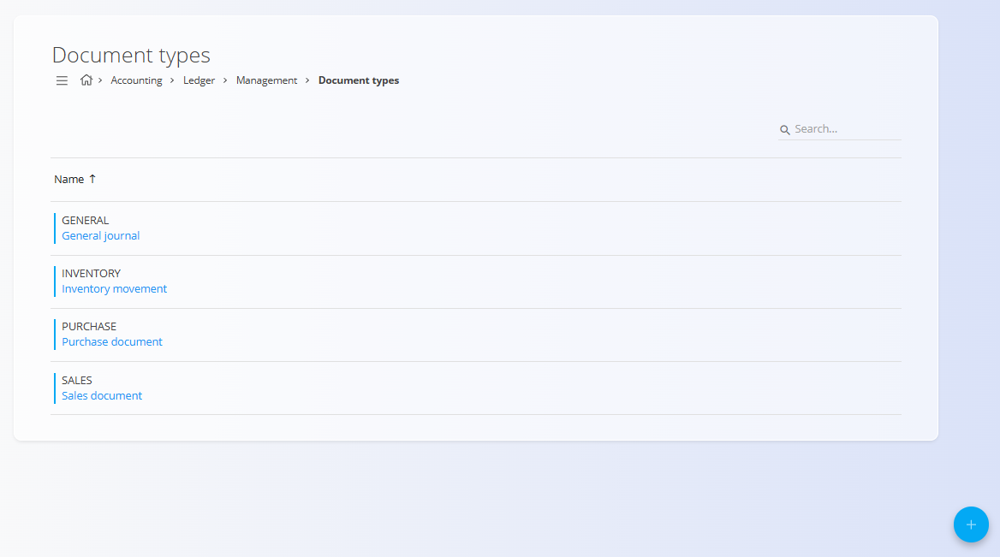
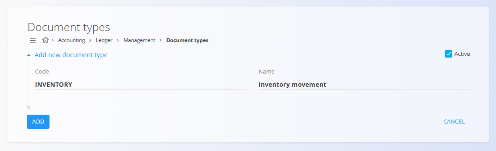

<!-- app_route: /management/ledger/document-types -->
<!-- app_label: Tipi dokumentov -->
<!-- canonical_source_url: https://github.com/Tom-PIT/Connected.Docs/blob/main/sl/Domene/Racunovodstvo/Upravljanje/GlavnaKnjiga/TipiDokumentov.md -->
<!-- canonical_source_title: Tipi dokumentov -->

# Tipi dokumentov

Šifrant **Tipi dokumentov** določa vrste računovodskih dokumentov, ki se uporabljajo v glavni knjigi. Vsak tip dokumenta razvršča temeljnice in druge računovodske knjižbe glede na njihov poslovni namen, kot so prodaja, nabava, premiki zaloge ali splošne prilagoditve.

Tipi dokumentov so **obvezna konfiguracija** glavne knjige. Na njih se sklicujejo temeljnice in jih sistem uporablja za razvrščanje knjižb, uporabo pravil knjiženja ter podporo poročanju in reviziji.

Za dostop do tega zaslona pojdite na **Računovodstvo / Glavna knjiga / Upravljanje / Tipi dokumentov** v [navigaciji](../../../../Skupno/UI/Navigacija.md).

## Shema

| Polje | Opis |
|------|------|
| **Šifra** | Tehnični identifikator tipa dokumenta. Uporablja se interno v sistemu in v temeljnicah. |
| **Ime** | Berljivo ime, ki opisuje namen tipa dokumenta. |
| **Aktiven** | Označuje, ali je tip dokumenta na voljo pri ustvarjanju novih dokumentov. |

## Seznamski pogled

Seznamski pogled prikazuje vse definirane tipe dokumentov.

Vsaka vrstica vsebuje:
- **Å ifra**
- **Ime**

Neaktivni tipi dokumentov so ohranjeni zaradi zgodovinske sledljivosti, vendar jih ni mogoče uporabljati za nove knjižbe.

## Dejanja

### Ustvariti tip dokumenta

Za dodajanje novega tipa dokumenta:

1. Kliknite [akcijski gumb](../../../../Skupno/UI/AkcijskiGumb.md) za ustvarjanje novega vnosa.
2. Vnesite:
   - **Å ifra**
   - **Ime**
   - **Aktiven** (privzeto omogočeno)
3. Kliknite **Dodaj** za shranjevanje ali **Prekliči** za zavrnitev vnosa.

### Urediti tip dokumenta

Kliknite tip dokumenta v seznamu, da ga odprete v načinu urejanja, in po potrebi posodobite polja.

Kliknite **Shrani** za uveljavitev sprememb ali **Prekliči** za zavrnitev.

## Izbrisati tip dokumenta

Tip dokumenta je mogoče izbrisati samo, če **ni uporabljen** v obstoječih temeljnicah ali konfiguracijskih pravilih.

Za brisanje odprite vnos v načinu urejanja in izberite **Izbriši**.

> [!WARNING]
> Brisanje tipa dokumenta, ki je potreben za delovanje temeljnic, lahko onemogoči pravilno knjiženje ali poročanje računovodskih podatkov.
