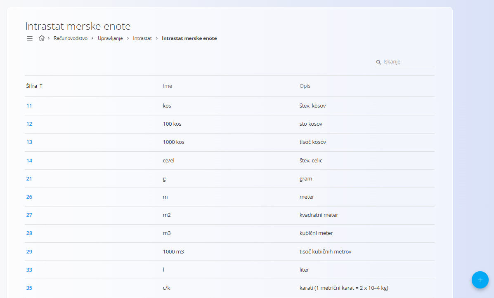
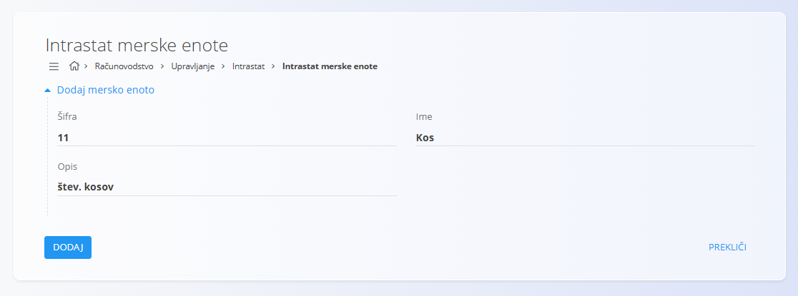

<!-- app_route: /management/intrastat/supplementary-units -->
<!-- app_label: Intrastat merske enote -->
<!-- canonical_source_url: https://github.com/Tom-PIT/Connected.Docs/blob/main/sl/Domene/Racunovodstvo/Upravljanje/Intrastat/IntrastatMerskeEnote.md -->
<!-- canonical_source_title: Intrastat merske enote -->

# Intrastat merske enote

**Intrastat merske enote** so standardizirane merske enote, ki se uporabljajo pri poročanju Intrastat in v logističnih ter prodajnih dokumentih. Uporabljajo se v dokumentih, kot so [naročila strank](../../../Prodaja/Dokumenti/NarocilaStrank.md), [dobavnice](../../../Prodaja/Dokumenti/Dobavnice.md) in drugih transakcijah, kjer je poleg osnovne količine potrebna dodatna statistična merska enota.

Za dostop do tega zaslona pojdite na **Računovodstvo / Upravljanje / Intrastat / Intrastat merske enote** v [**navigaciji**](../../../../Skupno/UI/Navigacija.md).

## Shema

| Polje | Opis |
|------|------|
| Šifra | Številčna oznaka merske enote (v skladu s standardom Intrastat). |
| Ime | Kratko ime ali oznaka merske enote (npr. `kos`, `m2`, `l`). |
| Opis | Opis merske enote v berljivi obliki. |

## Seznam

Seznam prikazuje vse razpoložljive Intrastat merske enote skupaj z njihovo **šifro**, **imenom** in **opisom**.

Omogočeno je:
- iskanje po seznamu,
- razvrščanje po **šifri**,
- odpiranje vnosa s klikom za urejanje.

## Ustvariti mersko enoto

Za dodajanje nove merske enote kliknite [**akcijski gumb**](../../../../Skupno/UI/AkcijskiGumb.md).

Vnesite:
- **Šifra**
- **Ime**
- **Opis**

Kliknite **Dodaj** za shranjevanje ali **Prekliči** za opustitev vnosa.

## Ustvariti mersko enoto

Kliknite na **šifro** v seznamu, da odprete vnos v načinu urejanja. Po potrebi posodobite **Šifro**, **Ime** ali **Opis**.

Kliknite **Shrani**, da potrdite spremembe, ali **Prekliči**, da jih zavržete.

## Izbrisati mersko enoto

Odprite vnos iz seznama in kliknite **Izbriši**. Brisanje potrdite v potrditvenem oknu.

> [!NOTE]
> Mersko enoto je mogoče izbrisati le, če ni uporabljena v odvisnih dokumentih, kot so prodajna naročila, dobavnice ali Intrastat poročila.
