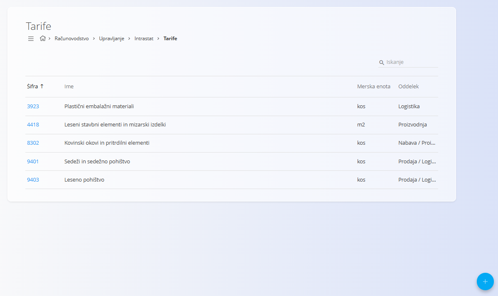
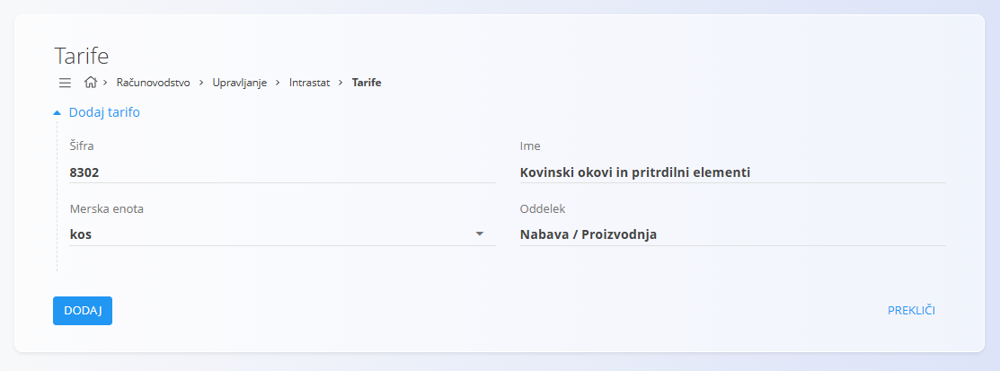

<!-- app_route: /management/intrastat/tariffs -->
<!-- app_label: Tarife -->
<!-- canonical_source_url: https://github.com/Tom-PIT/Connected.Docs/blob/main/sl/Domene/Racunovodstvo/Upravljanje/Intrastat/Tarife.md -->
<!-- canonical_source_title: Tarife -->

# Tarife

Tarife predstavljajo **klasifikacijske šifre blaga**, ki se uporabljajo za **poročanje Intrastat** ter v izbranih logističnih in prodajnih procesih. Vsaka tarifa določa vrsto blaga, pripadajočo mersko enoto in oddelek, v katerem se najpogosteje uporablja.

Za dostop do tega zaslona pojdite na **Računovodstvo / Upravljanje / Intrastat / Tarife** v [**navigaciji**](../../../../Skupno/UI/Navigacija.md).

## Shema

| Polje | Opis |
|------|------|
| **Šifra** | Tarifa (običajno numerična), uporabljena za klasifikacijo blaga. |
| **Ime** | Opis vrste blaga, ki ga tarifa pokriva. |
| **Merska enota** | Dodatna merska enota, zahtevana za poročanje Intrastat (npr. `kos`, `m2`). |
| **Oddelek** | Funkcionalni oddelek, kjer se tarifa uporablja (npr. Prodaja, Logistika, Proizvodnja). |

## Seznam tarif

Seznam prikazuje vse definirane tarife z naslednjimi stolpci:

- **Šifra**
- **Ime**
- **Merska enota**
- **Oddelek**

Tarife je mogoče iskati z iskalnikom v zgornjem desnem kotu.

## Ustvariti tarife

Za dodajanje nove tarife kliknite [**akcijski gumb**](../../../../Skupno/UI/AkcijskiGumb.md).

Izpolnite naslednja polja:

- **Šifra**
- **Ime**
- **Merska enota**
- **Oddelek**

Kliknite **Dodaj**, da shranite tarifo, ali **Prekliči**, da opustite vnos.

## Urejati tarife

Kliknite **šifro** tarife v seznamu, da jo odprete v načinu urejanja. Po potrebi posodobite **Šifro**, **Ime**, **Mersko enoto** ali **Oddelek**.

Kliknite **Shrani** za uveljavitev sprememb ali **Prekliči** za zavrnitev.

## Brisati tarife

Odprite tarifo iz seznama in kliknite **Izbriši**. Brisanje potrdite v pogovornem oknu.

> [!NOTE]
> Tarifo je mogoče izbrisati le, če ni uporabljena v odvisnih dokumentih, Intrastat poročilih ali drugih zakonsko zahtevanih evidencah.
