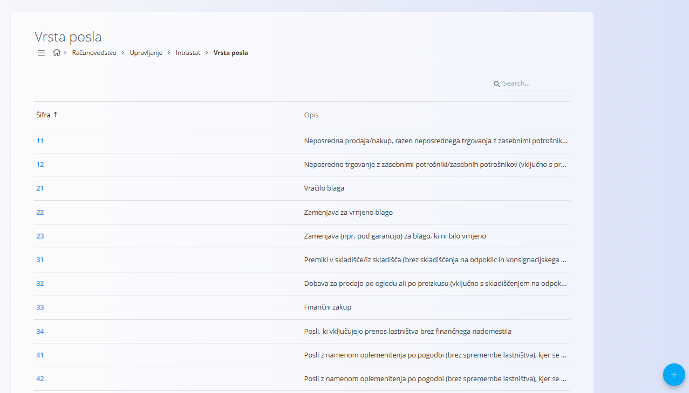
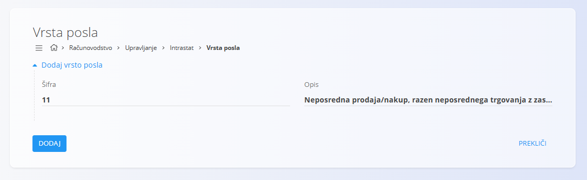

# Vrsta posla

Šifrarnik **Vrsta posla** se uporablja za poročanje Intrastat in v računovodstvu za razvrščanje vrste transakcije, v okviru katere se blago odpošlje ali prejme. Vsaka šifra predstavlja standardizirano kategorijo transakcije, določeno s pravili Intrastata, in je obvezna za statistično in regulativno poročanje.

Do tega zaslona dostopate preko **Računovodstvo / Upravljanje / Intrastat / Vrsta posla** v [**navigaciji**](../../../../Skupno/UI/Navigacija.md).

## Shema

| Polje | Opis |
|------|------|
| Šifra | Številčna oznaka vrste posla |
| Opis | Opis vrste transakcije |

## Seznam

Seznam prikazuje vse definirane šifre vrste posla.

Vsaka vrstica vsebuje:
- **Šifro**
- **Opis**

Seznam je mogoče filtrirati z iskalnim poljem v zgornjem desnem kotu.

Tipični primeri vključujejo:
- Neposredno prodajo ali nakup
- Vračilo blaga
- Zamenjavo blaga (npr. v okviru garancije)
- Finančni zakup
- Posle predelave po pogodbi

## Dejanja

### Dodaj vrsto posla

Za dodajanje nove vrste posla:
1. Kliknite **Dodaj vrsto posla**
2. Vnesite:
   - **Šifro**
   - **Opis**
3. Kliknite **Dodaj** za shranjevanje vnosa

### Uredi vrsto posla

Kliknite šifro v seznamu, da jo odprete v načinu urejanja. Po potrebi posodobite **Šifro** ali **Opis**.

Kliknite **Shrani**, da uveljavite spremembe, ali **Prekliči**, da jih zavržete.

### Brisanje

Odprite zapis iz seznama in kliknite **Izbriši**. Brisanje potrdite v pogovornem oknu.

> [!NOTE]
> Vrsto posla je mogoče izbrisati samo, če ni uporabljena v povezanih Intrastat poročilih ali računovodskih evidencah.
