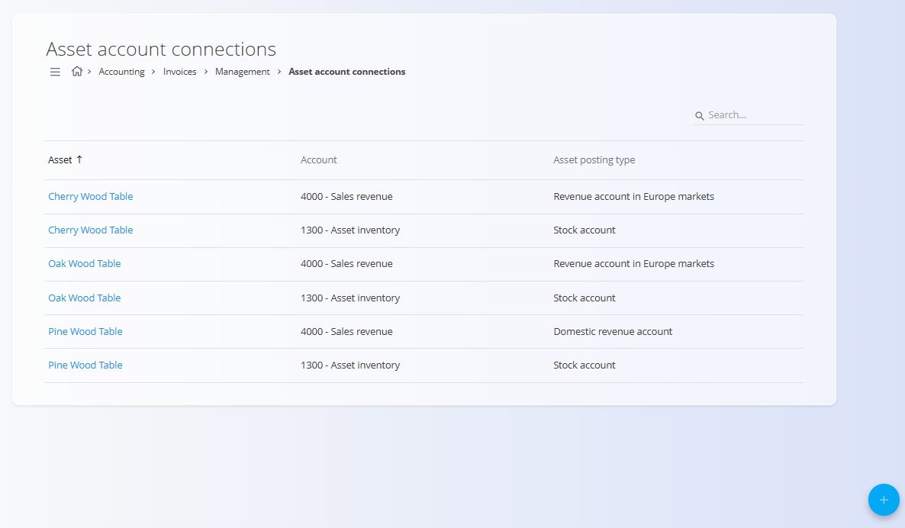

# Povezave sredstev in kontov

Pogled **Povezave sredstev in kontov** določa, kako so posamezna **sredstva** povezana s konti glavne knjige za računovodska knjiženja, ki nastanejo iz računov. Ta konfiguracija določa, kateri konti se uporabijo, ko je sredstvo prodano, skladiščeno ali kako drugače vključeno v knjiženja, povezana z računi.

Za dostop do tega pogleda pojdite na **Računovodstvo / Računi / Upravljanje / Povezave sredstev in kontov** v [**navigaciji**](../../../Skupno/UI/Navigacija.md).

## Pregled

Povezave sredstev in kontov:

- Povezujejo posamezno **sredstvo** s konkretnim **kontom**
- Se upoštevajo pri knjiženju računov
- Omogočajo različno knjiženje glede na **tip knjiženja sredstva**

Te povezave same po sebi ne ustvarjajo knjižb. Predstavljajo pravila knjiženja, ki se uporabijo, ko se obdelujejo računi, ki se nanašajo na sredstvo.

## Shema

| Polje | Opis |
|------|------|
| **Sredstvo** | Sredstvo, za katerega velja povezava s kontom. |
| **Tip knjiženja** | Določa računovodski kontekst, v katerem se konto uporabi. |
| **Konto** | Konto iz **[kontnega načrta](../GlavnaKnjiga/Konti.md)**, ki se uporabi za izbran tip knjiženja. |

### Tip knjiženja

**Tip knjiženja** določa, *kdaj* se izbrani konto uporabi. Razpoložljive možnosti lahko vključujejo:

- **Konto prihodka na domačem trgu** – Uporabi se pri prodaji sredstva na domačem trgu
- **Konto prihodka na trgih EU** – Uporabi se pri prodaji znotraj Evropske unije
- **Konto prihodka na trgih izven EU** – Uporabi se pri prodaji izven Evropske unije
- **Konto zaloge** – Uporabi se za prikaz vrednosti zaloge sredstva

> [!NOTE]
> Vsak tip knjiženja predstavlja drugačen računovodski scenarij. Za isto sredstvo je mogoče definirati več povezav, po eno za vsak tip knjiženja.

## Seznam

Seznam prikazuje vse definirane povezave med sredstvi in konti.

Vsaka vrstica prikazuje:
* **Sredstvo**
* **Tip knjiženja**
* **Konto**

## Dejanja

### Dodajanje povezave sredstva in konta

Za dodajanje nove povezave:

1. Kliknite [**akcijski gumb**](../../../Skupno/UI/AkcijskiGumb.md) za dodajanje novega zapisa
2. Izberite **Sredstvo**
3. Izberite **Tip knjiženja**
4. Izberite **Konto**, ki se uporabi za izbrani tip knjiženja
5. Kliknite **Dodaj** za shranjevanje ali **Prekliči** za opustitev

### Praktični primeri

Spodnji primeri prikazujejo tipične in realne povezave sredstev in kontov.

#### Primer: Končni izdelek – prodaja na domačem trgu

- **Sredstvo:** Cherry Wood Table  
- **Tip knjiženja:** Konto prihodka na domačem trgu  
- **Konto:** Prihodki od prodaje  

Ta povezava določa, kateri konto prihodkov se uporabi pri domači prodaji sredstva.

#### Primer: Končni izdelek – vrednost zaloge

- **Sredstvo:** Cherry Wood Table  
- **Tip knjiženja:** Konto zaloge  
- **Konto:** Zaloga  

Ta povezava poveže sredstvo s kontom zaloge in se uporablja za prikaz vrednosti zaloge.

#### Primer: Končni izdelek – prodaja v EU

- **Sredstvo:** Oak Wood Table  
- **Tip knjiženja:** Konto prihodka na trgih EU  
- **Konto:** Prihodki od prodaje  

To omogoča različno knjiženje prihodkov glede na prodajni trg.

## Brisanje

Povezavo sredstva in konta je mogoče izbrisati samo, če ni uporabljena v obstoječih knjiženjih računov.

Za brisanje povezave jo odprite v načinu urejanja in izberite **Izbriši**.

> [!WARNING]
> Odstranitev povezav sredstev in kontov lahko prepreči pravilno knjiženje računov, ki vključujejo to sredstvo.
