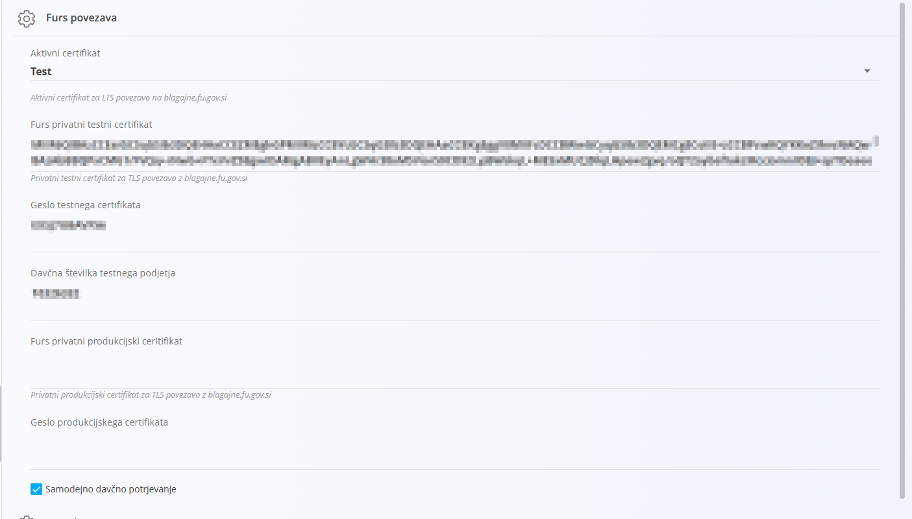

<!-- app_route: /sales/retail/settings -->
<!-- app_label: Nastavitve maloprodaje SI -->
<!-- app_navigation_hint: Odprite **Nastavitve** v glavni navigaciji, nato odprite **Sales Retails SI Settings**. -->
<!-- canonical_source_url: https://github.com/Tom-PIT/Connected.Docs/blob/main/sl/Domene/Sistem/Nastavitve/KonfiguracijaMaloprodajaSI.md -->
<!-- canonical_source_title: Nastavitve maloprodaje SI -->

# Nastavitve maloprodaje SI

Nastavitve **Maloprodaja SI** se uporabljajo za konfiguracijo povezave s **FURS (Finančna uprava Republike Slovenije)** za namen davčnega potrjevanja računov.

Te nastavitve omogočajo pošiljanje davčno pomembnih podatkov za [**maloprodajne izdane račune**](../../Prodaja/Dokumenti/MaloprodajniRacuni.md) na FURS.

Do teh nastavitev dostopate preko **Sales.Retail.SI / Sales Retail SI Settings**.

> [!NOTE]
> Oznaka **SI** pomeni, da se nastavitve nanašajo na **Slovenijo**.  
> Če je izbrana druga država (npr. Hrvaška), se lahko nastavitve razlikujejo glede na lokalne zahteve fiskalizacije.

## Pregled

Davčno potrjevanje zahteva varno povezavo s FURS preko **digitalnih certifikatov**, ki jih izda FURS.

Več informacij o certifikatih in tehničnih specifikacijah je na voljo [na uradnem portalu FURS](https://edavki.durs.si/EdavkiPortal/OpenPortal/CommonPages/Opdynp/PageD.aspx?category=dpr_teh_spec).  

## Certifikati

Konfiguracija vključuje dve vrsti certifikatov:

Nastavitev **Aktivni certifikat** določa, katero okolje se uporablja:

- **Test** – podatki se pošiljajo v testni sistem FURS  
- **Produkcija** – podatki se pošiljajo v produkcijski sistem FURS 

## Schema

| Polje | Opis |
|------|------|
| **Aktivni certifikat** | Določa, katero okolje se uporablja za povezavo s FURS:  • **Test** – pošiljanje v testni sistem  • **Produkcija** – pošiljanje v produkcijski sistem |
| **FURS privatni testni certifikat** | Digitalni certifikat za povezavo s testnim okoljem FURS |
| **Geslo testnega certifikata** | Geslo za dostop do testnega certifikata |
| **Davčna številka testnega podjetja** | Davčna številka, uporabljena v testnem okolju |
| **FURS privatni produkcijski certifikat** | Digitalni certifikat za povezavo s produkcijskim okoljem FURS |
| **Geslo produkcijskega certifikata** | Geslo za dostop do produkcijskega certifikata |
| **Samodejno davčno potrjevanje** | Če je omogočeno, se računi samodejno pošljejo na FURS ob izdaji |