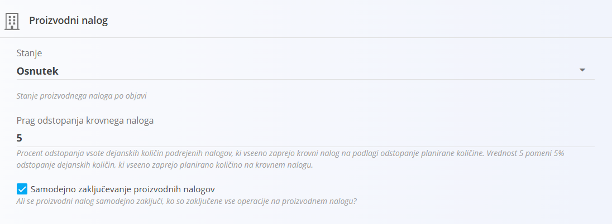
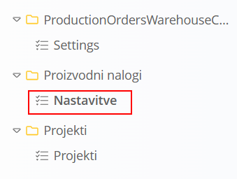
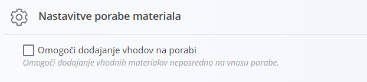

<!-- app_route: /management/configuration -->
<!-- app_label: Konfiguracija -->
<!-- canonical_source_url: https://tom-pit.github.io/Connected.Docs/sl/Domene/Sistem/Nastavitve/KonfiguracijaProizvodnihNalogov/ -->
<!-- canonical_source_title: Konfiguracija proizvodnih nalogov -->

# Konfiguracija proizvodnih nalogov

Nastavitve konfiguracije proizvodnih nalogov določajo privzeto vedenje proizvodnih nalogov, vključno z njihovim začetnim stanjem, pravili za zaključevanje in porabo materiala.

Za dostop do teh nastavitev pojdite na **Sistem / Konfiguracija** v [navigaciji](../../../Skupno/UI/Navigacija.md), nato v levem stranskem meniju izberite **Proizvodni nalogi / Nastavitve**.

## Nastavitve porabe materiala

### Omogoči dodajanje vhodov na porabi

Če je možnost omogočena, lahko neposredno na vnos porabe dodate dodatne vhodne materiale.

Če je možnost onemogočena, je poraba omejena na [vhodne materiale](../../Proizvodnja/Upravljanje/Vhodi.md), ki so že določeni za proizvodno operacijo.

## Proizvodni nalog

Razdelek **Proizvodni nalog** določa, kako se proizvodni nalogi obnašajo ob ustvarjanju in zaključevanju.

### Stanje

Določa privzeto stanje, ki se proizvodnemu nalogu dodeli ob ustvarjanju.

Novi proizvodni nalogi imajo ob ustvarjanju privzeto stanje **Osnutek**. Izberite drugo stanje, če želite, da imajo novi proizvodni nalogi drugačno začetno stanje, npr. *Aktivno*.

### Prag odstopanja krovnega naloga

Določa dovoljeni odstotek odstopanja pri ugotavljanju, ali je mogoče **krovni proizvodni nalog** zaključiti glede na dejanske količine, proizvedene v njegovih podrejenih proizvodnih nalogih.

Če ima na primer krovni proizvodni nalog planirano količino **100** in je **Prag odstopanja krovnega naloga** nastavljen na **5**, skupna dejanska količina **95** iz podrejenih proizvodnih nalogov zadostuje za izpolnitev krovnega naloga.

Vrednost **0** pomeni, da odstopanje količine ni dovoljeno.

> [!NOTE]
> Ta nastavitev velja za proizvodne naloge, ki vsebujejo podrejene proizvodne naloge.

### Samodejno zaključevanje proizvodnih nalogov

Če je možnost omogočena, se proizvodni nalog samodejno zaključi, ko so zaključene vse njegove operacije.

Če je možnost onemogočena, je treba proizvodni nalog po zaključku vseh operacij zaključiti ročno.