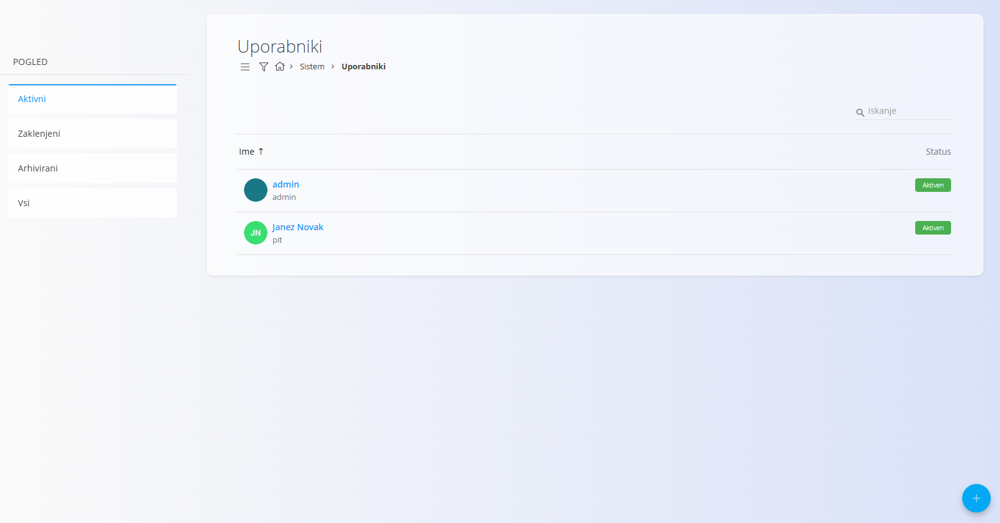
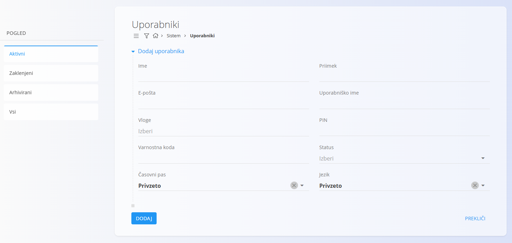
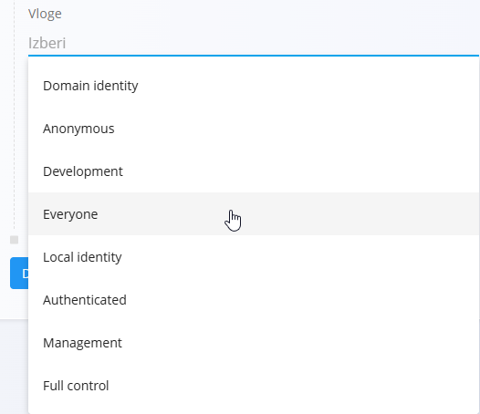

# Uporabniki

Šifrant **Uporabniki** vsebuje vse uporabniške račune, registrirane v sistemu.
Uporabniški računi določajo prijavne podatke, dostopne pravice na podlagi vlog,
osebne podatke profila (ime, e-pošta, časovni pas, jezik) ter ali ima uporabnik
dostop do posameznih delov sistema (pravila po domenah/skladiščih so lahko dodatno omejena).

Te nastavitve zagotavljajo, da ima vsak uporabnik ustrezna dovoljenja glede na svoje odgovornosti.

Za dostop do strani **Uporabniki** pojdite na **Sistem / Uporabniki** v
[**navigaciji**](../../../Skupno/UI/Navigacija.md).

## Shema

| Polje | Opis |
|------|------|
| **Ime** | Ime uporabnika. |
| **Priimek** | Priimek uporabnika. |
| **E-pošta** | E-poštni naslov za identifikacijo računa in komunikacijo. |
| **Uporabniško ime** | Prijavno ime za dostop do sistema. |
| **Vloge** | Ena ali več sistemskih vlog, ki določajo dostopne pravice. |
| **PIN** | Neobvezna številčna koda za poenostavljeno prijavo. |
| **Varnostna koda** | Neobvezna dodatna varnostna koda (uporaba je odvisna od sistema). |
| **Status** | Status uporabnika: *Aktiven*, *Zaklenjen* ali *Arhiviran*. |
| **Časovni pas** | Določa privzeti časovni pas za vse datumske in časovne operacije. |
| **Jezik** | Jezik uporabniškega vmesnika (*Privzeto*, *Slovenščina*, *Angleščina*). |

## Upravljanje

Do šifranta **Uporabniki** dostopate prek **Sistem / Uporabniki** v
[**navigaciji**](../../../Skupno/UI/Navigacija.md).

Seznam prikazuje vse uporabnike v sistemu skupaj z njihovim statusom.

Na voljo so naslednji pogledi:

- **Aktivni**
- **Zaklenjeni**
- **Arhivirani**
- **Vsi**

Uporabnike lahko **iščete**, **razvrščate** ali kliknete posameznega uporabnika
za urejanje njegovih podatkov.

## Dejanja

Kliknite [**akcijski gumb**](../../../Skupno/UI/AkcijskiGumb.md), da ustvarite novega uporabnika.

### Dodaj uporabnika

Kliknite **Dodaj uporabnika**, da odprete obrazec za vnos novega uporabnika.
Obrazec vključuje osebne podatke, prijavne podatke, dodeljene vloge ter lokalizacijske nastavitve.

Razpoložljive **vloge** lahko izberete iz spustnega seznama:

Kliknite **DODAJ**, da ustvarite uporabnika, ali **PREKLIČI**, da se vrnete na seznam.

> **Opomba:**  
> Vloge določajo dostopne pravice uporabnika v sistemu.
> Struktura in pomen posameznih vlog sta odvisna od konfiguracije sistema,
> poslovnega modela in operativnih potreb, zato se lahko razlikujeta med različnimi implementacijami.

## Urejanje

Za urejanje obstoječega uporabnika kliknite njegovo **ime** v seznamu.

Zaslon za urejanje omogoča spreminjanje vseh polj, vključno z vlogami in statusom.

Kliknite **Shrani**, da potrdite spremembe, ali **Prekliči**, da jih zavržete.

---