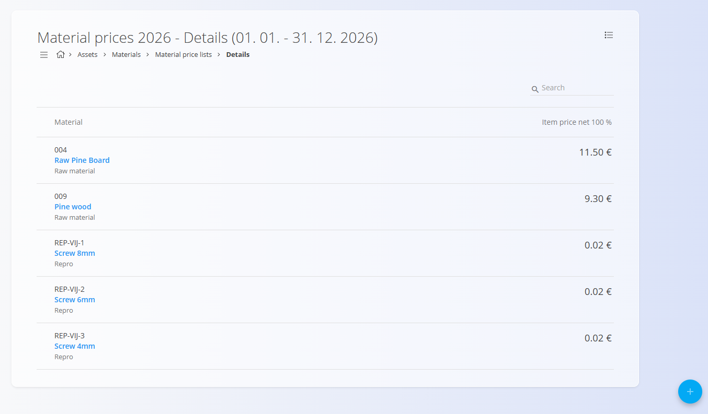
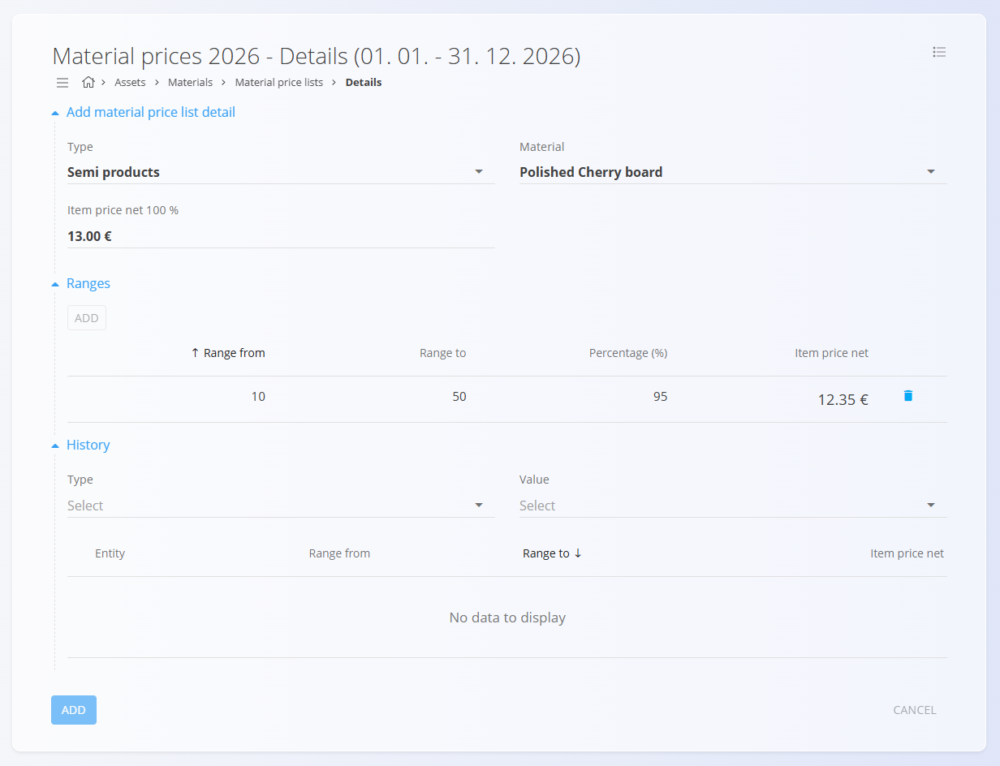

<!-- app_route: /management/materials/material-price-lists -->
<!-- app_label: Ceniki materialov -->
<!-- canonical_source_url: https://github.com/Tom-PIT/Connected.Docs/blob/main/sl/Domene/Sredstva/Materiali/CenikiMaterialov.md -->
<!-- canonical_source_title: Ceniki materialov -->

# Ceniki materialov

**Ceniki materialov** so osrednji vir resnice za **neto cene materialov** v določenem obdobju veljavnosti. Omogočajo:
- dosledno cenitev v procesih **nabave, proizvodnje in upravljanja zalog**
- časovno odvisne spremembe cen z uporabo **Velja od** / **Velja do**
- neobvezne **količinske razpone**, ki na osnovno ceno uporabijo odstotkovne prilagoditve

Ta zaslon se uporablja za ustvarjanje in vzdrževanje cenikov po vrsti materiala, nastavitev osnovne neto cene (100 %) ter konfiguracijo razponov, ki samodejno izračunajo dejansko neto ceno za določene količine naročila.

Za dostop do tega zaslona pojdite na  
**Sredstva / Materiali / Ceniki materialov** v [**navigaciji**](../../../Skupno/UI/Navigacija.md).

## Shema

### Glava cenika

| Polje | Opis |
|------|------|
| **Ime** | Prikazno ime cenika materialov (obvezno). |
| **Veljavno od** | Datum začetka veljavnosti cenika. |
| **Veljavno do** | Datum konca veljavnosti cenika. |

### Podrobnosti cenika

| Polje | Opis |
|------|------|
| **Tip** | Razvrstitev materiala (npr. *Surovine*, *Polizdelki*, *Repro materiali*). |
| [**Material**](../Domena/Materiali.md) | Konkreten material, za katerega velja cena. |
| **Neto cena (na enoto) 100 %** | Osnovna neto cena materiala brez popustov. |
| **Razponi** | Neobvezna pravila količinske cenitve, ki določajo popuste ali prilagoditve. |
| **Razpon od / Razpon do** | Količinski interval, za katerega velja pravilo. |
| **Odstotek (%)** | Odstotek osnovne cene, ki se uporabi za razpon. |
| **Neto cena (na enoto)** | Izračunana neto cena za določen razpon. |

## Upravljanje

### Zaslon seznama

Za dostop do seznama cenikov materialov pojdite na:

**Sredstva / Materiali / Ceniki materialov**

Seznam prikazuje:
- vse obstoječe cenike materialov
- njihova **obdobja veljavnosti**
- gumb **Podrobnosti** za upravljanje cen materialov

Seznam je mogoče filtrirati po:
- **Tipu**
- **Vrednosti**

Klik na **ime cenika** odpre zaslon za **urejanje**.

Klik na gumb **Postavke** odpre stran s podrobnostmi cenitve.

## Dejanja

Glede na trenutni zaslon [**akcijski gumb**](../../../Skupno/UI/AkcijskiGumb.md) ponuja različne možnosti.

### Na strani Ceniki materialov
- **Nov**
- **Kopiraj**

### Na strani Podrobnosti
- **Nov**
- **Uvoz**

## Ustvariti novega cenika materialov

1. Kliknite **Nov** na zaslonu *Ceniki materialov*.
2. Vnesite:
   - **Ime**
   - **Veljavno od**
   - **Veljavno do**
3. Kliknite **Dodaj**, da shranite glavo cenika.

   

4. Kliknite gumb **Postavke**, da upravljate cene materialov.

   

5. Z uporabo akcijskega gumba dodajte enega ali več **materialov**.

   

6. Vnesite:
   - **Tip**
   - **Material**
   - **Neto cena postavke 100 %**

7. (Neobvezno) Dodajte **Razpone**, da določite količinske popuste.  
   Na primer: pri naročilu med *10 in 50 enotami* se cena zmanjša na *95 %* osnovne cene.

8. Shranite podrobnosti.  
   Cenik materialov je zdaj aktiven za izbrano obdobje.

### Urediti cenik materialov

Kliknite **ime cenika** na seznamu, da odprete zaslon za urejanje. Tukaj lahko spremenite informacije o glavi cenika, vendar ne materialov ali razponov. Za urejanje materialov in razponov kliknite gumb **Postavke**, kot je opisano v prejšnjem razdelku.

> [!OPOMBA]
> Če želite urediti cene in razpone materialov, kliknite gumb **Postavke**, da odprete stran s podrobnostmi, kjer lahko po potrebi spremenite materiale in razpone.

#### Meni

Meni v pogledu **Podrobnosti** omogoča:
- izvoz podrobnosti cen materialov (vključno z razponi) v **CSV**

### Kopirati cenik materialov

Ustvari kopijo obstoječega cenika, vključno z obdobjem veljavnosti in vsebino.

### Uvoziti cenik materialov

Zaslon **Uvoz** omogoča uvoz CSV datoteke s seznamom postavk cenika.

## Brisati cenik materialov

Cenik materialov je mogoče izbrisati **samo, če ne vsebuje nobenih podrobnosti materialov**.

Če v razdelku **Podrobnosti** obstajajo materiali:

1. Odprite **Podrobnosti**
2. Kliknite vrstico materiala
3. Izbrišite podrobnost cenitve materiala
4. Postopek ponovite, dokler ne ostane nobena podrobnost

Ko je cenik prazen, ga lahko izbrišete na zaslonu za urejanje.
