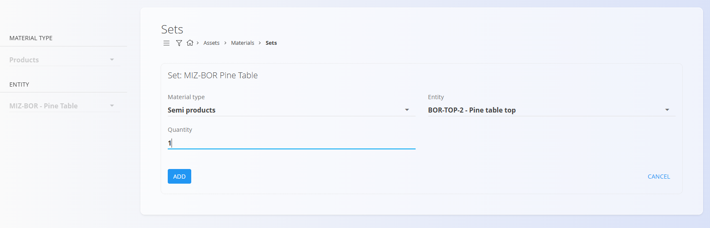

<!-- app_route: /management/materials/sets -->
<!-- app_label: Garniture -->
<!-- canonical_source_url: https://github.com/Tom-PIT/Connected.Docs/blob/main/sl/Domene/Sredstva/Materiali/Garniture.md -->
<!-- canonical_source_title: Garniture -->

# Garniture

**Garniture** omogočajo definiranje sestavljenih postavk iz obstoječih materialov (izdelkov, polizdelkov, surovin ali repro materialov). Garnitura združuje več komponent z določenimi količinami pod enim nadrejenim materialom, tako da jo lahko upravljate ali obravnavate kot eno celoto.

Za dostop do tega zaslona pojdite na  
**Sredstva / Materiali / Garniture** v [navigaciji](../../../Skupno/UI/Navigacija.md).

## Shema

### Razdelek dokumenta

| Polje | Opis |
|---|---|
| **Tip [materiala](../Domena/Materiali.md)** | Kategorija nadrejene garniture (npr. Izdelek, Polizdelek). |
| **Entiteta** | Nadrejeni material, ki predstavlja garnituro (npr. Pohištvena garnitura). |
| **Količina** | Količina posamezne komponente v garnituri. |

## Upravljanje

### Predpogoji
- Najprej ustvarite nadrejeni material v ustrezni kategoriji (npr. **Izdelki**, **Polizdelki**).
- Prepričajte se, da so vse komponente, ki jih želite vključiti, že definirane v ustreznih šifrantih.

## Seznam garnitur

Leva stranska vrstica prikazuje nadrejene materiale, združene po **[Vrsti materiala](../Domena/Materiali.md)** (npr. **[Izdelki](Izdelki.md)**, **[Polizdelki](Polizdelki.md)**).  
Izberite nadrejeni material, da si v glavnem seznamu ogledate njegove komponente in pripadajoče količine.

### Ustvarati garniture

1. Ustvarite nadrejeni material v njegovi kategoriji:
   - Pojdite na **Sredstva / Materiali / Izdelki** in dodajte nov izdelek (npr. **Garnitura iz borovega lesa**).
2. Odprite **Sredstva / Materiali / Garniture** in v levi stranski vrstici izberite nadrejeni material:  
   **Izdelki → Garnitura iz borovega lesa**.
3. Kliknite **[akcijski gumb](../../../Skupno/UI/AkcijskiGumb.md)** za dodajanje komponent v garnituro (vsaka komponenta mora že obstajati):
   - Primer komponent: **Borova miza** (1), **Borov stol** (4)

   

4. Shranite. **Garnitura iz borovega lesa** zdaj referencira vse komponente z določenimi količinami.

   

### Urediti garniture

Kliknite komponento v seznamu garniture, da spremenite njeno količino ali jo zamenjate z drugim materialom.

## Povezane operacije

Garniture so povezane z **[Demontaže](../../Logistika/Dokumenti/Demontaze.md)**.

Garnituro lahko razstavite, na primer ob prevzemu, če želite posamezne komponente uporabiti ali prodati ločeno. Razstavljanje ustvari logistične dokumente, ki odstranijo garnituro iz zaloge in hkrati vnesejo njene komponente v zalogo glede na definirane količine.

## Izbrisati garniture

Posamezne komponente lahko odstranite iz garniture tako, da jih izberete in kliknete **Izbriši**.  
Po potrditvi se komponenta odstrani iz nadrejene garniture.
