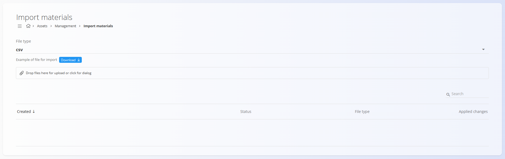
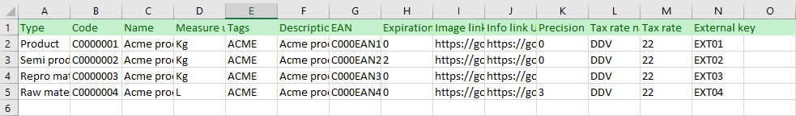
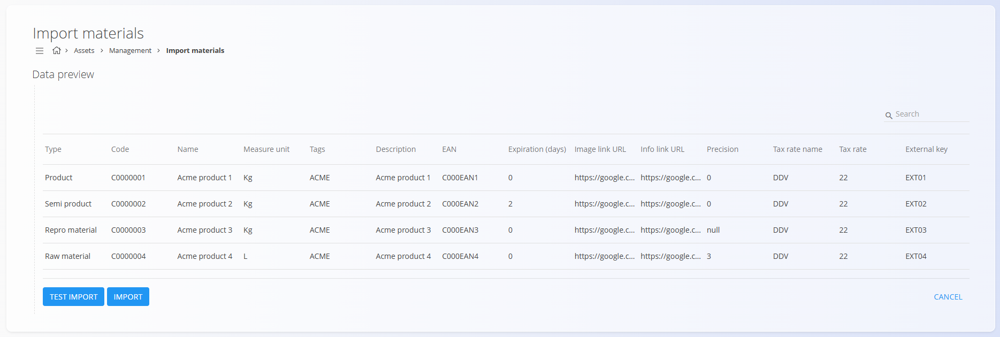

<!-- app_route: /management/materials/import -->
<!-- app_label: Uvoz materialov -->
<!-- canonical_source_url: https://github.com/Tom-PIT/Connected.Docs/blob/main/sl/Domene/Sredstva/Materiali/UvozMaterialov.md -->
<!-- canonical_source_title: Uvoz materialov -->

# Uvoz materialov

Ta dokument opisuje, kako v sistem hkrati uvoziti več materialov z uporabo preglednice.  
Uvoz omogoča hitro množično ustvarjanje ali posodabljanje zapisov materialov.

Uvoz podpira naslednje vrste materialov:

- **[Izdelki](Izdelki.md)**  
- **[Polizdelki](Polizdelki.md)**  
- **[Repro materiali](ReproMateriali.md)**  
- **[Surovine](Surovine.md)**  

Zaslon omogoča tudi prenos **primerne datoteke**, ki prikazuje zahtevano strukturo preglednice.  
Pred dejanskim uvozom lahko izvedete **Testni uvoz**, ki preveri podatke in poroča o napakah, ne da bi uveljavil spremembe.

> [!NOTE]  
> **Predpogoji**  
> Pred uvozom materialov preverite naslednje šifrante:  
> - **[Merske enote](../../../Skupno/Upravljanje/MerskeEnote.md)**  
> - **[Davčne stopnje](../../../Skupno/Upravljanje/DavcneStopnje.md)**  
> Če manjkajoča merska enota ali davčna stopnja še ne obstaja, bo ustvarjena samodejno med uvozom.  
> Predhodni pregled teh šifrantov pomaga zagotoviti pravilna poimenovanja in preslikave.

Za dostop do šifranta **Uvoz materialov** pojdite na  
**Sredstva / Materiali / Uvoz materialov** v [**navigaciji**](../../../Skupno/UI/Navigacija.md).

## Shema

| Polje | Opis |
|------|------|
| **Ustvarjen** | Datum in čas nalaganja preglednice. |
| **Status** | Rezultat preverjanja ali uvoza, ki prikazuje število veljavnih vrstic in vrstic z napakami. |
| **Tip datoteke** | Oblika naložene datoteke: CSV ali XLSX. |
| **Dodane spremembe** | Označuje, ali so bile spremembe dejansko uvožene (označeno) ali je šlo le za testni uvoz (ni označeno). |

## Vrsta datoteke

Sistem sprejema uvoze v obliki **CSV** ali **XLSX**.  
Spustni meni se uporablja za izbiro oblike **primerne datoteke**, ki jo lahko prenesete.

Kliknite **Prenesi**, da pridobite primer uvozne datoteke v izbrani obliki.  
Primerna datoteka vsebuje vse zahtevane stolpce v pravilnem vrstnem redu.



## Struktura preglednice

Uvozna datoteka mora vsebovati spodaj navedene stolpce. Vsaka vrstica predstavlja en material, ki bo uvožen.

> [!IMPORTANT]
> - Ne spreminjajte vrstnega reda stolpcev. Kot referenco uporabite primerno datoteko.
> - Materiali morajo imeti enolične vrednosti v stolpcu **Koda**, da se izognete konfliktom.
> - Prazna neobvezna polja bodo uvožena kot prazne vrednosti.
> - URL-ji (URL slike, URL informacij) morajo biti veljavni ali prazni.

| Stolpec | Opis |
|--------|------|
| **Tip** | Tip materiala: **Izdelki**, **Polizdelki**, **Repro materiali**, **Surovine**. |
| **Šifra** | Enolični identifikator materiala. Če material z isto šifro že obstaja, se zapis posodobi. |
| **Naziv** | Polno ime materiala. |
| **Merska enota** | Merska enota za količine. Mora ustrezati obstoječi **merski enoti**. |
| **Oznake** | Neobvezne oznake za razvrščanje. Več oznak ločite z vejicami. |
| **Opis** | Neobvezno besedilo z opisom materiala. |
| **EAN** | Vrednost črtne šifre materiala. |
| **Datum do (dni)** | Število dni do poteka materiala. |
| **URL slike** | URL do slike materiala. |
| **URL informacij** | URL do zunanje informacijske strani o materialu. |
| **Natančnost** | Število decimalnih mest za prikaz vrednosti. |
| **Ime davčne stopnje** | Ime davčne stopnje. Mora ustrezati obstoječi davčni stopnji. |
| **Davčna stopnja** | Odstotek davka, ki se uporabi za material. |
| **Zunanji ključ** | Identifikator v zunanjem sistemu. |

## Primer vrstice

```
Izdelki,C0000001,Acme izdelek 1,Kg,ACME,Acme izdelek 1,C000EAN1,0,https://google.com;https://google.com,0,DDV,22,EXT01
```

## Urediti datoteke

Preglednico lahko pripravite ali uredite v pregledničnem urejevalniku:



## Uvoziti datoteke

1. Za začetek uvoza povlecite **CSV** ali **XLSX** datoteko v območje za nalaganje ali kliknite območje, da odprete pogovorno okno za izbiro datoteke.

2. Ko je datoteka naložena, se prikaže **Predogled podatkov**, ki prikazuje vse razčlenjene zapise. Na voljo so naslednja dejanja:

   - **Testni uvoz** — izvede preverjanje brez shranjevanja podatkov  
   - **Uvoz** — uvozi in shrani podatke ter uveljavi vse veljavne spremembe  

   

   Priporočljivo je, da najprej izvedete **Testni uvoz**, da preverite strukturo podatkov in preprečite napake.  
   Pod območjem za nalaganje je prikazan seznam vseh predhodno naloženih datotek.

   Vrstice z napakami so v stolpcu **Status** označene **rdeče**, veljavne vrstice pa **zeleno**.

   

3. Za dokončanje dejanskega uvoza po uspešnem **Testnem uvozu** ponovno naložite preglednico in izberite možnost **Uvoz**.

Med uvozom:

- ustvarijo se novi materiali  
- obstoječi materiali (ujemanje po **Kodi**) se posodobijo  
- odvisnosti (oznake, merske enote, davčne stopnje) se samodejno povežejo  
- vrsta materiala se določi glede na stolpec **Tip**  

Po končanem uvozu se stanje v seznamu posodobi in prikaže, katere vrstice so bile uspešno obdelane.

## Seznam rezultatov

Kliknite katerikoli uvoz v stolpcu **Ustvarjeno** na seznamu uvozov, da pregledate rezultate in morebitne napake.


