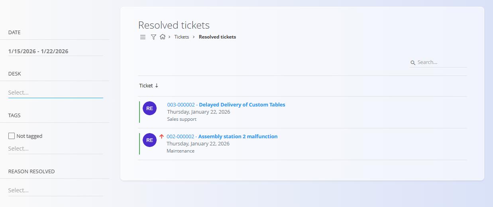

<!-- app_route: /customer-support/resolved-tickets -->
<!-- app_label: Rešene prijave -->
<!-- canonical_source_url: https://github.com/Tom-PIT/Connected.Docs/blob/main/sl/Domene/Stranke/Prijave/ResenePrijave.md -->
<!-- canonical_source_title: Rešene prijave -->

# Rešene prijave

Zaslon **Rešene prijave** omogoča pregled prijav, ki so zaključile svoj življenjski cikel. Uporablja se za pregled opravljenega dela, vpogled v zgodovino prijav in po potrebi ponovno odpiranje prijav.

Za dostop do tega zaslona pojdite na **Stranke / Prijave / Rešene prijave** v [navigaciji](../../../Skupno/UI/Navigacija.md).

## Shema

| Polje | Opis |
|-----|------|
| **Zadeva** | Kratek naslov, ki opisuje rešeno težavo |
| **Številka** | Enolična identifikacija prijave |
| **[Področje](../Upravljanje/Podrocja.md)** | Področje, kateremu prijava pripada |
| **Kanal** | Izvor prijave (**Splet**, **Telefon**, **E-pošta**) |
| **Avtor** | Uporabnik, ki je ustvaril prijavo |
| **Dodeljeno** | Uporabnik, ki je obravnaval prijavo |
| **[Oznake](Prijave.md#shema)** | Klasifikacijske oznake |
| **Prioriteta** | Prioriteta prijave (**Nizka**, **Normalna**, **Visoka**) |
| **Ustvarjeno** | Čas ustvarjanja prijave |
| **Aktivirano** | Čas, ko je prijava postala aktivna |
| **Rešeno** | Čas rešitve prijave |

## Seznam rešenih prijav

Seznam prikazuje vse prijave s stanjem **Rešeno**.

Vsaka vrstica prikazuje:
- številko in zadevo prijave,
- datum rešitve,
- področje, kateremu prijava pripada.

Klik na naslov prijave odpre **celoten pogled prijave**.

### Filtri

Rešene prijave je mogoče filtrirati z uporabo levega panela:

- **Datum**
- **Področje**
- **Oznake**
- **Razlog rešen**

## Pregled rešenih prijav

Ob odprtju rešene prijave se prikaže enak podrobni pogled kot pri aktivnih prijavah, vključno z:

- metapodatki prijave,
- opisom in prilogami,
- celotno zgodovino komentarjev,
- revizijsko sledjo.

Večina polj je **samo za branje**, vendar je še vedno mogoče:
- posodobiti izbrana polja (na primer **Zadeva**, **Opis**, **Prioriteta**),
- dodajati komentarje,
- uporabljati dejanja prek [akcijskega gumba](../../../Skupno/UI/AkcijskiGumb.md).

## Ponovno odpirati prijave

Iz pogleda rešene prijave omogoča [akcijski gumb](../../../Skupno/UI/AkcijskiGumb.md) ponovno odpiranje prijave.

Na voljo sta naslednji možnosti:
- **Shrani kot novo**
- **Shrani kot aktivno**

Ko je prijava ponovno odprta:

- se odstrani iz seznama **Rešene prijave**,
- se znova prikaže v zaslonu **[Prijave](Prijave.md)**,
- njeno stanje se ustrezno posodobi.

## Meni

Meni omogoča dodatna dejanja, ki so na voljo na tej strani.

Na voljo so naslednja dejanja:

- **Odjavi s prijave**
- **Naročniki**
- **Deli**
- **Delo**

> [!NOTE]
> Nastavitve obvestil za posamezno področje lahko upravljate v [**Nastavitve obvestil**](../Upravljanje/NastavitveObvestil.md).

Za podrobnosti o dejanjih menija glejte [**Dejanja menija**](../../../Skupno/Koncepti/MeniDejanja.md).
